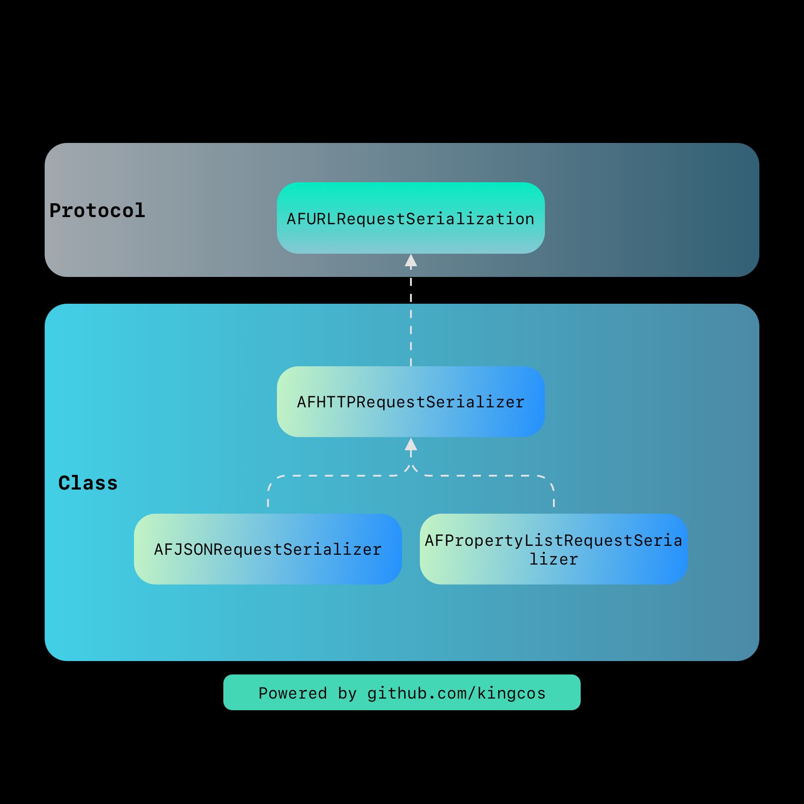

# Focus - AFNetworking 剖析

| Date | Notes | Source Code |
|:-----:|:-----:|:-----:|
| 2019-03-03 | 首次提交 | [AFNetworking 3.2.1](https://github.com/AFNetworking/AFNetworking/releases/tag/3.2.1) |

> 许久未更！这次我将以 AFNetworking 最新 Release 版本 3.2.1 为例，作为深度剖析的第一个开源库。当然我也计划后续剖析 Alamofire，即 Swift 的网络库。第一次做剖析开源库的文章，不免会有所纰漏，但我会尽力将文章做到翔实。涉及到部分语法特性，可能会将其作为单独的内容提炼出去。其实网上已经有不少对 AFNetworking 剖析的文章，在本文基本完成后，我会再参考前人之所见，查漏补缺。所有参考的资料都可以在文末「Reference」中找到。那下面就开始吧！


## What

AFNetworking 是由 Objective-C 编写的适用于 iOS/macOS/watchOS/tvOS 全平台的网络库。但凡接触过 iOS 开发的同学都应该对其不陌生。其 GitHub 首页上有一段自我介绍中有一句话，如下：

> **It's built on top of the [Foundation URL Loading System](https://developer.apple.com/documentation/foundation/url_loading_system), extending the powerful high-level networking abstractions built into Cocoa.**
>
> 译：其建立在 Foundation 中的 [URL 加载系统](https://github.com/kingcos/Perspective/issues/70)之上，扩展了 Cocoa 中内置的强大且高级的网络抽象。

所以 AFNetworking 也是建立在 URL 加载系统之上，封装了系统提供的 URLSession 相关接口，并为使用者提供了更加友好的 API。

## 总体概览

根据 AFNetworking 开源在 GitHub 上最新的 3.2.1 版本 Tag，可以直接下载到该版本的源代码。其支持 CocoaPods 集成，所以通过查看 Podspec 文件就可以得知真正的库文件，总共只有 14 个文件。文件结构如下：

```
➜  AFNetworking tree
.
├── AFCompatibilityMacros.h
├── AFHTTPSessionManager.h
├── AFHTTPSessionManager.m
├── AFNetworkReachabilityManager.h
├── AFNetworkReachabilityManager.m
├── AFNetworking.h
├── AFSecurityPolicy.h
├── AFSecurityPolicy.m
├── AFURLRequestSerialization.h
├── AFURLRequestSerialization.m
├── AFURLResponseSerialization.h
├── AFURLResponseSerialization.m
├── AFURLSessionManager.h
└── AFURLSessionManager.m

0 directories, 14 files
```

Podspec 不仅指定了源文件的路径，也可以较为容易地了解整体的架构和分层，根据其中的定义，AFNetworking 整体被分为 Serialization、Security、Reachability、NSURLSession、UIKit 五个子层级（Subspec），AFNetworking 本身只有 AFNetworking.h 一个源文件，但它会作为库本身对外界暴露头文件的统一管理者。

```ruby
  # AFNetworking.podspec 摘录

  s.subspec 'Serialization' do |ss|
    ss.source_files = 'AFNetworking/AFURL{Request,Response}Serialization.{h,m}'
    ss.public_header_files = 'AFNetworking/AFURL{Request,Response}Serialization.h'
    ss.watchos.frameworks = 'MobileCoreServices', 'CoreGraphics'
    ss.ios.frameworks = 'MobileCoreServices', 'CoreGraphics'
    ss.osx.frameworks = 'CoreServices'
  end

  s.subspec 'Security' do |ss|
    ss.source_files = 'AFNetworking/AFSecurityPolicy.{h,m}'
    ss.public_header_files = 'AFNetworking/AFSecurityPolicy.h'
    ss.frameworks = 'Security'
  end

  s.subspec 'Reachability' do |ss|
    ss.ios.deployment_target = '7.0'
    ss.osx.deployment_target = '10.9'
    ss.tvos.deployment_target = '9.0'

    ss.source_files = 'AFNetworking/AFNetworkReachabilityManager.{h,m}'
    ss.public_header_files = 'AFNetworking/AFNetworkReachabilityManager.h'

    ss.frameworks = 'SystemConfiguration'
  end

  s.subspec 'NSURLSession' do |ss|
    ss.dependency 'AFNetworking/Serialization'
    ss.ios.dependency 'AFNetworking/Reachability'
    ss.osx.dependency 'AFNetworking/Reachability'
    ss.tvos.dependency 'AFNetworking/Reachability'
    ss.dependency 'AFNetworking/Security'

    ss.source_files = 'AFNetworking/AF{URL,HTTP}SessionManager.{h,m}', 'AFNetworking/AFCompatibilityMacros.h'
    ss.public_header_files = 'AFNetworking/AF{URL,HTTP}SessionManager.h', 'AFNetworking/AFCompatibilityMacros.h'
  end

  s.subspec 'UIKit' do |ss|
    ss.ios.deployment_target = '7.0'
    ss.tvos.deployment_target = '9.0'
    ss.dependency 'AFNetworking/NSURLSession'

    ss.public_header_files = 'UIKit+AFNetworking/*.h'
    ss.source_files = 'UIKit+AFNetworking'
  end
```

综上，对于 iOS 平台（注：下文后如不特别注明，即以 iOS 平台为主，其他平台视情况针对性说明），AFNetworking 3.2.1 的大概层级关系如下图所示：


需要注意的是，其中 UIKit 层主要是针对系统 UIKit 中部分 UI 控件以分类（Category）形式提供支持，不涉及 AFNetworking 核心功能，官方也没有将其直接放在 AFNetworking 文件夹下，而是放在了 UIKit+AFNetworking 文件夹下，共有 20 个文件。

```
➜  UIKit+AFNetworking tree
.
├── AFAutoPurgingImageCache.h
├── AFAutoPurgingImageCache.m
├── AFImageDownloader.h
├── AFImageDownloader.m
├── AFNetworkActivityIndicatorManager.h
├── AFNetworkActivityIndicatorManager.m
├── UIActivityIndicatorView+AFNetworking.h
├── UIActivityIndicatorView+AFNetworking.m
├── UIButton+AFNetworking.h
├── UIButton+AFNetworking.m
├── UIImage+AFNetworking.h
├── UIImageView+AFNetworking.h
├── UIImageView+AFNetworking.m
├── UIKit+AFNetworking.h
├── UIProgressView+AFNetworking.h
├── UIProgressView+AFNetworking.m
├── UIRefreshControl+AFNetworking.h
├── UIRefreshControl+AFNetworking.m
├── UIWebView+AFNetworking.h
└── UIWebView+AFNetworking.m

0 directories, 20 files
```

NSURLSession 层依赖了较为独立的 Serialization、Security 以及 Reachability，是 AFNetworking 的核心所在。

## Serialization



我们先从 AFNetworking 层级最下方的 Serialization 即序列化来剖析。

### What

那么什么是序列化呢？打个比方，一个小朋友将积木拼成了机器人，但因为书包太小，不好放置一整个机器人，也容易在路上挤压到而损坏；所以他不得不将机器人拆成积木装进书包，等到了学校再拼装成相同的机器人和其他小朋友玩耍。我们可以把机器人当作对象（Object），将机器人拆成积木的过程就是序列化，而把积木再组装成机器人的过程就是反序列化。在网络请求中，我们通常将 App 中的数据传输到服务器，并接收服务器给 App 的响应，就离不开数据的序列化和反序列化。

Serialization 层首先定义了 `AFURLRequestSerialization` 协议。其中唯一的方法是 `requestBySerializingRequest:withParameters:error:`，即遵守该协议的实例要能够将 URL 请求和参数编码为一个序列化的新请求。URL 是统一资源定位符，并不局限于某种具体的协议，所以 `AFHTTPRequestSerializer` 即是可以使用 HTTP 协议来对请求进行序列化的类。


## 举个 🌰

AFNetworking 仓库 README 文档的第一个例子是创建并开始下载任务：

```objc
// 默认会话配置
NSURLSessionConfiguration *config = [NSURLSessionConfiguration defaultSessionConfiguration];
// 使用会话配置初始化 AFURLSessionManager
AFURLSessionManager *manager = [[AFURLSessionManager alloc] initWithSessionConfiguration:config];
// 构造 URL 请求
NSURL *url = [NSURL URLWithString:@"https://httpstat.us/200"];
NSURLRequest *request = [NSURLRequest requestWithURL:url];
// 创建下载任务
NSURLSessionDownloadTask *task = [manager downloadTaskWithRequest:request
                                                         progress:nil
                                                      destination:^NSURL * _Nonnull(NSURL * _Nonnull targetPath,
                                                                                    NSURLResponse * _Nonnull response) {
                                                          // 构造下载目的地 URL
                                                          NSURL *documentsDirectoryURL = [[NSFileManager defaultManager]
                                                                                          URLForDirectory:NSDocumentDirectory
                                                                                                inDomain:NSUserDomainMask
                                                                                        appropriateForURL:nil
                                                                                                    create:NO
                                                                                                    error:nil];
                                                          return [documentsDirectoryURL URLByAppendingPathComponent:[response suggestedFilename]];
                                                      } completionHandler:^(NSURLResponse * _Nonnull response,
                                                                            NSURL * _Nullable filePath,
                                                                            NSError * _Nullable error) {
                                                          // 输出下载完成的文件地址
                                                          NSLog(@"File downloaded to: %@", filePath);
                                                      }];
// 执行任务
[task resume];
```

那么如何用系统的 `NSURLSession` 来完成这个下载任务呢？

```objc
// 默认会话配置
NSURLSessionConfiguration *config = [NSURLSessionConfiguration defaultSessionConfiguration];
// 构造 URL 请求
NSURL *url = [NSURL URLWithString:@"https://httpstat.us/200"];
NSURLRequest *request = [NSURLRequest requestWithURL:url];
// 创建下载任务
NSURLSessionDownloadTask *task = [[NSURLSession sessionWithConfiguration:config]
                                  downloadTaskWithRequest:request
                                  completionHandler:^(NSURL * _Nullable location,
                                                      NSURLResponse * _Nullable response,
                                                      NSError * _Nullable error) {
                                      // 构造下载目的地 URL
                                      NSURL *documentsDirectoryURL = [[NSFileManager defaultManager] URLForDirectory:NSDocumentDirectory
                                                                                                            inDomain:NSUserDomainMask
                                                                                                appropriateForURL:nil
                                                                                                            create:NO
                                                                                                            error:nil];
                                      NSURL *newURL = [documentsDirectoryURL URLByAppendingPathComponent:[location lastPathComponent]];
                                      // 将已下载的文件移动到构造的目的地 URL
                                      [[NSFileManager defaultManager] moveItemAtURL:location toURL:newURL error:nil];
                                      // 输出最终的文件地址
                                      NSLog(@"File downloaded to: %@", newURL.absoluteString);
                                  }];
// 执行任务
[task resume];
```

对于这个下载任务来说，AFNetworking 和系统的 `NSURLSession` 在整体流程上并没有特别大的差异。比较大的不同点就在于 AFNetworking 使用了 `AFURLSessionManager` 管理会话配置并创建下载任务。


## Reachability

## Security

## 3.x

## Reference

- [GitHub - AFNetworking](https://github.com/AFNetworking/AFNetworking)
- [[译]URL 加载系统](https://github.com/kingcos/Perspective/issues/70)
- [Wikipedia - 序列化](https://zh.wikipedia.org/wiki/序列化)