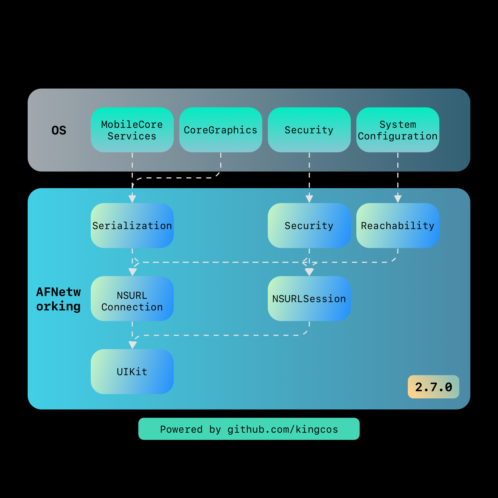

# Focus - AFNetworking 剖析

| Date | Notes | Source Code |
|:-----:|:-----:|:-----:|
| 2019-03-03 | 首次提交 | [AFNetworking 2.7.0](https://github.com/AFNetworking/AFNetworking/releases/tag/2.7.0) |

> 许久未更！这次我将以 AFNetworking 最新 Release 版本 2.7.0 为例，作为深度剖析的第一个开源库。之后我也将阅读 3.2.1 版本，尝试去对比更新的地方。当然我也计划后续剖析 Alamofire，即 Swift 的网络库。第一次做剖析开源库的文章，不免会有所纰漏，但我会尽力将文章做到翔实。涉及到部分语法特性，可能会将其作为单独的内容提炼出去。其实网上已经有不少对 AFNetworking 剖析的文章，在本文基本完成后，我会参考前人之所见，查漏补缺。所有参考的资料都将在文末「Reference」中找到。那下面就开始吧！


## 总体概览

但凡接触过 iOS 开发，用过 Obj-C 的同学应该对 AFNetworking 这个名字不陌生。AFNetworking 是由 Objective-C 编写的适用于 iOS/macOS/watchOS/tvOS 全平台的网络库。根据开源在 GitHub 上最新的 2.x 版本 Tag，下载到的源代码压缩包解压后共计 146 个文件，查看 Podspec 文件我们可以得知其中 AFNetworking 文件夹下的文件才真正属于库的源代码本身，总共只有 19 个文件。文件结构如下：

```
➜  AFNetworking tree
.
├── AFHTTPRequestOperation.h
├── AFHTTPRequestOperation.m
├── AFHTTPRequestOperationManager.h
├── AFHTTPRequestOperationManager.m
├── AFHTTPSessionManager.h
├── AFHTTPSessionManager.m
├── AFNetworkReachabilityManager.h
├── AFNetworkReachabilityManager.m
├── AFNetworking.h
├── AFSecurityPolicy.h
├── AFSecurityPolicy.m
├── AFURLConnectionOperation.h
├── AFURLConnectionOperation.m
├── AFURLRequestSerialization.h
├── AFURLRequestSerialization.m
├── AFURLResponseSerialization.h
├── AFURLResponseSerialization.m
├── AFURLSessionManager.h
└── AFURLSessionManager.m

0 directories, 19 files
```

因为 AFNetworking 通常使用 CocoaPods 集成进我们的 Project。所以根据 Podspec 可以较为容易地了解整体的架构和分层，根据其中的定义，AFNetworking 整体被分为 Serialization、Security、Reachability、NSURLConnection、NSURLSession、UIKit 六个层级（Subspec），AFNetworking 本身只有 AFNetworking.h 一个源文件，作为对外暴露头文件的管理。

```ruby
  # AFNetworking.podspec
  # 注：此处仅作部分摘录

  s.public_header_files = 'AFNetworking/AFNetworking.h'
  s.source_files = 'AFNetworking/AFNetworking.h'

  s.subspec 'Serialization' do |ss|
    ss.source_files = 'AFNetworking/AFURL{Request,Response}Serialization.{h,m}'
    ss.public_header_files = 'AFNetworking/AFURL{Request,Response}Serialization.h'
    ss.watchos.frameworks = 'MobileCoreServices', 'CoreGraphics'
    ss.ios.frameworks = 'MobileCoreServices', 'CoreGraphics'
    ss.osx.frameworks = 'CoreServices'
  end

  s.subspec 'Security' do |ss|
    ss.source_files = 'AFNetworking/AFSecurityPolicy.{h,m}'
    ss.public_header_files = 'AFNetworking/AFSecurityPolicy.h'
    ss.frameworks = 'Security'
  end

  s.subspec 'Reachability' do |ss|
    ss.ios.deployment_target = '7.0'
    ss.osx.deployment_target = '10.9'

    ss.source_files = 'AFNetworking/AFNetworkReachabilityManager.{h,m}'
    ss.public_header_files = 'AFNetworking/AFNetworkReachabilityManager.h'

    ss.frameworks = 'SystemConfiguration'
  end

  s.subspec 'NSURLConnection' do |ss|
    ss.ios.deployment_target = '7.0'
    ss.osx.deployment_target = '10.9'

    ss.dependency 'AFNetworking/Serialization'
    ss.dependency 'AFNetworking/Reachability'
    ss.dependency 'AFNetworking/Security'

    ss.source_files = 'AFNetworking/AFURLConnectionOperation.{h,m}', 'AFNetworking/AFHTTPRequestOperation.{h,m}', 'AFNetworking/AFHTTPRequestOperationManager.{h,m}'
    ss.public_header_files = 'AFNetworking/AFURLConnectionOperation.h', 'AFNetworking/AFHTTPRequestOperation.h', 'AFNetworking/AFHTTPRequestOperationManager.h'
  end

  s.subspec 'NSURLSession' do |ss|
    ss.ios.deployment_target = '7.0'
    ss.osx.deployment_target = '10.9'
    ss.watchos.deployment_target = '2.0'
    
    ss.dependency 'AFNetworking/Serialization'
    ss.ios.dependency 'AFNetworking/Reachability'
    ss.osx.dependency 'AFNetworking/Reachability'
    ss.dependency 'AFNetworking/Security'

    ss.source_files = 'AFNetworking/AF{URL,HTTP}SessionManager.{h,m}'
    ss.public_header_files = 'AFNetworking/AF{URL,HTTP}SessionManager.h'
  end

  s.subspec 'UIKit' do |ss|
    ss.platform = :ios
    ss.dependency 'AFNetworking/NSURLConnection'
    ss.dependency 'AFNetworking/NSURLSession'

    ss.public_header_files = 'UIKit+AFNetworking/*.h'
    ss.source_files = 'UIKit+AFNetworking'
  end
```

所以，对于 iOS 平台（注：下文后如不特别注明，即以 iOS 平台为主，其他平台视情况针对性说明），AFNetworking 2.7.0 的大概层级关系如下图所示：




需要注意的是，其中 UIKit 主要是针对系统 UIKit 中部分 UI 控件以分类（Category）形式提供支持，不涉及 AFNetworking 核心功能，官方也没有将其直接放在 AFNetworking 文件夹下，而是放在了 UIKit+AFNetworking 文件夹下，共有 18 个文件。这一部分将不作为核心，视情况进行剖析。

```
➜  UIKit+AFNetworking tree
.
├── AFNetworkActivityIndicatorManager.h
├── AFNetworkActivityIndicatorManager.m
├── UIActivityIndicatorView+AFNetworking.h
├── UIActivityIndicatorView+AFNetworking.m
├── UIAlertView+AFNetworking.h
├── UIAlertView+AFNetworking.m
├── UIButton+AFNetworking.h
├── UIButton+AFNetworking.m
├── UIImage+AFNetworking.h
├── UIImageView+AFNetworking.h
├── UIImageView+AFNetworking.m
├── UIKit+AFNetworking.h
├── UIProgressView+AFNetworking.h
├── UIProgressView+AFNetworking.m
├── UIRefreshControl+AFNetworking.h
├── UIRefreshControl+AFNetworking.m
├── UIWebView+AFNetworking.h
└── UIWebView+AFNetworking.m

0 directories, 18 files
```

NSURLConnection 和 NSURLSession 的 Subspec 即为对于不同的系统网络 API 的封装，是 AFNetworking 的核心所在。由于 AFNetworking「历史」悠久，，在 iOS 6.0 或 macOS 10.8 及以下版本，官方建议使用 NSURLConnection 中的方法；更新版本则建议使用 NSURLSession 版本（在 3.x 版本，AFNetworking 更是直接移除了 NSURLConnection 部分）。

在上述两者的上层，是 Serialization、Security 以及 Reachability，分别主要作用于序列化、安全以及网络可用性方面；后面两者较为独立，后续将分开剖析；序列化部分将和上述核心部分一起剖析。


## Reference

- [GitHub - AFNetworking](https://github.com/AFNetworking/AFNetworking)