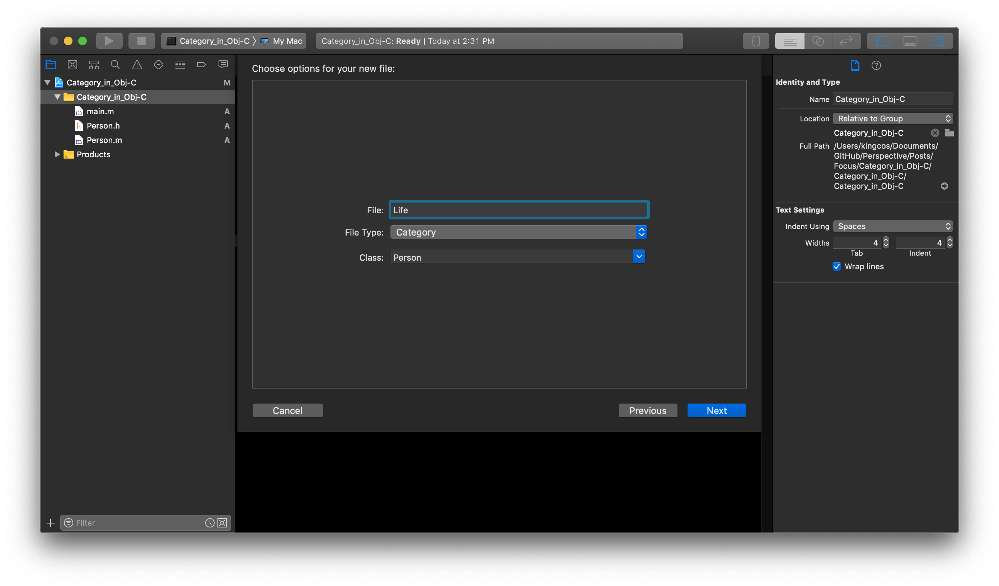
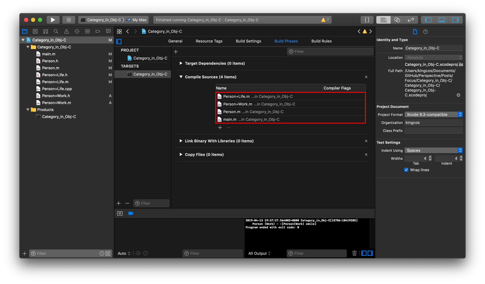
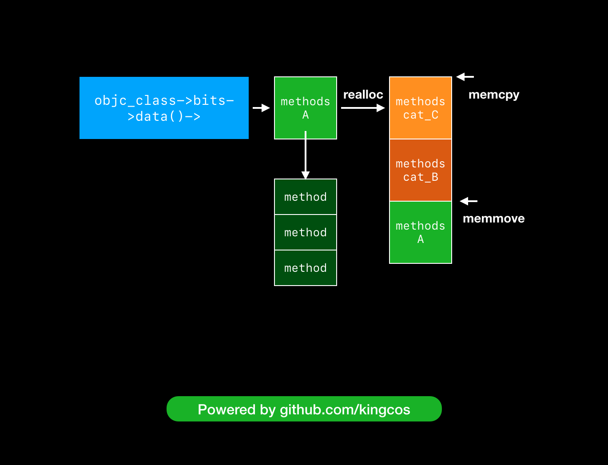

# Focus - iOS 中的 Category

| Date | Notes | Source Code | Demo |
|:-----:|:-----:|:-----:|:-----:|
| 2019-04-13 | 首次提交 | [objc4-750](https://opensource.apple.com/tarballs/objc4/) | [Category_in_Obj-C](Category_in_Obj-C/) |

## Preface



在 Obj-C 中，我们经常会使用 Category（中文常译作分类，但为表述清晰，下文仍将使用 Category）来对一个类进行扩展，使得类可以具备更多的功能；也会对一个类进行拆分，使得其结构更加清晰条理。本文将由浅入深，谈谈 iOS 中的 Category。

## `category_t`

```objc
// Person+Life.h
/**
 LifeProtocol
 */
@protocol LifeProtocol <NSObject>
- (void)eat;
@end

/**
 Person+Life
 */
@interface Person (Life) <LifeProtocol>

@property (nonatomic, copy) NSString *name;

// Instance method
- (void)run;

// Class method
+ (void)foo;

// Protocol method
- (void)eat;

@end
```

以 Person 类为例，创建一个 `Life` 的 Category，并在其中遵守协议、声明属性、定义并实现对象方法和类方法。为了便于分析，我们使用 `xcrun -sdk iphoneos clang -arch arm64 -rewrite-objc Person+Life.m` 命令将 Person+Life.m 翻译为 C/C++ 代码（Person+Life.cpp），关于翻译 Obj-C 代码的细节可以参考文末的「将 Obj-C 代码翻译为 C++ 代码」一文。

```cpp
// Person+Life.cpp
struct _category_t {
	const char *name;                               // 类名
	struct _class_t *cls;                           // 类指针
	const struct _method_list_t *instance_methods;  // 对象方法列表指针
	const struct _method_list_t *class_methods;     // 类方法列表指针
	const struct _protocol_list_t *protocols;       // 协议列表指针
	const struct _prop_list_t *properties;          // 属性列表指针
};

static struct _category_t _OBJC_$_CATEGORY_Person_$_Life __attribute__ ((used, section ("__DATA,__objc_const"))) = 
{
	"Person",
	0, // &OBJC_CLASS_$_Person,
	(const struct _method_list_t *)&_OBJC_$_CATEGORY_INSTANCE_METHODS_Person_$_Life,
	(const struct _method_list_t *)&_OBJC_$_CATEGORY_CLASS_METHODS_Person_$_Life,
	(const struct _protocol_list_t *)&_OBJC_CATEGORY_PROTOCOLS_$_Person_$_Life,
	(const struct _prop_list_t *)&_OBJC_$_PROP_LIST_Person_$_Life,
};

// 对象方法列表
static struct /*_method_list_t*/ {
	unsigned int entsize;  // sizeof(struct _objc_method)
	unsigned int method_count;
	struct _objc_method method_list[2];
} _OBJC_$_CATEGORY_INSTANCE_METHODS_Person_$_Life __attribute__ ((used, section ("__DATA,__objc_const"))) = {
	sizeof(_objc_method),
	2,
	{{(struct objc_selector *)"run", "v16@0:8", (void *)_I_Person_Life_run},
	{(struct objc_selector *)"eat", "v16@0:8", (void *)_I_Person_Life_eat}}
};

// 类方法列表
static struct /*_method_list_t*/ {
	unsigned int entsize;  // sizeof(struct _objc_method)
	unsigned int method_count;
	struct _objc_method method_list[1];
} _OBJC_$_CATEGORY_CLASS_METHODS_Person_$_Life __attribute__ ((used, section ("__DATA,__objc_const"))) = {
	sizeof(_objc_method),
	1,
	{{(struct objc_selector *)"foo", "v16@0:8", (void *)_C_Person_Life_foo}}
};

// 协议列表
static struct /*_protocol_list_t*/ {
	long protocol_count;  // Note, this is 32/64 bit
	struct _protocol_t *super_protocols[1];
} _OBJC_CATEGORY_PROTOCOLS_$_Person_$_Life __attribute__ ((used, section ("__DATA,__objc_const"))) = {
	1,
	&_OBJC_PROTOCOL_LifeProtocol
};

// 属性列表
static struct /*_prop_list_t*/ {
	unsigned int entsize;  // sizeof(struct _prop_t)
	unsigned int count_of_properties;
	struct _prop_t prop_list[1];
} _OBJC_$_PROP_LIST_Person_$_Life __attribute__ ((used, section ("__DATA,__objc_const"))) = {
	sizeof(_prop_t),
	1,
	{{"name","T@\"NSString\",C,N"}}
};
```

在翻译后的 C++ 源代码中，我们可以发现一个名称和 Category 相关的结构体定义：`_category_t`，该结构体表示了 Obj-C 中 Category 的实际结构；`_OBJC_$_CATEGORY_Person_$_Life` 则就是我们定义的 `Life` Category。`_category_t` 结构体中存储了类名、类指针、对象方法列表指针、类方法列表指针、协议列表指针、以及属性列表指针，所以 Category 中支持遵守协议、声明属性、以及定义实现对象方法和类方法，但并不支持定义成员变量。当然，在 Apple 开源的 objc4 中，也可以找到 `category_t` 结构体：

```objc
// objc-runtime-new.h
struct category_t {
    const char *name;
    classref_t cls;
    struct method_list_t *instanceMethods;
    struct method_list_t *classMethods;
    struct protocol_list_t *protocols;
    struct property_list_t *instanceProperties;
    // Fields below this point are not always present on disk.
    struct property_list_t *_classProperties;

    method_list_t *methodsForMeta(bool isMeta) {
        if (isMeta) return classMethods;
        else return instanceMethods;
    }

    property_list_t *propertiesForMeta(bool isMeta, struct header_info *hi);
};
```

## 执行顺序

在上一节中，我们了解了 Category 的结构，那么当定义多个 Category 时，每个 Category 和本类中都有相同的方法时执行顺序会是怎么样呢？

### What

尝试分别在 `Person` 主类、`Person (Life)` 和 `Person (Work)` Category 中定义并实现 `smile` 方法。有个细节是，我们在 Category 中实现主类中已经实现的方法时，编译器会警告「Category is implementing a method which will also be implemented by its primary class」，这又是为什么呢？

```objc
// Person.h
@interface Person : NSObject
- (void)smile;
@end

// Person+Life.h
@interface Person (Life) <LifeProtocol>
// ...

- (void)smile;
@end

// Person+Work.h
@interface Person (Work)
- (void)smile;
@end

// main.m
Person *p = [[Person alloc] init];
[p smile];

// OUTPUT:
// Person (Work) - -[Person(Work) smile]
```

当我们运行程序，发现最终只输出了一句，并且是调用到了 `Person (Work)` Category 中的方法。那么先说结论：**当 Category 中实现了主类中同一个方法时，将总是调用 Category 中的方法（这也是为何编译器警告的原因）；当存在多个 Category 实现同一个方法时，将总是调用最后被编译的 Category 中的方法**。如何查看文件的编译顺序呢？在 Xcode -「Build Phases」-「Compile Sources」中，靠前的即是最先被编译的：



### Why

为了证明上述结论，我们需要在 objc4 的源码中，从 Obj-C 运行时初始化的入口着手，即 `_objc_init`：

```objc
objc-os.mm
/***********************************************************************
* _objc_init
* Bootstrap initialization. Registers our image notifier with dyld.
* 引导初始化。使用 dyld 注册镜像通知器。
* Called by libSystem BEFORE library initialization time
* 在库初始化时间之前由 libSystem 调用
**********************************************************************/

void _objc_init(void)
{
    static bool initialized = false;
    if (initialized) return;
    initialized = true;
    
    // fixme defer initialization until an objc-using image is found?
    environ_init();
    tls_init();
    static_init();
    lock_init();
    exception_init();

    // ➡️ dyld 注册通知；map_images：映射镜像，load_images：加载镜像，unmap_image：反映射镜像
    _dyld_objc_notify_register(&map_images, load_images, unmap_image);
}

// objc-runtime-new.mm
/***********************************************************************
* map_images
* Process the given images which are being mapped in by dyld.
* 由 dyld 处理给定将要映射的镜像。
* Calls ABI-agnostic code after taking ABI-specific locks.
* 加上指定 ABI 锁后调用 ABI 无关（agnostic）的代码。
*
* Locking: write-locks runtimeLock
* 锁：写锁 runtimeLock
**********************************************************************/
void
map_images(unsigned count, const char * const paths[],
           const struct mach_header * const mhdrs[])
{
    // 互斥锁
    mutex_locker_t lock(runtimeLock);
    // ➡️ map_images_nolock：映射镜像（无锁）
    return map_images_nolock(count, paths, mhdrs);
}

// objc-os.mm
void 
map_images_nolock(unsigned mhCount, const char * const mhPaths[],
                  const struct mach_header * const mhdrs[])
{
    static bool firstTime = YES;
    header_info *hList[mhCount];
    uint32_t hCount;
    size_t selrefCount = 0;

    // Perform first-time initialization if necessary.
    // 必要时执行首次初始化。
    // This function is called before ordinary library initializers.
    // 在普通库构造方法之前调用该函数。
    // fixme defer initialization until an objc-using image is found?
    if (firstTime) {
        preopt_init();
    }

    // Xcode 中 OBJC_PRINT_IMAGES 环境变量值为 YES 时，将可在控制台打印该信息
    // OPTION(PrintImages, OBJC_PRINT_IMAGES, "log image and library names as they are loaded")
    if (PrintImages) {
        _objc_inform("IMAGES: processing %u newly-mapped images...\n", mhCount);
    }


    // Find all images with Objective-C metadata.
    // 使用 Obj-C 元数据查找所有镜像。
    hCount = 0;

    // Count classes. Size various table based on the total.
    // 计算类。根据总数计算不同的表。
    int totalClasses = 0;
    int unoptimizedTotalClasses = 0;
    {
        uint32_t i = mhCount;
        // 遍历 mach-o header
        while (i--) {
            const headerType *mhdr = (const headerType *)mhdrs[i];

            // ➡️ addHeader：添加头部信息（计算类的总数、未优化的类总数）
            auto hi = addHeader(mhdr, mhPaths[i], totalClasses, unoptimizedTotalClasses);
            if (!hi) {
                // no objc data in this entry
                // 若 hi 为空，则该条目没有 Obj-C 数据
                continue;
            }
            
            // 判断文件类型是否是可执行文件
            // #define	MH_EXECUTE	0x2		/* demand paged executable file */
            if (mhdr->filetype == MH_EXECUTE) {
                // Size some data structures based on main executable's size
                // 根据主可执行文件的大小调整一些数据结构的大小
#if __OBJC2__
                size_t count;
                
                // 在 __objc_selrefs 节获取 SEL 引用（此处可参考 Mach-O 或 Link Map 文件中 Sections 部分）
                // GETSECT(_getObjc2SelectorRefs,        SEL,             "__objc_selrefs"); 
                _getObjc2SelectorRefs(hi, &count);
                selrefCount += count;
                // 在 __objc_msgrefs 节获取消息引用
                // GETSECT(_getObjc2MessageRefs,         message_ref_t,   "__objc_msgrefs"); 
                _getObjc2MessageRefs(hi, &count);
                selrefCount += count;
#else
                _getObjcSelectorRefs(hi, &selrefCount);
#endif
                
#if SUPPORT_GC_COMPAT
                // Halt if this is a GC app.
                if (shouldRejectGCApp(hi)) {
                    _objc_fatal_with_reason
                        (OBJC_EXIT_REASON_GC_NOT_SUPPORTED, 
                         OS_REASON_FLAG_CONSISTENT_FAILURE, 
                         "Objective-C garbage collection " 
                         "is no longer supported.");
                }
#endif
            }
            
            // hList 保存 hi 并 hCount 自增
            hList[hCount++] = hi;
            
            if (PrintImages) {
                _objc_inform("IMAGES: loading image for %s%s%s%s%s\n", 
                             hi->fname(),
                             mhdr->filetype == MH_BUNDLE ? " (bundle)" : "",
                             hi->info()->isReplacement() ? " (replacement)" : "",
                             hi->info()->hasCategoryClassProperties() ? " (has class properties)" : "",
                             hi->info()->optimizedByDyld()?" (preoptimized)":"");
            }
        }
    }

    // Perform one-time runtime initialization that must be deferred until 
    // the executable itself is found. This needs to be done before 
    // further initialization.
    // (The executable may not be present in this infoList if the 
    // executable does not contain Objective-C code but Objective-C 
    // is dynamically loaded later.
    // 在找到可执行文件本身之前必须延迟执行一次性运行时初始化。
    // 这需要在进一步初始化之前完成。
    // （如果可执行文件不包含 Obj-C 代码但 Obj-C 在之后动态加载，则 infoList 中可能不包含该可执行文件。）
    if (firstTime) {
        sel_init(selrefCount);
        arr_init();

#if SUPPORT_GC_COMPAT
        // Reject any GC images linked to the main executable.
        // We already rejected the app itself above.
        // Images loaded after launch will be rejected by dyld.

        for (uint32_t i = 0; i < hCount; i++) {
            auto hi = hList[i];
            auto mh = hi->mhdr();
            if (mh->filetype != MH_EXECUTE  &&  shouldRejectGCImage(mh)) {
                _objc_fatal_with_reason
                    (OBJC_EXIT_REASON_GC_NOT_SUPPORTED, 
                     OS_REASON_FLAG_CONSISTENT_FAILURE, 
                     "%s requires Objective-C garbage collection "
                     "which is no longer supported.", hi->fname());
            }
        }
#endif

#if TARGET_OS_OSX
        // Disable +initialize fork safety if the app is too old (< 10.13).
        // Disable +initialize fork safety if the app has a
        //   __DATA,__objc_fork_ok section.

        if (dyld_get_program_sdk_version() < DYLD_MACOSX_VERSION_10_13) {
            DisableInitializeForkSafety = true;
            if (PrintInitializing) {
                _objc_inform("INITIALIZE: disabling +initialize fork "
                             "safety enforcement because the app is "
                             "too old (SDK version " SDK_FORMAT ")",
                             FORMAT_SDK(dyld_get_program_sdk_version()));
            }
        }

        for (uint32_t i = 0; i < hCount; i++) {
            auto hi = hList[i];
            auto mh = hi->mhdr();
            if (mh->filetype != MH_EXECUTE) continue;
            unsigned long size;
            if (getsectiondata(hi->mhdr(), "__DATA", "__objc_fork_ok", &size)) {
                DisableInitializeForkSafety = true;
                if (PrintInitializing) {
                    _objc_inform("INITIALIZE: disabling +initialize fork "
                                 "safety enforcement because the app has "
                                 "a __DATA,__objc_fork_ok section");
                }
            }
            break;  // assume only one MH_EXECUTE image
        }
#endif

    }

    if (hCount > 0) {
        // ➡️ 读取镜像（传入 header_info 列表，数量，类的总数，未优化的类的总数）
        _read_images(hList, hCount, totalClasses, unoptimizedTotalClasses);
    }

    // 第一次执行完毕后，置为 NO
    firstTime = NO;
}

// objc-os.mm
static header_info * addHeader(const headerType *mhdr, const char *path, int &totalClasses, int &unoptimizedTotalClasses)
{
    header_info *hi;

    if (bad_magic(mhdr)) return NULL;

    bool inSharedCache = false;

    // Look for hinfo from the dyld shared cache.
    // 在 dyld 共享缓存中寻找 hinfo（关于 dyld 共享缓存可参考文末「谈谈 iOS 中的 dyld_shared_cache」一文）。
    // 为头部预优化 hinfo
    hi = preoptimizedHinfoForHeader(mhdr);
    if (hi) {
        // Found an hinfo in the dyld shared cache.
        // 在 dyld 共享缓存中找到 hinfo

        // Weed out duplicates.
        // 去除重复（若该 hi 已被加载，则返回空）。
        if (hi->isLoaded()) {
            return NULL;
        }

        inSharedCache = true;

        // Initialize fields not set by the shared cache
        // 初始化未由共享缓存设置的域
        // hi->next is set by appendHeader
        // hi->next 由 appendHeader 设置
        // 设置已加载为 true
        hi->setLoaded(true);

        // Xcode 中 OBJC_PRINT_PREOPTIMIZATION 环境变量值为 YES 时，将可在控制台打印该信息
        // OPTION(PrintPreopt, OBJC_PRINT_PREOPTIMIZATION, "log preoptimization courtesy of dyld shared cache")
        if (PrintPreopt) {
            _objc_inform("PREOPTIMIZATION: honoring preoptimized header info at %p for %s", hi, hi->fname());
        }

#if !__OBJC2__
        _objc_fatal("shouldn't be here");
#endif
#if DEBUG
        // Verify image_info
        // DEBUG 模式校验 image_info
        size_t info_size = 0;
        const objc_image_info *image_info = _getObjcImageInfo(mhdr,&info_size);
        assert(image_info == hi->info());
#endif
    }
    else 
    {
        // Didn't find an hinfo in the dyld shared cache.
        // 在 dyld 共享缓存中未找到 hinfo。

        // Weed out duplicates
        // 去除重复
        for (hi = FirstHeader; hi; hi = hi->getNext()) {
            if (mhdr == hi->mhdr()) return NULL;
        }

        // Locate the __OBJC segment
        // 定位 __OBJC 段（Segment）
        size_t info_size = 0;
        unsigned long seg_size;
        // _getObjcImageInfo：内部实际是获取 __objc_imageinfo 数据（__DATA 或 __DATA_CONST 或 __DATA_DIRTY）节（Section）信息
        const objc_image_info *image_info = _getObjcImageInfo(mhdr,&info_size);
        // getsegmentdata：获取 __OBJC 段数据
        // #define	SEG_OBJC	"__OBJC"	/* objective-C runtime segment */
        const uint8_t *objc_segment = getsegmentdata(mhdr,SEG_OBJC,&seg_size);
        // 若都没有获取到，返回空
        if (!objc_segment  &&  !image_info) return NULL;

        // Allocate a header_info entry.
        // 分配一个 header_info。
        // Note we also allocate space for a single header_info_rw in the
        // rw_data[] inside header_info.
        // 注意我们在 header_info 内部的 rw_data[] 也为单个 header_info_rw 分配了空间。
        hi = (header_info *)calloc(sizeof(header_info) + sizeof(header_info_rw), 1);

        // Set up the new header_info entry.
        // 设置新的 header_info。
        hi->setmhdr(mhdr);
#if !__OBJC2__
        // mhdr must already be set
        hi->mod_count = 0;
        hi->mod_ptr = _getObjcModules(hi, &hi->mod_count);
#endif
        // Install a placeholder image_info if absent to simplify code elsewhere
        // 如果没有在其他地方简化代码则安装占位符 image_info
        static const objc_image_info emptyInfo = {0, 0};
        hi->setinfo(image_info ?: &emptyInfo);

        // 设置已加载为 true
        hi->setLoaded(true);
        hi->setAllClassesRealized(NO);
    }

#if __OBJC2__
    {
        size_t count = 0;
        // 在 __objc_classlist 节获取类列表
        // GETSECT(_getObjc2ClassList,           classref_t,      "__objc_classlist");
        if (_getObjc2ClassList(hi, &count)) {
            // totalClasses 设置为获取到的类数量
            totalClasses += (int)count;
            // 若获取的 header_info 不在共享缓存中，则视为未优化类，更新 unoptimizedTotalClasses
            if (!inSharedCache) unoptimizedTotalClasses += count;
        }
    }
#endif

    appendHeader(hi);
    
    return hi;
}

// objc-runtime-new.mm
/***********************************************************************
* _read_images
* Perform initial processing of the headers in the linked 
* list beginning with headerList. 
* 从 headerList 开始为链表中的头部执行初始处理。
*
* Called by: map_images_nolock
* 由 map_images_nolock 调用
*
* Locking: runtimeLock acquired by map_images
* 锁：由 map_images 获得的 runtimeLock
**********************************************************************/
void _read_images(header_info **hList, uint32_t hCount, int totalClasses, int unoptimizedTotalClasses)
{
    header_info *hi;
    uint32_t hIndex;
    size_t count;
    size_t i;
    Class *resolvedFutureClasses = nil;
    size_t resolvedFutureClassCount = 0;
    static bool doneOnce;
    TimeLogger ts(PrintImageTimes);

    runtimeLock.assertLocked();

#define EACH_HEADER \
    hIndex = 0;         \
    hIndex < hCount && (hi = hList[hIndex]); \
    hIndex++

    if (!doneOnce) {
        doneOnce = YES;

#if SUPPORT_NONPOINTER_ISA
        // Disable non-pointer isa under some conditions.

# if SUPPORT_INDEXED_ISA
        // Disable nonpointer isa if any image contains old Swift code
        for (EACH_HEADER) {
            if (hi->info()->containsSwift()  &&
                hi->info()->swiftVersion() < objc_image_info::SwiftVersion3)
            {
                DisableNonpointerIsa = true;
                if (PrintRawIsa) {
                    _objc_inform("RAW ISA: disabling non-pointer isa because "
                                 "the app or a framework contains Swift code "
                                 "older than Swift 3.0");
                }
                break;
            }
        }
# endif

# if TARGET_OS_OSX
        // Disable non-pointer isa if the app is too old
        // (linked before OS X 10.11)
        if (dyld_get_program_sdk_version() < DYLD_MACOSX_VERSION_10_11) {
            DisableNonpointerIsa = true;
            if (PrintRawIsa) {
                _objc_inform("RAW ISA: disabling non-pointer isa because "
                             "the app is too old (SDK version " SDK_FORMAT ")",
                             FORMAT_SDK(dyld_get_program_sdk_version()));
            }
        }

        // Disable non-pointer isa if the app has a __DATA,__objc_rawisa section
        // New apps that load old extensions may need this.
        for (EACH_HEADER) {
            if (hi->mhdr()->filetype != MH_EXECUTE) continue;
            unsigned long size;
            if (getsectiondata(hi->mhdr(), "__DATA", "__objc_rawisa", &size)) {
                DisableNonpointerIsa = true;
                if (PrintRawIsa) {
                    _objc_inform("RAW ISA: disabling non-pointer isa because "
                                 "the app has a __DATA,__objc_rawisa section");
                }
            }
            break;  // assume only one MH_EXECUTE image
        }
# endif

#endif

        if (DisableTaggedPointers) {
            disableTaggedPointers();
        }
        
        initializeTaggedPointerObfuscator();

        if (PrintConnecting) {
            _objc_inform("CLASS: found %d classes during launch", totalClasses);
        }

        // namedClasses
        // Preoptimized classes don't go in this table.
        // 4/3 is NXMapTable's load factor
        int namedClassesSize = 
            (isPreoptimized() ? unoptimizedTotalClasses : totalClasses) * 4 / 3;
        gdb_objc_realized_classes =
            NXCreateMapTable(NXStrValueMapPrototype, namedClassesSize);
        
        allocatedClasses = NXCreateHashTable(NXPtrPrototype, 0, nil);
        
        ts.log("IMAGE TIMES: first time tasks");
    }


    // Discover classes. Fix up unresolved future classes. Mark bundle classes.

    for (EACH_HEADER) {
        classref_t *classlist = _getObjc2ClassList(hi, &count);
        
        if (! mustReadClasses(hi)) {
            // Image is sufficiently optimized that we need not call readClass()
            continue;
        }

        bool headerIsBundle = hi->isBundle();
        bool headerIsPreoptimized = hi->isPreoptimized();

        for (i = 0; i < count; i++) {
            Class cls = (Class)classlist[i];
            Class newCls = readClass(cls, headerIsBundle, headerIsPreoptimized);

            if (newCls != cls  &&  newCls) {
                // Class was moved but not deleted. Currently this occurs 
                // only when the new class resolved a future class.
                // Non-lazily realize the class below.
                resolvedFutureClasses = (Class *)
                    realloc(resolvedFutureClasses, 
                            (resolvedFutureClassCount+1) * sizeof(Class));
                resolvedFutureClasses[resolvedFutureClassCount++] = newCls;
            }
        }
    }

    ts.log("IMAGE TIMES: discover classes");

    // Fix up remapped classes
    // Class list and nonlazy class list remain unremapped.
    // Class refs and super refs are remapped for message dispatching.
    
    if (!noClassesRemapped()) {
        for (EACH_HEADER) {
            Class *classrefs = _getObjc2ClassRefs(hi, &count);
            for (i = 0; i < count; i++) {
                remapClassRef(&classrefs[i]);
            }
            // fixme why doesn't test future1 catch the absence of this?
            classrefs = _getObjc2SuperRefs(hi, &count);
            for (i = 0; i < count; i++) {
                remapClassRef(&classrefs[i]);
            }
        }
    }

    ts.log("IMAGE TIMES: remap classes");

    // Fix up @selector references
    static size_t UnfixedSelectors;
    {
        mutex_locker_t lock(selLock);
        for (EACH_HEADER) {
            if (hi->isPreoptimized()) continue;
            
            bool isBundle = hi->isBundle();
            SEL *sels = _getObjc2SelectorRefs(hi, &count);
            UnfixedSelectors += count;
            for (i = 0; i < count; i++) {
                const char *name = sel_cname(sels[i]);
                sels[i] = sel_registerNameNoLock(name, isBundle);
            }
        }
    }

    ts.log("IMAGE TIMES: fix up selector references");

#if SUPPORT_FIXUP
    // Fix up old objc_msgSend_fixup call sites
    for (EACH_HEADER) {
        message_ref_t *refs = _getObjc2MessageRefs(hi, &count);
        if (count == 0) continue;

        if (PrintVtables) {
            _objc_inform("VTABLES: repairing %zu unsupported vtable dispatch "
                         "call sites in %s", count, hi->fname());
        }
        for (i = 0; i < count; i++) {
            fixupMessageRef(refs+i);
        }
    }

    ts.log("IMAGE TIMES: fix up objc_msgSend_fixup");
#endif

    // Discover protocols. Fix up protocol refs.
    for (EACH_HEADER) {
        extern objc_class OBJC_CLASS_$_Protocol;
        Class cls = (Class)&OBJC_CLASS_$_Protocol;
        assert(cls);
        NXMapTable *protocol_map = protocols();
        bool isPreoptimized = hi->isPreoptimized();
        bool isBundle = hi->isBundle();

        protocol_t **protolist = _getObjc2ProtocolList(hi, &count);
        for (i = 0; i < count; i++) {
            readProtocol(protolist[i], cls, protocol_map, 
                         isPreoptimized, isBundle);
        }
    }

    ts.log("IMAGE TIMES: discover protocols");

    // Fix up @protocol references
    // Preoptimized images may have the right 
    // answer already but we don't know for sure.
    for (EACH_HEADER) {
        protocol_t **protolist = _getObjc2ProtocolRefs(hi, &count);
        for (i = 0; i < count; i++) {
            remapProtocolRef(&protolist[i]);
        }
    }

    ts.log("IMAGE TIMES: fix up @protocol references");

    // Realize non-lazy classes (for +load methods and static instances)
    for (EACH_HEADER) {
        classref_t *classlist = 
            _getObjc2NonlazyClassList(hi, &count);
        for (i = 0; i < count; i++) {
            Class cls = remapClass(classlist[i]);
            if (!cls) continue;

            // hack for class __ARCLite__, which didn't get this above
#if TARGET_OS_SIMULATOR
            if (cls->cache._buckets == (void*)&_objc_empty_cache  &&  
                (cls->cache._mask  ||  cls->cache._occupied)) 
            {
                cls->cache._mask = 0;
                cls->cache._occupied = 0;
            }
            if (cls->ISA()->cache._buckets == (void*)&_objc_empty_cache  &&  
                (cls->ISA()->cache._mask  ||  cls->ISA()->cache._occupied)) 
            {
                cls->ISA()->cache._mask = 0;
                cls->ISA()->cache._occupied = 0;
            }
#endif
            
            addClassTableEntry(cls);
            realizeClass(cls);
        }
    }

    ts.log("IMAGE TIMES: realize non-lazy classes");

    // Realize newly-resolved future classes, in case CF manipulates them
    if (resolvedFutureClasses) {
        for (i = 0; i < resolvedFutureClassCount; i++) {
            realizeClass(resolvedFutureClasses[i]);
            resolvedFutureClasses[i]->setInstancesRequireRawIsa(false/*inherited*/);
        }
        free(resolvedFutureClasses);
    }    

    ts.log("IMAGE TIMES: realize future classes");

    // ➡️ Category
    // Discover categories.
    // 发现 Category。
    // 遍历 hList 中的 header_info
    for (EACH_HEADER) {
        // 在 __objc_catlist 节获取 Category 列表
        // GETSECT(_getObjc2CategoryList,        category_t *,    "__objc_catlist");
        category_t **catlist = 
            _getObjc2CategoryList(hi, &count);
        bool hasClassProperties = hi->info()->hasCategoryClassProperties();

        // 遍历 Category
        for (i = 0; i < count; i++) {
            // 获取第 i 个 Category，类型为 category_t
            category_t *cat = catlist[i];
            // 根据 Category 的 cls 重新映射类
            Class cls = remapClass(cat->cls);

            // 类为空时
            if (!cls) {
                // Category's target class is missing (probably weak-linked).
                // Category 的目标类丢失（可能为弱链接）。
                // Disavow any knowledge of this category.
                // 否认对此 Category 的任何了解。
                // 将 Category 置为 nil
                catlist[i] = nil;
                if (PrintConnecting) {
                    _objc_inform("CLASS: IGNORING category \?\?\?(%s) %p with "
                                 "missing weak-linked target class", 
                                 cat->name, cat);
                }
                continue;
            }
            
            // 类非空时

            // Process this category. 
            // First, register the category with its target class. 
            // Then, rebuild the class's method lists (etc) if 
            // the class is realized. 
            // 处理该 Category。
            // 首先，使用目标类注册 Category。
            // 然后，如果实现了类，则重建类的方法列表（等）。
            bool classExists = NO;
            // 判断 Category 中存在对象方法、协议、或属性
            if (cat->instanceMethods ||  cat->protocols  
                ||  cat->instanceProperties) 
            {
                // 记录未附加上的 Category
                addUnattachedCategoryForClass(cat, cls, hi);
                if (cls->isRealized()) {
                    // ➡️ 如果实现了类，重建类
                    remethodizeClass(cls);
                    classExists = YES;
                }
                if (PrintConnecting) {
                    _objc_inform("CLASS: found category -%s(%s) %s", 
                                 cls->nameForLogging(), cat->name, 
                                 classExists ? "on existing class" : "");
                }
            }

            // 判断 Category 中存在类方法、协议、或类属性
            if (cat->classMethods  ||  cat->protocols  
                ||  (hasClassProperties && cat->_classProperties)) 
            {
                // 记录未附加上的 Category
                addUnattachedCategoryForClass(cat, cls->ISA(), hi);
                if (cls->ISA()->isRealized()) {
                    // ➡️  如果实现了元类，重建元类
                    remethodizeClass(cls->ISA());
                }
                if (PrintConnecting) {
                    _objc_inform("CLASS: found category +%s(%s)", 
                                 cls->nameForLogging(), cat->name);
                }
            }
        }
    }

    ts.log("IMAGE TIMES: discover categories");

    // Category discovery MUST BE LAST to avoid potential races 
    // when other threads call the new category code before 
    // this thread finishes its fixups.

    // +load handled by prepare_load_methods()

    if (DebugNonFragileIvars) {
        realizeAllClasses();
    }


    // Print preoptimization statistics
    if (PrintPreopt) {
        static unsigned int PreoptTotalMethodLists;
        static unsigned int PreoptOptimizedMethodLists;
        static unsigned int PreoptTotalClasses;
        static unsigned int PreoptOptimizedClasses;

        for (EACH_HEADER) {
            if (hi->isPreoptimized()) {
                _objc_inform("PREOPTIMIZATION: honoring preoptimized selectors "
                             "in %s", hi->fname());
            }
            else if (hi->info()->optimizedByDyld()) {
                _objc_inform("PREOPTIMIZATION: IGNORING preoptimized selectors "
                             "in %s", hi->fname());
            }

            classref_t *classlist = _getObjc2ClassList(hi, &count);
            for (i = 0; i < count; i++) {
                Class cls = remapClass(classlist[i]);
                if (!cls) continue;

                PreoptTotalClasses++;
                if (hi->isPreoptimized()) {
                    PreoptOptimizedClasses++;
                }
                
                const method_list_t *mlist;
                if ((mlist = ((class_ro_t *)cls->data())->baseMethods())) {
                    PreoptTotalMethodLists++;
                    if (mlist->isFixedUp()) {
                        PreoptOptimizedMethodLists++;
                    }
                }
                if ((mlist=((class_ro_t *)cls->ISA()->data())->baseMethods())) {
                    PreoptTotalMethodLists++;
                    if (mlist->isFixedUp()) {
                        PreoptOptimizedMethodLists++;
                    }
                }
            }
        }

        _objc_inform("PREOPTIMIZATION: %zu selector references not "
                     "pre-optimized", UnfixedSelectors);
        _objc_inform("PREOPTIMIZATION: %u/%u (%.3g%%) method lists pre-sorted",
                     PreoptOptimizedMethodLists, PreoptTotalMethodLists, 
                     PreoptTotalMethodLists
                     ? 100.0*PreoptOptimizedMethodLists/PreoptTotalMethodLists 
                     : 0.0);
        _objc_inform("PREOPTIMIZATION: %u/%u (%.3g%%) classes pre-registered",
                     PreoptOptimizedClasses, PreoptTotalClasses, 
                     PreoptTotalClasses 
                     ? 100.0*PreoptOptimizedClasses/PreoptTotalClasses
                     : 0.0);
        _objc_inform("PREOPTIMIZATION: %zu protocol references not "
                     "pre-optimized", UnfixedProtocolReferences);
    }

#undef EACH_HEADER
}

// objc-runtime-new.mm
/***********************************************************************
* remethodizeClass
* Attach outstanding categories to an existing class.
* 将未完成的 Category 附加到现有类。
* Fixes up cls's method list, protocol list, and property list.
* 修复 cls 的方法列表、协议列表、以及属性列表。
* Updates method caches for cls and its subclasses.
* 更新 cls 以及其子类的方法缓存。
* Locking: runtimeLock must be held by the caller
* 锁：调用者必须持有 runtimeLock
**********************************************************************/
static void remethodizeClass(Class cls)
{
    // Category 列表
    category_list *cats;
    bool isMeta;

    runtimeLock.assertLocked();

    // 是否为元类
    isMeta = cls->isMetaClass();

    // Re-methodizing: check for more categories
    // 重新方法化：检查更多的 Category
    if ((cats = unattachedCategoriesForClass(cls, false/*not realizing*/))) {
        if (PrintConnecting) {
            _objc_inform("CLASS: attaching categories to class '%s' %s", 
                         cls->nameForLogging(), isMeta ? "(meta)" : "");
        }
        
        // ➡️ 附加 Category（类/元类，Category，是否刷新缓存）
        attachCategories(cls, cats, true /*flush caches*/);        
        free(cats);
    }
}

// objc-runtime-new.mm
// Attach method lists and properties and protocols from categories to a class.
// 将所有 Category 的方法列表、属性列表、协议列表附加到类上。
// Assumes the categories in cats are all loaded and sorted by load order, 
// oldest categories first.
// 假设 cats 中的 Category 都已加载并由加载顺序排序，则最后（编译）的 Category 排在最先。
static void 
attachCategories(Class cls, category_list *cats, bool flush_caches)
{
    if (!cats) return;
    // ➡️ Xcode 中 OBJC_PRINT_REPLACED_METHODS 环境变量值为 YES 时，将可在控制台打印该信息
    // OPTION(PrintReplacedMethods, OBJC_PRINT_REPLACED_METHODS, "log methods replaced by category implementations")
    if (PrintReplacedMethods) printReplacements(cls, cats);

    // 是否是元类
    bool isMeta = cls->isMetaClass();

    // fixme rearrange to remove these intermediate allocations
    // 方法列表（指向指针的指针，存储了两维：eg. [[cat_1->method_a, cat_1->method_b], [cat_2->method_c, cat_2->method_d]]）
    method_list_t **mlists = (method_list_t **)
        malloc(cats->count * sizeof(*mlists));
    // 属性列表
    property_list_t **proplists = (property_list_t **)
        malloc(cats->count * sizeof(*proplists));
    // 协议列表
    protocol_list_t **protolists = (protocol_list_t **)
        malloc(cats->count * sizeof(*protolists));

    // Count backwards through cats to get newest categories first
    int mcount = 0;
    int propcount = 0;
    int protocount = 0;
    // i = Category 的个数
    int i = cats->count;
    bool fromBundle = NO;
    // ➡️ 将所有 Category 中的方法、属性、协议提取出
    // 倒数 i
    while (i--) {
        // entry = 一个 Category
        auto& entry = cats->list[i];

        // mlist = Category 中的方法列表
        method_list_t *mlist = entry.cat->methodsForMeta(isMeta);
        if (mlist) {
            mlists[mcount++] = mlist;
            fromBundle |= entry.hi->isBundle();
        }

        // proplist = Category 中的属性列表
        property_list_t *proplist = 
            entry.cat->propertiesForMeta(isMeta, entry.hi);
        if (proplist) {
            proplists[propcount++] = proplist;
        }

        // protolist = Category 中的协议列表
        protocol_list_t *protolist = entry.cat->protocols;
        if (protolist) {
            protolists[protocount++] = protolist;
        }
    }

    // rw = 类/元类对象的 class_rw_t *data()
    auto rw = cls->data();

    prepareMethodLists(cls, mlists, mcount, NO, fromBundle);
    // ➡️ Category 方法列表 -> 类/元类方法列表，方法列表数量（上述二维中第一维的大小）
    rw->methods.attachLists(mlists, mcount);
    free(mlists);
    if (flush_caches  &&  mcount > 0) flushCaches(cls);

    // ➡️ Category 属性列表 -> 类/元类属性列表，属性列表数量（上述二维中第一维的大小）
    rw->properties.attachLists(proplists, propcount);
    free(proplists);

    // ➡️ Category 协议列表 -> 类/元类协议列表，协议列表数量（上述二维中第一维的大小）
    rw->protocols.attachLists(protolists, protocount);
    free(protolists);
}

// objc-runtime-new.h
class list_array_tt {
 public:
    void attachLists(List* const * addedLists, uint32_t addedCount) {
        if (addedCount == 0) return;

        if (hasArray()) {
            // many lists -> many lists
            // oldCount = 原有的大小
            uint32_t oldCount = array()->count;
            // newCount = 原有 + 新增
            uint32_t newCount = oldCount + addedCount;
            // realloc 重新分配内存空间（扩容）
            setArray((array_t *)realloc(array(), array_t::byteSize(newCount)));
            // 设置为新大小
            array()->count = newCount;
            // array()->lists 为原有列表的指针
            // 将指针指向的内存内容向后偏移 addedCount
            // void    *memmove(void *__dst, const void *__src, size_t __len);
            memmove(array()->lists + addedCount, array()->lists, 
                    oldCount * sizeof(array()->lists[0]));
            // addedLists 为所有 Category 中相应列表（如方法列表等）的指针
            // 将指针指向的内存内容拷贝到原有列表的指针地址处
            // void    *memcpy(void *__dst, const void *__src, size_t __n);
            memcpy(array()->lists, addedLists, 
                   addedCount * sizeof(array()->lists[0]));
        }
        else if (!list  &&  addedCount == 1) {
            // 0 lists -> 1 list
            list = addedLists[0];
        } 
        else {
            // 1 list -> many lists
            List* oldList = list;
            uint32_t oldCount = oldList ? 1 : 0;
            uint32_t newCount = oldCount + addedCount;
            setArray((array_t *)malloc(array_t::byteSize(newCount)));
            array()->count = newCount;
            if (oldList) array()->lists[addedCount] = oldList;
            memcpy(array()->lists, addedLists, 
                   addedCount * sizeof(array()->lists[0]));
        }
    }
};
```

`realloc` 到 `memmove` 和 `memcpy` 部分可以参考下图：



因此，对于 Category 在运行时将其中的方法、属性、协议加载到主类的过程搞明白后，之前的结论就水落石出。越靠后编译的 Category，其方法列表最终就越靠前。因此在调用时，虽然主类和其他 Category 中的方法并没有被覆盖，但会因为在前面已经被找到并调用而无法调用到。在上面源码中我们也可以发现，在 Xcode 设置 `OBJC_PRINT_REPLACED_METHODS` 环境变量为 `YES` 后，就可以在运行时输出被替换的方法（若添加后仍未输出我们自定义类的替换信息，可以在尝试主类和所有 Category 中添加 `+ (void)load` 方法实现后重试）：

```
objc[17895]: REPLACED: -[Person smile]  by category Life  (IMP was 0x100001b90 (/Users/kingcos/Library/Developer/Xcode/DerivedData/Category_in_Obj-C-cgesibqaizbvgnckrzeofmpfkmmy/Build/Products/Debug/Category_in_Obj-C), now 0x100001b00 (/Users/kingcos/Library/Developer/Xcode/DerivedData/Category_in_Obj-C-cgesibqaizbvgnckrzeofmpfkmmy/Build/Products/Debug/Category_in_Obj-C))
objc[17895]: REPLACED: -[Person smile]  by category Work  (IMP was 0x100001b00 (/Users/kingcos/Library/Developer/Xcode/DerivedData/Category_in_Obj-C-cgesibqaizbvgnckrzeofmpfkmmy/Build/Products/Debug/Category_in_Obj-C), now 0x100001b40 (/Users/kingcos/Library/Developer/Xcode/DerivedData/Category_in_Obj-C-cgesibqaizbvgnckrzeofmpfkmmy/Build/Products/Debug/Category_in_Obj-C))
```

第一条的替换，是指 Category `Life` 替换了主类中的 `smile` 方法，而第二条指 Category `Work` 再次替换了 Category `Life` 中的 `smile` 方法，因此最终也由 `Work` 中的方法被调用，最终也与我们的结论一致。

## Reference

- [将 Obj-C 代码翻译为 C++ 代码](https://github.com/kingcos/Perspective/issues/72)
- [谈谈 iOS 中的 `dyld_shared_cache`](https://github.com/kingcos/Perspective/issues/55)
- [Xcode 中的 Link Map 文件](https://github.com/kingcos/Perspective/issues/75)