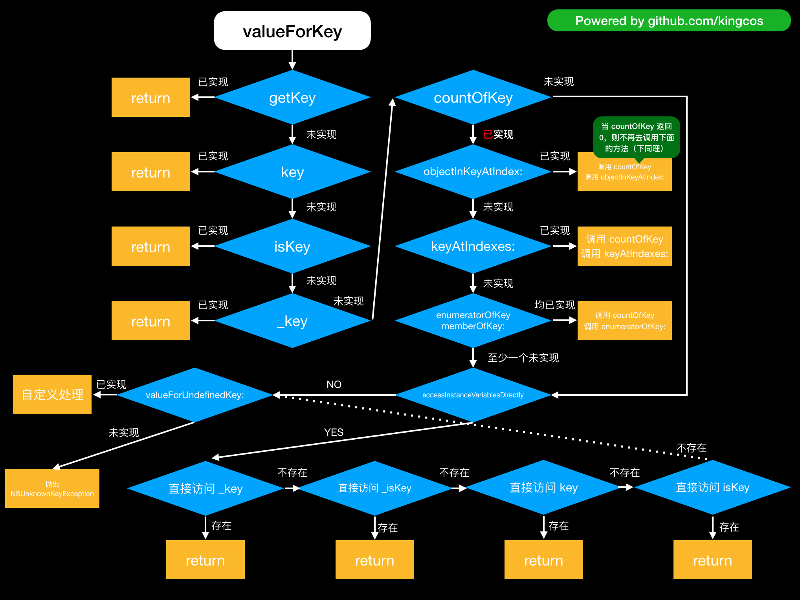

# Focus - iOS 中的 KVC

| Date | Notes |
|:-----:|:-----:|
| 2019-03-25 | 首次提交 |

## Preface

KVC，即 Key-Value Coding，译作键值编码（下文简称 KVC）。当对象兼容 KVC 时，可以通过统一的 API 访问对象中某个键对应的属性值。Cocoa 中的许多功能都依赖 KVC，比如，KVO、Cocoa 绑定机制、Core Data、以及 AppleScript 等。本文将主要探讨 KVC 及其本质相关，关于其它的内容可参考文末的「Reference」。

## Basics

### How

```objc
#import <Foundation/Foundation.h>

@interface Speaker : NSObject
@property (nonatomic) int volume;
@end

@implementation Speaker
@end

@interface Computer : NSObject
@property (nonatomic) NSString *name;
@property (nonatomic) NSArray *speakers;
@end

@implementation Computer
@end

int main(int argc, const char * argv[]) {
    @autoreleasepool {
        Computer *cpt = [[Computer alloc] init];
        // ➡️ 通过 setter 设置
        [cpt setName:@"My Mac 1"];
        // ➡️ 通过 getter 读取
        NSLog(@"name from getter - %@", [cpt name]);
        
        // ➡️ 通过 setValue:forKey: 设置
        [cpt setValue:@"My Mac 2" forKey:@"name"];
        // ➡️ 通过 valueForKey: 读取
        NSLog(@"name from KVC - %@", [cpt valueForKey:@"name"]);
        
        Speaker *s1 = [[Speaker alloc] init];
        s1.volume = 5;
        Speaker *s2 = [[Speaker alloc] init];
        s2.volume = 5;
        cpt.speakers = @[s1, s2];
        // ➡️ 通过 setValue:forKeyPath: 设置
        [cpt setValue:@10 forKeyPath:@"speakers.volume"];
        // ➡️ 通过 valueForKeyPath: 读取
        NSLog(@"speakers.volume - %@", [cpt valueForKeyPath:@"speakers.volume"]);
        
        // ➡️ dictionaryWithValuesForKeys
        NSLog(@"%@", [cpt dictionaryWithValuesForKeys:@[@"name", @"speakers"]]);
    }
    return 0;
}

// OUTPUT:
// name from getter - My Mac 1
// name from KVC - My Mac 2
// speakers.volume - (
//     10,
//     10
// )
// {
//     name = "My Mac 2";
//     speakers =     (
//         "<Speaker: 0x100501610>",
//         "<Speaker: 0x1005018f0>"
//     );
// }
```

定义一个 `Computer` 类，其拥有 `name` 和 `speakers` 属性，后者为数组类型，是容纳 `Speaker` 类型对象的集合。访问对象的属性，最自然的是通过 getter & setter，但 KVC 提供了通过键或键路径统一访问属性的方式。`setValue:forKey:` 和 `valueForKey:` 可以通过键来使用，键即是属性的名称，使用 ASCII 编码，不支持空格；`setValue:forKeyPath:` 和 `valueForKeyPath:` 是对应的键路径方法，键路径通过 `.` 连接键，对于多级嵌套的类型提供了便捷的方式。`dictionaryWithValuesForKeys:` 支持通过多个键（非键路径）的数组返回包含键和对应值的字典。

### Why

KVC 中的方法都定义在 NSObject 的 `NSKeyValueCoding` 分类（Category）中，所以所有基于 NSObject 类型的对象都是 KVC 兼容的。那么 KVC 是如何根据键或键路径来搜索匹配到属性的呢？

#### valueForKey

##### getter

```objc
@interface Computer : NSObject
@end

@implementation Computer

- (NSString *)getName {
    return [NSString stringWithFormat:@"%s", __func__];
}

- (NSString *)name {
    return [NSString stringWithFormat:@"%s", __func__];
}

- (NSString *)isName {
    return [NSString stringWithFormat:@"%s", __func__];
}

- (NSString *)_name {
    return [NSString stringWithFormat:@"%s", __func__];
}

@end

Computer *cpt = [[Computer alloc] init];
NSLog(@"%@", [cpt valueForKey:@"name"]);

// 依次注释方法代码可得：
// OUTPUT:
// -[Computer getName]
// -[Computer name]
// -[Computer isName]
// -[Computer _name]
```

当调用 `valueForKey` 方法时，首先会通过传入的 Key 按顺序寻找调用 `get<Key>`、`<key>`、`is<Key>`、`_<key>` getter **方法**，当前面的寻找到并返回后，即提前结束匹配，若该四个方法都没有实现，则进入下一阶段集合元素匹配。

##### 集合匹配

```objc
@interface Computer : NSObject {
    @public
    NSArray *_namesArray;
    NSSet *_namesSet;
}
@end

@implementation Computer

// 属性数量
- (NSUInteger)countOfNamesArray {
    NSLog(@"%@", [NSString stringWithFormat:@"%s", __func__]);
    return [_namesArray count];
}

// 数组指定下标的元素（与 namesArrayAtIndexes: 择一实现即可）
- (id)objectInNamesArrayAtIndex:(NSUInteger)index {
    NSLog(@"%@", [NSString stringWithFormat:@"%s", __func__]);
    return [_namesArray objectAtIndex:index];
}

// 数组下标集合的元素数组
- (NSArray *)namesArrayAtIndexes:(NSIndexSet *)indexes {
    NSLog(@"%@", [NSString stringWithFormat:@"%s", __func__]);
    return [_namesArray objectsAtIndexes:indexes];
}

//- (void)getNamesArray:(NSString *)namesArray range:(NSRange)range {
//    NSLog(@"%@", [NSString stringWithFormat:@"%s", __func__]);
//}

// ---

// 属性数量
- (NSUInteger)countOfNamesSet {
    NSLog(@"%@", [NSString stringWithFormat:@"%s", __func__]);
    return [_namesSet count];
}

// 集合枚举
- (NSEnumerator *)enumeratorOfNamesSet {
    NSLog(@"%@", [NSString stringWithFormat:@"%s", __func__]);
    return [_namesSet objectEnumerator];
}

// 集合成员
- (id)memberOfNamesSet:(NSSet *)namesSet {
    NSLog(@"%@", [NSString stringWithFormat:@"%s", __func__]);
    return [_namesSet member:namesSet];
}

@end

Computer *cpt = [[Computer alloc] init];
cpt->_namesArray = @[@"a", @"b", @"c"];
NSLog(@"%@", [cpt valueForKey:@"namesArray"]);

// OUTPUT:
// -[Computer countOfNamesArray]
// -[Computer countOfNamesArray]
// -[Computer objectInNamesArrayAtIndex:] or -[Computer namesArrayAtIndexes:]
// -[Computer objectInNamesArrayAtIndex:] or -[Computer namesArrayAtIndexes:]
// -[Computer objectInNamesArrayAtIndex:] or -[Computer namesArrayAtIndexes:]
// (
//     a,
//     b,
//     c
// )

cpt->_namesSet = [NSSet setWithArray:@[@"a", @"b", @"c"]];
NSLog(@"%@", [cpt valueForKey:@"namesSet"]);

// OUTPUT:
// -[Computer countOfNamesSet]
// -[Computer countOfNamesSet]
// -[Computer enumeratorOfNamesSet]
// {(
//     a,
//     b,
//     c
// )}
```

集合匹配主要是利用集合（Collection）类型的一些方法进行匹配：

1. 首先如果 `countOf<Key>` 方法（其内部本质为 NSArray 或 NSSet 的 `count`）已经被实现，跳入第 2 步，如果未被实现，则直接跳入成员变量匹配；
2. 若 `objectIn<Key>AtIndex:`（其内部本质为 NSArray 的 `objectAtIndex:`）或 `<key>AtIndexes:`（其内部本质为 NSArray 的 `objectsAtIndexes:`）两个方法中至少有一个被实现，首先会调用（两次）`countOf<Key>` 方法；之后会调用两者中被实现的方法，如果均被实现时，只会调用一次前者，并结束匹配；若该两个方法均未实现，跳入第 3 步；
3. 判断 `enumeratorOf<Key>`（其内部本质为 NSSet 的 `objectEnumerator`）和 `memberOf<Key>:`（其内部本质为 NSSet 的 `member:`）两个方法的实现，若两者都已实现，则会调用 `enumeratorOf<Key>` 并跳入下一步匹配；若有其中之一未实现，则直接跳入下一步匹配。

- 在 2 和 3 步骤中，当这些方法匹配到时，`valueForKey` 将返回一个集合代理对象。但对于空数组、空集合（Set）或非 NSArray/NSSet 类型的属性只会调用到 `countOf<key>`，当其返回 `0` 后续的方法便不会再调用了。

> ⚠️ 注意
> 
> 官方文档中提到在上述第 2 步中，如果对象实现了 `get<Key>:range:` 方法，代理对象也会在合适的时机调用该方法以达到更好的性能。但我在尝试中，在 `objectIn<Key>AtIndex:` 或 `<key>AtIndexes:` 中有被实现的方法时，即会在 `countOf<Key>` 方法被调用后，调用 `get<Key>:range:` 方法，但会发生崩溃：「Thread 1: EXC_BAD_ACCESS」。具体的原因尚未查明，欢迎大家指教。

#### 成员变量匹配

```objc
@interface Computer : NSObject {
    @public
    NSString *_name;
    NSString *_isName;
    NSString *name;
    NSString *isName;
}
@end

@implementation Computer
@end

Computer *cpt = [[Computer alloc] init];

cpt->_name = @"a";
cpt->_isName = @"b";
cpt->name = @"c";
cpt->isName = @"d";

NSLog(@"%@", [cpt valueForKey:@"name"]);

// 依次注释方法和成员变量代码可得：
// OUTPUT:
// a
// b
// c
// d
```

在成员变量匹配阶段首先判断 `accessInstanceVariablesDirectly` 方法的返回，即是否允许直接访问成员变量，默认返回 `YES`；当为 `YES` 时，将按顺序尝试直接访问 `_<key>`、`_is<Key>`、`<key>`、`is<Key>` 成员变量。当为 `NO` 或没有匹配到相应的成员变量时，将调用 `valueForUndefinedKey:` 方法，该方法默认实现为抛出「NSUnknownKeyException」异常，但子类可以重写该方法以提供更灵活的行为。

```objc
@interface Computer : NSObject
@end

@implementation Computer

- (id)valueForUndefinedKey:(NSString *)key {
    NSLog(@"%@", [NSString stringWithFormat:@"%s", __func__]);
    if ([key isEqualToString:@"name"]) {
        return nil;
    }
    
    return [super valueForUndefinedKey:key];
}

@end

Computer *cpt = [[Computer alloc] init];
NSLog(@"%@", [cpt valueForKey:@"name"]);

// OUTPUT:
// -[Computer valueForUndefinedKey:]
// (null)
```

##### 总结

KVC `valueForKey:` 方法的调用确实深究起来比较复杂，画成图表更容易理解些：



#### setValue:forKey:

```objc
@interface Computer : NSObject
@end

@implementation Computer

- (void)setName:(NSString *)name {
    NSLog(@"%@", [NSString stringWithFormat:@"%s", __func__]);
    _name = name;
}

- (void)_setName:(NSString *)name {
    NSLog(@"%@", [NSString stringWithFormat:@"%s", __func__]);
    _name = name;
}

@end

// 依次注释方法代码可得：
// OUTPUT:
// -[Computer setName:] or -[Computer _setName:]
// a
```

当调用 `setValue:forKey:` 方法时，会通过传入的 Key 按顺序寻找调用 `set<Key>`、`_set<Key>` 方法，当前面的寻找到并设置后，即提前返回。

```objc
@interface Computer : NSObject {
    @public
    NSString *_name;
    NSString *_isName;
    NSString *name;
    NSString *isName;
}
@end

@implementation Computer

@end

// 依次注释成员变量代码可得：
// OUTPUT:
// a
// a
// a
// a
```

若这两个方法都没有实现，则会判断 `accessInstanceVariablesDirectly` 方法的返回，即是否允许直接访问成员变量，默认返回 YES；当为 YES 时，将按顺序尝试直接通过 `_<key>`、`_is<Key>`、`<key>`、`is<Key>` 成员变量设置值。当为 NO 或没有匹配到相应的成员变量时，将调用 `setValue:forUndefinedKey:` 方法，该方法默认实现为抛出「NSUnknownKeyException」异常，但子类可以重写该方法以提供更灵活的行为。

```objc
@interface Computer : NSObject
@end

@implementation Computer

- (void)setValue:(id)value forUndefinedKey:(NSString *)key {
    NSLog(@"%@", [NSString stringWithFormat:@"%s", __func__]);
    if ([key isEqualToString:@"name"]) {
        return;
    }
    
    return [super setValue:value forUndefinedKey:key];
}

@end

Computer *cpt = [[Computer alloc] init];
[cpt setValue:@"a" forKey:@"name"];
NSLog(@"%@", [cpt valueForKey:@"name"]);

// OUTPUT:
// -[Computer setValue:forUndefinedKey:]
// -[Computer valueForUndefinedKey:]
// (null)
```

## mutableValueForKey

### How

```objc
Computer *cpt = [[Computer alloc] init];

Speaker *s1 = [[Speaker alloc] init];
s1.volume = @1;
Speaker *s2 = [[Speaker alloc] init];
s1.volume = @2;

cpt.speakers = @[s1, s2];

NSMutableArray *arr = [cpt mutableArrayValueForKeyPath:@"speakers"];

Speaker *s3 = [[Speaker alloc] init];
s3.volume = @20;

[arr addObject:s3];

NSLog(@"%@", [cpt mutableArrayValueForKey:@"speakers"]);

// OUTPUT:
// (
//     "<Speaker: 0x100505220>",
//     "<Speaker: 0x1005021a0>",
//     "<Speaker: 0x100502180>"
// )
```

对于对象中的集合类型 `NSArray`、`NSSet`、`NSOrderedSet`，KVC 提供了比 `setValue:forKey:` 和 `valueForKey:` 更便捷高效的 `mutableArrayValueForKey:`、`mutableSetValueForKey`、`mutableOrderedSetValueForKey:` 以及对应的 `KeyPath` 方法。它们都会返回一个可变（Mutable）类型的代理对象，在该代理对象上的操作将影响真实的属性值。

### Why

```objc
@interface Computer : NSObject {
	@public
	NSMutableArray *_speakers;
}
@end

@implementation Computer
- (void)insertObject:(id)value inSpeakersAtIndex:(NSUInteger)index {
    NSLog(@"%@", [NSString stringWithFormat:@"%s", __func__]);
    [_speakers insertObject:value atIndex:index];
}

- (void)removeObjectFromSpeakersAtIndex:(NSUInteger)index {
    NSLog(@"%@", [NSString stringWithFormat:@"%s", __func__]);
    [_speakers removeObjectAtIndex:index];
}

- (void)insertSpeakers:(id)object atIndexes:(NSIndexSet *)indexes {
    NSLog(@"%@", [NSString stringWithFormat:@"%s", __func__]);
    [_speakers insertObjects:@[object] atIndexes:indexes];
}

- (void)removeSpeakersAtIndexes:(NSIndexSet *)indexes {
    NSLog(@"%@", [NSString stringWithFormat:@"%s", __func__]);
    [_speakers removeObjectsAtIndexes:indexes];
}
@end

Computer *cpt = [[Computer alloc] init];

Speaker *s1 = [[Speaker alloc] init];
s1.volume = @1;
Speaker *s2 = [[Speaker alloc] init];
s1.volume = @2;

cpt->_speakers = [@[s1, s2] mutableCopy];

NSMutableArray *arr = [cpt mutableArrayValueForKey:@"speakers"];

Speaker *s3 = [[Speaker alloc] init];
s3.volume = @20;

Speaker *s4 = [[Speaker alloc] init];
s4.volume = @30;

[arr addObjectsFromArray:@[s3, s4]];

NSLog(@"%@", [cpt mutableArrayValueForKey:@"speakers"]);

// OUTPUT:
// -[Computer insertObject:inSpeakersAtIndex:]
// -[Computer insertObject:inSpeakersAtIndex:]
// (
//     "<Speaker: 0x10068cb00>",
//     "<Speaker: 0x10067a880>",
//     "<Speaker: 0x100705430>",
//     "<Speaker: 0x100705020>"
// )
```

当调用 `mutableArrayValueForKey:` 会首先寻找 `insertObject:in<key>AtIndex:`（其内部本质为 NSMutableArray 的 `insertObject:atIndex:`）、`removeObjectFrom<key>AtIndex:`（其内部本质为 NSMutableArray 的 `removeObjectAtIndex:`）、`insertSpeakers:atIndexes:`（其内部本质为 NSMutableArray 的 `insertObjects:atIndexes:`）、`removeKeyAtIndexes:`（其内部本质为 NSMutableArray 的 `removeObjectsAtIndexes:`），判断这四个方法中是否有至少一个插入和一个移除方法被实现，如果有，将返回 NSMutableArray 类型的代理对象，并通过调用已实现的插入和移除方法对实际的数组进行操作。

```objc
@implementation Computer

- (void)setSpeakers:(NSMutableArray *)speakers {
    NSLog(@"%@", [NSString stringWithFormat:@"%s", __func__]);
    _speakers = speakers;
}

@end

// OUTPUT:
// -[Computer setSpeakers:]
// -[Computer setSpeakers:]
// (
//     "<Speaker: 0x101808b90>",
//     "<Speaker: 0x10180da20>",
//     "<Speaker: 0x100613c00>",
//     "<Speaker: 0x100613260>"
// )
```

如果上述四个方法不符合至少一个插入和一个移除方法被实现，将寻找 setter `setKey:` 方法实现，若存在该实现，代理对象将通过它设置值。但若这一阶段的效率将低于上一阶段，因为每次更新数据都需要创建新的一个数组对象。

```objc
@interface Computer : NSObject {
    @public
    NSMutableArray *_speakers;
    NSMutableArray *speakers;
}
@end

@implementation Computer
@end

// 注释成员变量声明可得到同样的结果：
// OUTPUT:
// (
//     "<Speaker: 0x100601550>",
//     "<Speaker: 0x100604800>",
//     "<Speaker: 0x100606190>",
//     "<Speaker: 0x100600bd0>"
// )
```

若 setter 也不存在，将会判断 `accessInstanceVariablesDirectly` 方法的返回，即是否允许直接访问成员变量，默认返回 YES；当为 YES 时，代理对象将按顺序尝试直接通过 `_<key>`、`<key>` 成员变量设置值。当为 NO 或没有匹配到相应的成员变量时，官方文档称将调用 `setValue:forUndefinedKey:` 方法，该方法默认实现为抛出「NSUnknownKeyException」异常，但子类可以重写该方法以提供更灵活的行为。

```objc
@interface Computer : NSObject
@end

@implementation Computer
- (id)valueForUndefinedKey:(NSString *)key {
    NSLog(@"%@", [NSString stringWithFormat:@"%s", __func__]);
    return [super valueForUndefinedKey:key];
}

- (void)setValue:(id)value forUndefinedKey:(NSString *)key {
    NSLog(@"%@", [NSString stringWithFormat:@"%s", __func__]);
    return [super setValue:value forUndefinedKey:key];
}
@end

Speaker *s3 = [[Speaker alloc] init];
s3.volume = @20;

[arr addObject:s3];

// OUTPUT:
// -[Computer valueForUndefinedKey:]
// *** Terminating app due to uncaught exception 'NSUnknownKeyException', reason: '[<Computer 0x1005426d0> valueForUndefinedKey:]: this class is not key value coding-compliant for the key speakers.'
```

但其实经过测试，对代理对象进行插入操作，将首先进入 `valueForUndefinedKey:`，若该 key 无法匹配，将抛出「NSUnknownKeyException」异常，若这一步骤未抛出异常，才将会进入到 `setValue:forUndefinedKey:`。原因我认为是当我们对代理对象进行插入操作时，首先要获得其中原本的元素，所以此时如果无法匹配，将抛出异常提前终止。

## 集合操作符

对于对象中的集合类型，KVC 提供了一些可以放置在键路径中的操作符，由 `@` 开头，整体结构为：`左键路径.@集合操作符.右键路径`，当然，左右键路径都可以根据需要选择是否忽略。集合操作符分为三种：聚合（Aggregation）操作符、数组操作符、嵌套（Nesting）操作符。

<table>
    <tr>
        <th>类型</th>
        <th>操作符</th>
        <th>作用</th>
    </tr>
    <tr>
        <td rowspan="6" align="center">聚合操作符<br>（针对数组或集合类型，最终返回反应集合某个特性的单一值）</td>
    </tr>
    <tr>
        <td><code>@avg</code></td>
        <td>将数值转换为 <code>double</code> 类型求和并计算平均值（<code>nil</code> 值为 <code>0</code>），并返回 <code>NSNumber</code> 类型的实例</td>
    </tr>
    <tr>
        <td><code>@count</code></td>
        <td>计算集合类型中的对象数量，将忽略右键路径</td>
    </tr>
    <tr>
        <td><code>@max</code></td>
        <td>内部使用 <code>compare:</code> 方法比对出最大值（忽略 <code>nil</code> 值），并返回 <code>NSNumber</code> 类型的实例</td>
    </tr>
    <tr>
        <td><code>@min</code></td>
        <td>内部使用 <code>compare:</code> 方法比对出最小值（忽略 <code>nil</code> 值），并返回 <code>NSNumber</code> 类型的实例</td>
    </tr>
    <tr>
        <td><code>@sum</code></td>
        <td>将数值转换为 <code>double</code> 类型求和（<code>nil</code> 值为 <code>0</code>），并返回 <code>NSNumber</code> 类型的实例</td>
    </tr>
    <tr>
        <td rowspan="3" align="center">数组操作符<br>（返回特定的对象数组）</td>
    </tr>
    <tr>
        <td><code>@unionOfObjects</code></td>
        <td>返回包含右键路径指定属性的对象数组（即值为 <code>nil</code> 时不会被包含进来）</td>
    </tr>
    <tr>
        <td><code>@distinctUnionOfObjects</code></td>
        <td>返回包含右键路径指定属性的对象数组（即值为 <code>nil</code> 时不会被包含进来），并去重</td>
    </tr>
    <tr>
        <td rowspan="4" align="center">嵌套操作符<br>（嵌套意为包含集合的集合）</td>
    </tr>
    <tr>
        <td><code>@unionOfArrays</code></td>
        <td>返回调用数组中所有数组中包含右键路径指定属性的对象数组（当指定属性的值为 <code>nil</code> 时，对象将返回空）</td>
    </tr>
    <tr>
        <td><code>@distinctUnionOfArrays</code></td>
        <td>返回调用数组中所有数组中包含右键路径指定属性的对象数组（当指定属性的值为 <code>nil</code> 时，对象将返回空，多个空对象也会被去重），并去重</td>
    </tr>
    <tr>
        <td><code>@distinctUnionOfSets</code></td>
        <td>返回调用集合（Set）中所有集合（Set）中包含右键路径指定属性的对象数组（即值为 <code>nil</code> 时不会被包含进来，多个空对象也会被去重），并去重</td>
    </tr>
</table>

```objc
@interface Speaker : NSObject
// ⚠️ 注意：这里将 volume 改为 NSNumber * 类型，因为 int 时，属性将有默认值 0，不便于后续结果演示
@property (nonatomic) NSNumber *volume;
@end

@implementation Speaker
@end

// main()
Computer *cpt1 = [[Computer alloc] init];
Speaker *s1 = [[Speaker alloc] init];
s1.volume = @1;
Speaker *s2 = [[Speaker alloc] init];
s2.volume = @2;
Speaker *s3 = [[Speaker alloc] init];
s3.volume = @2;
Speaker *s4 = [[Speaker alloc] init];
// s4.volume = nil;
Speaker *s5 = [[Speaker alloc] init];
s5.volume = @5;

[cpt1 setValue:@[s1, s2, s3, s4, s5] forKey:@"speakers"];

// Aggregation Operators:
NSLog(@"Aggregation Operators:");
NSLog(@"Volumes at avg: %.2lf", [[cpt1 valueForKeyPath:@"speakers.@avg.volume"] doubleValue]);
NSLog(@"Speakers at count: %d", [[cpt1 valueForKeyPath:@"speakers.@count"] intValue]);
NSLog(@"Volumes at max: %.2lf", [[cpt1 valueForKeyPath:@"speakers.@max.volume"] doubleValue]);
NSLog(@"Volumes at min: %.2lf", [[cpt1 valueForKeyPath:@"speakers.@min.volume"] doubleValue]);
NSLog(@"Volumes at sum: %.2lf", [[cpt1 valueForKeyPath:@"speakers.@sum.volume"] doubleValue]);

// OUTPUT:
// Aggregation Operators:
// Volumes at avg: 2.00
// Speakers at count: 5
// Volumes at max: 5.00
// Volumes at min: 1.00
// Volumes at sum: 10.00

// Array Operators:
NSLog(@"Array Operators:");
NSLog(@"%@", [cpt1.speakers valueForKeyPath:@"@unionOfObjects.volume"]);
NSLog(@"%@", [cpt1.speakers valueForKeyPath:@"@distinctUnionOfObjects.volume"]);

Computer *cpt2 = [[Computer alloc] init];
Speaker *s6 = [[Speaker alloc] init];
s6.volume = @5;
Speaker *s7 = [[Speaker alloc] init];
// s7.volume = nil;
Speaker *s8 = [[Speaker alloc] init];
s8.volume = @8;
cpt2.speakers = @[s6, s7, s8];

// OUTPUT:
// Array Operators:
// (
//     1,
//     2,
//     2,
//     5
// )
// (
//     2,
//     5,
//     1
// )

// Nesting Operators:
NSLog(@"Nesting Operators:");
NSArray *arrayOfArrays = @[cpt1.speakers, cpt2.speakers];
NSLog(@"%@", [arrayOfArrays valueForKeyPath:@"@unionOfArrays.volume"]);
NSLog(@"%@", [arrayOfArrays valueForKeyPath:@"@distinctUnionOfArrays.volume"]);

NSSet *setOfSets = [NSSet setWithArray:@[[NSSet setWithArray:cpt1.speakers], [NSSet setWithArray:cpt2.speakers]]];
NSLog(@"%@", [setOfSets valueForKeyPath:@"@distinctUnionOfSets.volume"]);

// OUTPUT:
// Nesting Operators:
// (
//     1,
//     2,
//     2,
//     "<null>",
//     5,
//     5,
//     "<null>",
//     8
// )
// (
//     5,
//     1,
//     2,
//     "<null>",
//     8
// )
// {(
//     2,
//     5,
//     8,
//     1
// )}
```

## 非对象属性

当 KVC 中的 `valueForKey:` 或 `valueForKeyPath:` 获取到的值不是 Obj-C 对象时，将会以其值初始化 	`NSNumber` 对象（针对标量（Scalar））或 `NSValue` 对象（针对结构体）并返回。

- 标量值

```objc
@interface Computer : NSObject {
    @public
    int _diskSize;
}
@end

@implementation Computer
@end

Computer *cpt = [[Computer alloc] init];
cpt->_diskSize = 512;
NSNumber *diskSizeNum = [cpt valueForKey:@"diskSize"];
NSLog(@"Disk size: %d.", [diskSizeNum intValue]);

// LLDB:
// (lldb) po object_getClass([cpt valueForKey:@"diskSize"])
// __NSCFNumber

// OUTPUT:
// Disk size: 512.
```

- 结构体

```objc
typedef struct {
    NSSize size;
    double inch;
} Screen;

@interface Computer : NSObject {
    @public
    Screen _screen;
}
@end

@implementation Computer
@end

Computer *cpt = [[Computer alloc] init];
cpt->_screen.size = NSMakeSize(1920, 1090);
cpt->_screen.inch = 15.6;

// ➡️ valueForKey
NSValue *value = [cpt valueForKey:@"screen"];

Screen screen;
[value getValue:&screen];

NSLog(@"Screen size: %.f * %.f\nScreen inch: %.1lf", screen.size.width, screen.size.height, screen.inch);

// OUTPUT:
// Screen size: 1920 * 1090
// Screen inch: 15.6

Screen retinaScreen;
retinaScreen.size = NSMakeSize(2560, 1600);
retinaScreen.inch = 13.3;

NSValue *retinaValue = [NSValue valueWithBytes:&retinaScreen objCType:@encode(Screen)];

// ➡️ setValue:forKey
[cpt setValue:retinaValue forKey:@"screen"];

NSLog(@"Screen size: %.f * %.f\nScreen inch: %.1lf", cpt->_screen.size.width, cpt->_screen.size.height, cpt->_screen.inch);

// OUTPUT:
// Screen size: 2560 * 1600
// Screen inch: 13.3
```

## 属性校验

```objc
static NSString * const kKVCValidateErrorDomain = @"kKVCValidateErrorDomain";

typedef NS_ENUM(NSUInteger, KVCValidateError) {
    KVCValidateErrorNilValue
};

@interface Computer : NSObject
@property (nonatomic) NSString *name;
@end

@implementation Computer

- (BOOL)validateValue:(inout id  _Nullable __autoreleasing *)ioValue
               forKey:(NSString *)inKey
                error:(out NSError * _Nullable __autoreleasing *)outError {
    if ([inKey isEqualToString:NSStringFromSelector(@selector(name))]) {
        if (*ioValue != nil) {
            return YES;
        } else {
            *outError = [NSError errorWithDomain:kKVCValidateErrorDomain
                                            code:KVCValidateErrorNilValue
                                        userInfo:nil];
            return NO;
        }
    }
    
    return [super validateValue:ioValue forKey:inKey error:outError];
}

@end

Computer *cpt = [[Computer alloc] init];

NSString *nilName = nil;
NSError *err;

if (![cpt validateValue:&nilName forKey:@"name" error:&err]) {
    NSLog(@"Error domain: %@, code: %ld", err.domain, (long)err.code);
} else {
    [cpt setValue:nilName forKey:@"name"];
}

// OUTPUT:
// Error domain: kKVCValidateErrorDomain, code: 0
```

KVC 中的属性校验的方法可以让我们在设置值前先进行校验，即 `validateValue:forKey:error:`。该方法会调用被观察对象的 `validateValue:forKey:error:` 方法，NSObject 中的默认实现是返回 `YES` 即不作校验。所以当我们需要校验 `value` 是否为空，需要自己实现该方法。需要注意的是，`validateValue:forKey:error:` 和 `validateValue:forKey:error:` 方法中的 `value` 和 `error` 参数均是引用传递，外界调用时要传入相应的地址 `&value` 和 `&error`，而在方法内部我们只需要在方法中将其赋值到 `*value` 和 `*error` 即可。

## Reference

- [Key-Value Coding Programming Guide](https://developer.apple.com/library/archive/documentation/Cocoa/Conceptual/KeyValueCoding/index.html)
- [Practice - iOS 中的 KVO](https://github.com/kingcos/Perspective/tree/writing/Posts/Focus/KVO_in_iOS)
