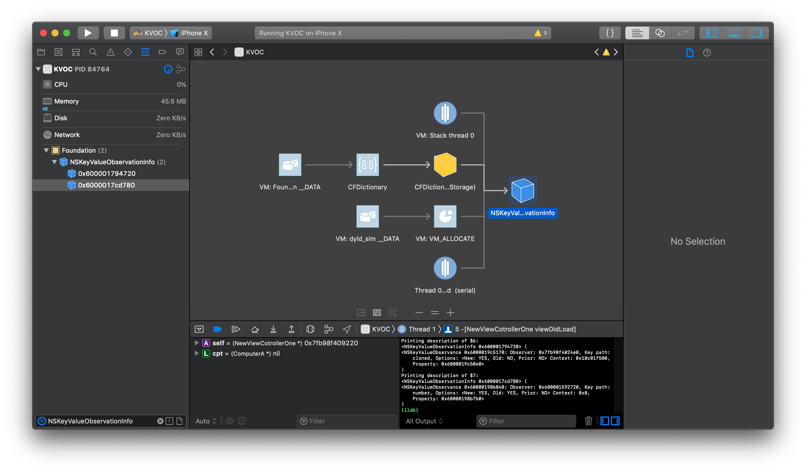
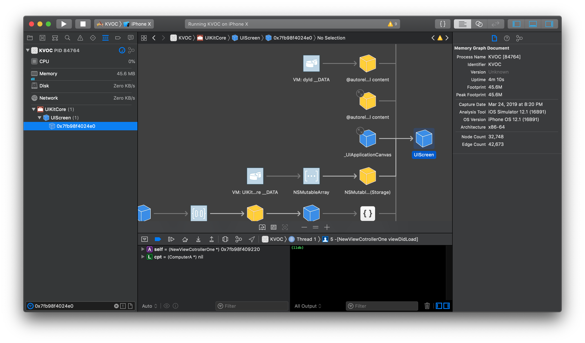
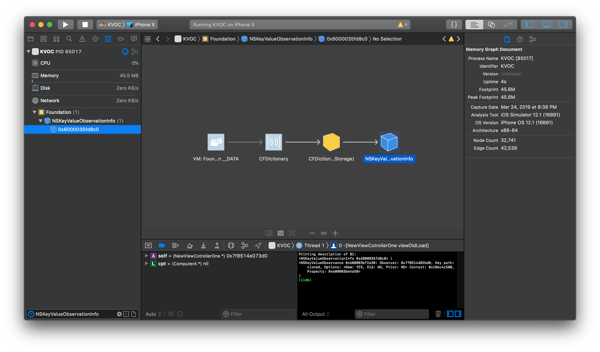
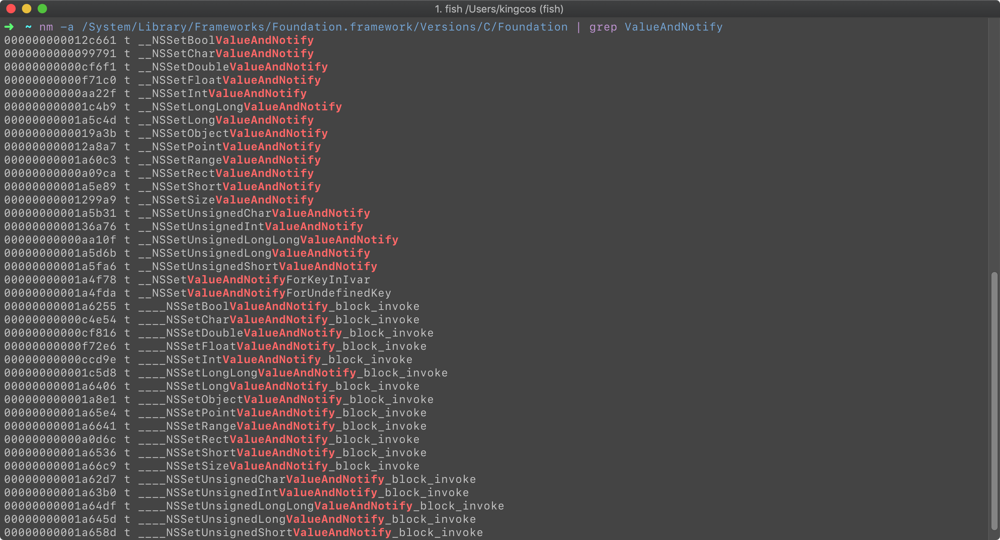
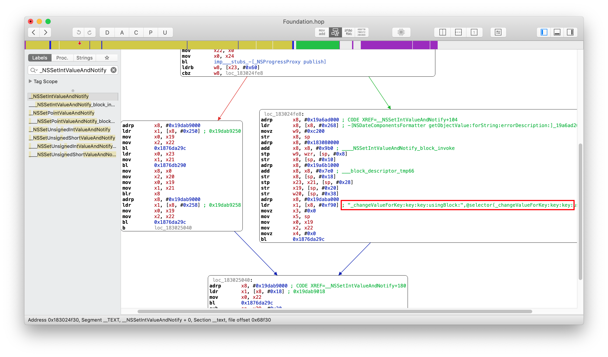
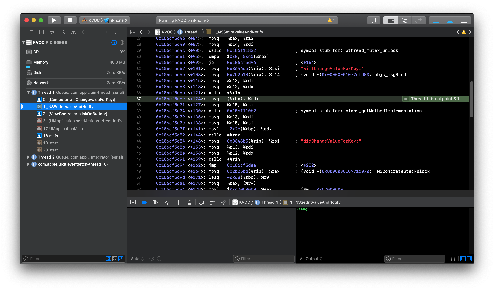

# Practice - iOS 中的 KVO 

| Date | Notes |
|:-----:|:-----:|
| 2019-03-13 | 首次提交 |

## Preface

KVO 即 Key-Value Observing，译作键值监听（下文简称 KVO），通常用于监听对象的某个特定属性值的变化。本文将由浅入深，谈谈 iOS 中的 KVO。

## How

```objc
#import "ViewController.h"

@interface Computer : NSObject
@property (nonatomic, assign) int buttonClickTimes;
@end

@implementation Computer
@end


@interface ViewController ()
@property (nonatomic, strong) Computer *cpt;
@end

@implementation ViewController

- (Computer *)cpt {
    if (!_cpt) {
        _cpt = [[Computer alloc] init];
        // ➡️ 为 cpt 属性的键路径 buttonClickTimes 增加监听者 self（该控制器）
        // options 决定监听者将同时接收到新值和旧值
        // context 决定附带的上下文信息「ViewController-buttonClickTimes」。
        [_cpt addObserver:self
               forKeyPath:@"buttonClickTimes"
                  options:NSKeyValueObservingOptionNew | NSKeyValueObservingOptionOld
                  context:@"ViewController-buttonClickTimes"];
    }
    return _cpt;
}

- (void)dealloc {
    // ➡️ 在监听者销毁前将其移除
    [self.cpt removeObserver:self forKeyPath:@"buttonClickTimes"];
}

- (IBAction)clickOnButton:(id)sender {
    self.cpt.buttonClickTimes += 1;
}

- (void)observeValueForKeyPath:(NSString *)keyPath
                      ofObject:(id)object
                        change:(NSDictionary *)change
                       context:(void *)context {
    // ➡️ 根据 context 判定
    if (context == @"ViewController-buttonClickTimes") {
        NSLog(@"%@ - %@ - %@ - %@", change, keyPath, object, context);
    } else {
        [super observeValueForKeyPath:keyPath ofObject:object change:change context:context];
    }
}

@end
```

在 `ViewController` 中，定义一个 `Computer` 类型的属性 `cpt`，并希望得知其中 `buttonClickTimes` 的每次变更。这时就可以将当前 `ViewController` 设置为 `cpt. buttonClickTimes` 的监听者；在按钮绑定的方法中，会对 `cpt.buttonClickTimes` 进行更新，所以当用户点击后，监听者就可以在 `observeValueForKeyPath:ofObject:change:context:` 中得知变更的通知；最后，在监听者销毁前，需要将其移除。

## What

简单来说，KVO 总共分为三个步骤，添加监听者、监听者得到通知、移除监听者。

```objc
// NSKeyValueObserving.h

@interface NSObject(NSKeyValueObserverRegistration)

- (void)addObserver:(NSObject *)observer forKeyPath:(NSString *)keyPath options:(NSKeyValueObservingOptions)options context:(nullable void *)context;
- (void)removeObserver:(NSObject *)observer forKeyPath:(NSString *)keyPath context:(nullable void *)context API_AVAILABLE(macos(10.7), ios(5.0), watchos(2.0), tvos(9.0));
- (void)removeObserver:(NSObject *)observer forKeyPath:(NSString *)keyPath;

@end
```

### 添加监听者

为属性添加监听者的 `addObserver:forKeyPath:options:context:` 方法中一共接收四个参数，下面来逐个分析一下。

#### observer

```objc
// NSKeyValueObserving.h

@interface NSObject(NSKeyValueObserving)

- (void)observeValueForKeyPath:(nullable NSString *)keyPath ofObject:(nullable id)object change:(nullable NSDictionary<NSKeyValueChangeKey, id> *)change context:(nullable void *)context;

@end
```

`observer` 即监听者，当监听的值发生改变后，监听者的 `observeValueForKeyPath:ofObject:change:context:` 方法就会被调用。而由于该方法定义在 Obj-C 中 NSObject 的 `NSKeyValueObserving` 分类中，所以任何 NSObject 的子类都是 KVO 兼容的。

#### keyPath

`keyPath` 即键路径。如上我们要监听 `cpt` 的 `buttonClickTimes` 属性，那么其绝对键路径就是 `cpt.buttonClickTimes`。而这里的 `keyPath` 其实是相对于被监听者的相对键路径，所以使用 `buttonClickTimes` 即可。在单一键路径时，也可以使用 `NSStringFromSelector(@selector(buttonClickTimes))` 获取 getter 的方法名作为键路径，更加安全。

如果是嵌套多个对象，则使用多个 `.` 即可，比如下例中要监听 `cpt` 的 `screen. refreshedTimes` 可以拥有两种方式进行监听：

```objc
#import "ViewController.h"

@interface Screen : NSObject
@property (nonatomic, assign) int refreshedTimes;
@end

@implementation Screen
@end

@interface Computer : NSObject
@property (nonatomic, assign) int buttonClickTimes;
@property (nonatomic, strong) Screen *screen;
@end

@implementation Computer
@end

@interface ViewController ()
@property (nonatomic, strong) Computer *cpt;
@end

@implementation ViewController

- (Computer *)cpt {
    if (!_cpt) {
        _cpt = [[Computer alloc] init];
        _cpt.screen = [[Screen alloc] init];
        
        [_cpt addObserver:self
               forKeyPath:@"buttonClickTimes" // NSStringFromSelector(@selector(buttonClickTimes))
                  options:NSKeyValueObservingOptionNew | NSKeyValueObservingOptionOld
                  context:@"ViewController - buttonClickTimes"];
        // ➡️ 监听 cpt 的 screen.refreshedTimes
        [_cpt addObserver:self
               forKeyPath:@"screen.refreshedTimes"
                  options:NSKeyValueObservingOptionNew | NSKeyValueObservingOptionOld
                  context:@"ViewController - screen.refreshedTimes"];
        // ➡️ 也可以监听 cpt.screen 的 refreshedTimes 
        // [_cpt.screen addObserver:self
        //               forKeyPath:@"refreshedTimes"
        //                  options:NSKeyValueObservingOptionNew | NSKeyValueObservingOptionOld
        //                  context:@"ViewController - screen.refreshedTimes"];
    }
    return _cpt;
}

- (void)dealloc {
    [self.cpt removeObserver:self forKeyPath:@"buttonClickTimes"];
    [self.cpt removeObserver:self forKeyPath:@"screen.refreshedTimes"];
}

- (IBAction)clickOnButton:(id)sender {
    self.cpt.buttonClickTimes += 1;
    self.cpt.screen.refreshedTimes += 1;
}

- (void)observeValueForKeyPath:(NSString *)keyPath
                      ofObject:(id)object
                        change:(NSDictionary *)change
                       context:(void *)context {
    if (context == @"ViewController - buttonClickTimes") {
        NSLog(@"%@ - %@ - %@ - %@", change, keyPath, object, context);
    } else if (context == @"ViewController - screen.refreshedTimes") {
        NSLog(@"%@ - %@ - %@ - %@", change, keyPath, object, context);
    } else {
        [super observeValueForKeyPath:keyPath ofObject:object change:change context:context];
    }
}

@end
```

需要注意的是，当 `keyPath` 为空时，编译器会警告「Null passed to a callee that requires a non-null argument」，此时监听是无意义的；当需要监听本类中无需嵌套的属性时，为 `self` 添加监听即可，若将 `keyPath` 设置为 `@""` 也是无效的。

#### options

`options` 即配置选项，其类型为 `NSKeyValueObservingOptions` 枚举，用来确定监听通知的内容和发送时机，其一共有四个枚举值，但可以通过 `|` 按位或运算符进行组合。

```objc
// NSKeyValueObserving.h
typedef NS_OPTIONS(NSUInteger, NSKeyValueObservingOptions) {
    NSKeyValueObservingOptionNew = 0x01,
    NSKeyValueObservingOptionOld = 0x02,
    NSKeyValueObservingOptionInitial API_AVAILABLE(macos(10.5), ios(2.0), watchos(2.0), tvos(9.0)) = 0x04,
    NSKeyValueObservingOptionPrior API_AVAILABLE(macos(10.5), ios(2.0), watchos(2.0), tvos(9.0)) = 0x08
};
```

在四个枚举值中，`NSKeyValueObservingOptionNew` 和 `NSKeyValueObservingOptionOld` 选项决定了监听者接收改变前的值和改变后的值，使用 `NSKeyValueChangeNewKey` 和 `NSKeyValueChangeOldKey` 即可取得 `change` 中对应的值：

```objc
- (void)observeValueForKeyPath:(NSString *)keyPath
                      ofObject:(id)object
                        change:(NSDictionary *)change
                       context:(void *)context {
    if (context == @"ViewController - buttonClickTimes") {
        NSLog(@"New: %@, old: %@ - %@ - %@ - %@", change[NSKeyValueChangeNewKey], change[NSKeyValueChangeOldKey], keyPath, object, context);
    } else if (context == @"ViewController - screen.refreshedTimes") {
        NSLog(@"New: %@, old: %@ - %@ - %@ - %@", change[NSKeyValueChangeNewKey], change[NSKeyValueChangeOldKey], keyPath, object, context);
    } else {
        [super observeValueForKeyPath:keyPath ofObject:object change:change context:context];
    }
}

// OUTPUT:
// New: 1, old: 0 - buttonClickTimes - <Computer: 0x600001a1c3e0> - ViewController - buttonClickTimes
// New: 1, old: 0 - refreshedTimes - <Screen: 0x600001844680> - ViewController - screen.refreshedTimes
```

`NSKeyValueObservingOptionInitial` 选项可以当添加监听者后立刻收到仅且一次的通知。

```objc
[_cpt addObserver:self
       forKeyPath:NSStringFromSelector(@selector(buttonClickTimes))
          options:NSKeyValueObservingOptionNew | NSKeyValueObservingOptionOld | NSKeyValueObservingOptionInitial
          context:@"ViewController - buttonClickTimes"];

// ➡️ 首次触发是由于添加了监听者而无需改变值，NSKeyValueObservingOptionInitial 会立刻触发
// 注意如果加了 NSKeyValueObservingOptionNew | NSKeyValueObservingOptionOld 选项，则新值为添加时属性的值，旧值为空
// New: 0, old: (null) - buttonClickTimes - <Computer: 0x6000016464c0> - ViewController - buttonClickTimes
// ➡️ buttonClickTimes 增加，监听者接收到通知
// New: 1, old: 0 - buttonClickTimes - <Computer: 0x6000016464c0> - ViewController - buttonClickTimes
```

`NSKeyValueObservingOptionPrior` 选项可以在属性改变前，还未得到新值时收到通知。我们可以在 `change` 中 `NSKeyValueChangeNotificationIsPriorKey` 对应值里检查是否来自该选项触发。

```objc
[_cpt addObserver:self
       forKeyPath:NSStringFromSelector(@selector(buttonClickTimes))
          options:NSKeyValueObservingOptionNew | NSKeyValueObservingOptionOld | NSKeyValueObservingOptionInitial | NSKeyValueObservingOptionPrior
          context:@"ViewController - buttonClickTimes"];

// NSLog(@"New: %@, old: %@ - isPrior %@ - %@ - %@ - %@", change[NSKeyValueChangeNewKey], change[NSKeyValueChangeOldKey], change[NSKeyValueChangeNotificationIsPriorKey], keyPath, object, context);

// ➡️ NSKeyValueObservingOptionInitial：一旦添加监听者，立即触发
// New: 0, old: (null) - isPrior (null) - buttonClickTimes - <Computer: 0x60000168dd00> - ViewController - buttonClickTimes
// ➡️ NSKeyValueObservingOptionPrior：属性改变前触发
// New: (null), old: 0 - isPrior 1 - buttonClickTimes - <Computer: 0x60000168dd00> - ViewController - buttonClickTimes
// ➡️ 属性已更新为新值
// New: 1, old: 0 - isPrior (null) - buttonClickTimes - <Computer: 0x60000168dd00> - ViewController - buttonClickTimes
```

#### context

`context` 即上下文。上下文是一个在阅读中常用的词，指文章的上文与下文，编程中常用的上下文也与此类似，泛指环境条件等信息。关于此处的 `context`，主要意义是来区分不同的监听通知，在后续也可以根据 `context` 移除指定的通知。关于 `context` 的最佳实践，首先要做到唯一且私有，唯一是为了区分不同的监听通知，而私有代表其不能被外界知晓甚至随意更改。比较好的实践是将 `context` 定义为静态全局变量，只可在定义该变量的源文件（.m）中有效，防止子类或其他源文件使用，做到私有；进而将 `context` 赋值为指向其本身内存地址，做到唯一。`context` 在参数中的类型为 `void *`，则将地址转换为该类型；为了防止在同一源文件中对该变量的更改，将其声明为 `const` 保证了其本身为常量，不可更改。

```objc
static void * const kButtonClickTimesKVOContext = (void *)&kButtonClickTimesKVOContext;

if (context == kButtonClickTimesKVOContext) {
    NSLog(@"New: %@, old: %@ - isPrior %@ - %@ - %@", change[NSKeyValueChangeNewKey], change[NSKeyValueChangeOldKey], change[NSKeyValueChangeNotificationIsPriorKey], keyPath, object);
}
```

需要注意的是，`addObserver` 方法中并不会对监听者、被监听者、以及上下文进行强引用，需要我们自己来保证不会被释放。

### 监听者得到通知

```objc
@interface NSObject(NSKeyValueObserving)

- (void)observeValueForKeyPath:(nullable NSString *)keyPath ofObject:(nullable id)object change:(nullable NSDictionary<NSKeyValueChangeKey, id> *)change context:(nullable void *)context;

@end
```

监听者要实现 `NSKeyValueObserving` 分类中的 `observeValueForKeyPath:ofObject:change:context:` 方法来接收被监听对象改变的通知，其中大部分参数与添加监听者中的一致。如果监听者不实现该方法，将在运行时发生崩溃：

```objc
// *** Terminating app due to uncaught exception 'NSInternalInconsistencyException', reason: '<ViewCotroller: 0x7f859a4093e0>: An -observeValueForKeyPath:ofObject:change:context: message was received but not handled.
```

#### change

```objc
typedef NSString * NSKeyValueChangeKey NS_STRING_ENUM;

FOUNDATION_EXPORT NSKeyValueChangeKey const NSKeyValueChangeKindKey;
FOUNDATION_EXPORT NSKeyValueChangeKey const NSKeyValueChangeNewKey;
FOUNDATION_EXPORT NSKeyValueChangeKey const NSKeyValueChangeOldKey;
FOUNDATION_EXPORT NSKeyValueChangeKey const NSKeyValueChangeIndexesKey;
FOUNDATION_EXPORT NSKeyValueChangeKey const NSKeyValueChangeNotificationIsPriorKey API_AVAILABLE(macos(10.5), ios(2.0), watchos(2.0), tvos(9.0));
```

`NSKeyValueChangeKindKey` 指变更的类型，又有以下四个枚举。当被监听的对象为非集合类型时，总是为 `NSKeyValueChangeSetting`；当为集合类型时，插入、删除、替换操作分别对应其余的几个枚举。

```objc
typedef NS_ENUM(NSUInteger, NSKeyValueChange) {
    NSKeyValueChangeSetting = 1,
    NSKeyValueChangeInsertion = 2,
    NSKeyValueChangeRemoval = 3,
    NSKeyValueChangeReplacement = 4,
};
```

`NSKeyValueChangeIndexesKey` 指变更的索引，类型为 `NSIndexSet`，仅当被监听对象为集合类型时，对应变更的索引集合。

### 移除监听者

KVO 给开发者带来个很强的自由性，但移除监听者中却有不少「坑」在这里的。

#### 监听者销毁前移除监听者

```objc
Computer *cpt = [[Computer alloc] init];
[self addObserver:cpt forKeyPath:@"number" options:NSKeyValueObservingOptionNew | NSKeyValueObservingOptionOld context:nil];
// [self removeObserver:cpt forKeyPath:@"number"];
cpt = nil;
self.number += 1;

// Crash: Thread 1: EXC_BAD_ACCESS
```

我们尝试下在监听者销毁后，对被监听者的值做出改变。这时程序将崩溃，为野指针错误。这说明在系统得知被监听者改变后，尝试去寻找监听者，但此时监听者已经被销毁，其保存的内存地址已经不再是监听者了，所以发生此错误。为了比较移除监听者的作用，首先我们在未移除的代码中 `self.number += 1;` 一行打个断点，查看 Debug Memory Graph：



其中有两个 `NSKeyValueObservationInfo` 对象，尝试将它们打印出来：

```objc
// LLDB:
// Printing description of $6:
// <NSKeyValueObservationInfo 0x600001794720> (
// <NSKeyValueObservance 0x6000019c5170: Observer: 0x7fb98f4024e0, Key path: cloned, Options: <New: YES, Old: NO, Prior: NO> Context: 0x10c01f500, Property: 0x6000019c50e0>
// )
// Printing description of $7:
// <NSKeyValueObservationInfo 0x6000017cd780> (
// <NSKeyValueObservance 0x60000198b840: Observer: 0x600001592720, Key path: number, Options: <New: YES, Old: YES, Prior: NO> Context: 0x0, Property: 0x60000198b7b0>
// )
```

第一个 KVO 应该是系统在底层加入的，监听者是 `0x7fb98f4024e0`，查一下发现是 `UIScreen`，这里略过。



第二 KVO 就是我们加入的对 `number` 的监听。由于我们没有手动移除监听者，虽然监听者已经销毁，但监听关系仍然存在。所以当我们继续执行，程序将发生崩溃。

而如果令监听者在销毁前移除监听，那么 Debug Memory Graph 会是这样：



即移除了之前我们加入的监听者，所以当我们继续执行，程序将不会发生崩溃。

#### 被监听者销毁前移除监听者

由于 Apple 并没有将 KVO 开源，对于「移除监听者」我查阅了不少资料，并进行了实践。似乎在之前的系统版本中（具体不明），当未在被监听者销毁前移除监听者时，程序也将发生崩溃。但在最新的系统中，相同的测试代码却未发生崩溃。且在 Debug Memory Graph 可以看出，即使没有移除监听者，`NSKeyValueObservationInfo` 却也在被监听者销毁后销毁了。

对于此，我也在 StackOverflow 中进行了提问，希望有明白这里细节的同学多多指点。如果有了答案，我在这里也将会进行补充。

#### context

```objc
// 添加两次 KVO
[_cpt addObserver:self
       forKeyPath:NSStringFromSelector(@selector(buttonClickTimes))
          options:NSKeyValueObservingOptionNew
          context:kButtonClickTimesKVOContext1];
[_cpt addObserver:self
       forKeyPath:NSStringFromSelector(@selector(buttonClickTimes))
          options:NSKeyValueObservingOptionNew
          context:kButtonClickTimesKVOContext2];
          
- (IBAction)click:(id)sender {
    NSLog(@"---");
    // 移除一次
    [self.cpt removeObserver:self forKeyPath:NSStringFromSelector(@selector(buttonClickTimes))];
}

// kButtonClickTimesKVOContext2
// kButtonClickTimesKVOContext1
// ---
// kButtonClickTimesKVOContext1
// ---
```

`context` 是 `removeObserver:forKeyPath:context:` 的参数，与添加监听者类似，用作区分通知。当我们尝试添加两次 KVO，并在点击方法中移除而不指定 `context`，监听者收到通知会打印相应的 `context` 名。从输出可以看出 `removeObserver:forKeyPath:` 并没有移除所有的监听者。根据官方的注释：建议使用 `removeObserver:forKeyPath:context:` 取代 `removeObserver:forKeyPath:`，因为后者并未指定 `context`，将会自动猜测 `context` 指针，从而可能导致不可预知的错误。

#### 非被监听者移除监听者

```objc
// 'NSRangeException', reason: 'Cannot remove an observer <ViewController 0x7fa953c18bd0> for the key path "buttonClickTimes" from <Computer 0x6000007731e0> because it is not registered as an observer.'
```

当我们在被监听者上移除监听者，被监听者将自动恢复为非被监听者，但当此时再次尝试移除监听者时，程序将发生崩溃。所以建议和 `try/catch` 一同使用，防止多次移除引起崩溃。

```objc
@try {
    [self.cpt removeObserver:self forKeyPath:@"buttonClickTimes"];
} @catch (NSException *exception) {
    NSLog(@"%@", [exception description]);
}

// OUTPUT:
// Cannot remove an observer <ViewController 0x7f9b60d012a0> for the key path "buttonClickTimes" from <Computer 0x600002975960> because it is not registered as an observer.
```

## Why

那么 KVO 的本质什么呢？官方文档在「Key-Value Observing Implementation Details」一节中描述如下：

> Automatic key-value observing is implemented using a technique called *isa-swizzling*.
> 
> The `isa` pointer, as the name suggests, points to the object's class which maintains a dispatch table. This dispatch table essentially contains pointers to the methods(,) the class implements, among other data.
> 
> When an observer is registered for an attribute of an object(,) the isa pointer of the observed object is modified, pointing to an intermediate class rather than at the true class. As a result the value of the isa pointer does not necessarily reflect the actual class of the instance.
> 
> You should never rely on the `isa` pointer to determine class membership. Instead, you should use the class method to determine the `class` of an object instance.
> 
> —— [Key-Value Observing Implementation Details, Key-Value Observing Programming Guide, Apple](https://developer.apple.com/library/archive/documentation/Cocoa/Conceptual/KeyValueObserving/Articles/KVOImplementation.html#//apple_ref/doc/uid/20002307-BAJEAIEE)
> 
> 译：
> 
> 自动键值监听使用一项叫做 *isa 交换*的技术实现。
> 
> 顾名思义，`isa` 指针指向维护调度表的对象的类。调度表本质上包含了指向方法、类实现、以及其他数据的指针。
> 
> 若监听者注册一个对象的属性时，被监听对象的 `isa` 指针将被改变，指向一个中间类而非真正的类。因此 `isa` 指针的值并不一定反映实例的真正类。
> 
> 我们绝不应当依赖 isa 指针来确定类的成员身份，相反，我们应当使用 `class` 方法来确定一个对象实例的类。
> 
> —— [键值监听实现细节，键值监听编程指南，苹果](https://developer.apple.com/library/archive/documentation/Cocoa/Conceptual/KeyValueObserving/Articles/KVOImplementation.html#//apple_ref/doc/uid/20002307-BAJEAIEE)

```objc
[self.cpt addObserver:self
           forKeyPath:NSStringFromSelector(@selector(buttonClickTimes))
              options:NSKeyValueObservingOptionNew
              context:ButtonClickTimesKVOContext];
// LLDB:
// 注意我们这里使用了 object_getClass 来获取其类对象
// (lldb) po object_getClass(self.cpt)
// NSKVONotifying_Computer
// // 因为如官方文档所写 class 中会隐藏一些细节
// (lldb) po [self.cpt class]
// Computer
```

通过官方这一段简短的解释，其实就能找到突破口了，即 `isa`。仍然拿最初的 Demo 举例，在添加监听者之前，`cpt` 实例对象的 `isa` 指向了 `Computer` 类对象，而当添加完监听者之后，`isa` 指向了 `NSKVONotifying_Computer` 类对象，即官方文档中提到的的「中间类」。`NSKVONotifying_Computer` 并不是我们手动建立的，它是由在运行时动态生成的，尝试打印其方法列表：

```objc
- (void)printMethodList:(Class)someClass {
    unsigned int count;
    Method *methods = class_copyMethodList([someClass class], &count);
    for (int i = 0; i < count; i ++) {
        Method method = methods[i];
        SEL sel = method_getName(method);
        const char *name = sel_getName(sel);
        NSLog(@"%s", name);
    }
    free(methods);
}

// OUTPUT:
// 添加监听前：
// buttonClickTimes
// setButtonClickTimes:
// ---
// 添加监听后：
// setButtonClickTimes:
// class
// dealloc
// _isKVOA
```

我们再进一步，尝试探究一下 `NSKVONotifying_Computer` 中方法。

### class

如官方文档所述，`class` 方法返回了实例对象「真正」的类，而原因其实是因为 `NSKVONotifying_Computer` 是运行时为了实现 KVO 所自行生成的类，其目的是来管理和实现 KVO，但作为开发者，其实多数时候不必关心其内部细节，所以，在 `NSKVONotifying_Computer` 中，`class` 需要重写为返回其原本的类。

### dealloc

`dealloc` 也比较容易理解，我们虽然无法得知其中的具体实现，但 `dealloc` 通常是做一些在对象销毁前的准备工作。`NSKVONotifying_Computer` 实现该方法也是为了在销毁前将其动态创建类和对象等资源进行回收等。

### _isKVOA

```objc
// LLDB:
// (lldb) po (BOOL)[self.cpt _isKVOA]
// YES
```

`_isKVOA` 通过其方法名可以认为是一个系统内部判断对象是否为 KVO 对象的方法。

### setter

```objc
// LLDB:
// (lldb) po [self.cpt methodForSelector:@selector(setButtonClickTimes:)]
// (Foundation`_NSSetIntValueAndNotify)
```

`setButtonClickTimes:` 是 `NSKVONotifying_Computer` 中唯一和 `keyPath` 相关的方法。其 `IMP` 是 `Foundation` 中的 `_NSSetIntValueAndNotify`。注意观察该方法名，其中的 `Int` 其实是 `buttonClickTimes` 的类型，尝试在 `Foundation` 搜索一下类似的方法（`nm`，即 llvm symbol table dumper，LLVM 符号表 Dumper）：



为了能一探 `_NSSetIntValueAndNotify` 究竟，此处稍微暴力一点，使用 Hopper 将 `Foundation` 中的类 dump 出来。



其中能让我们比较熟悉的是 `willChangeValueForKey`，我们尝试在被监听者的该方法中个打个断点，就可以在 Xcode 中看到 `_NSSetIntValueAndNotify` 中先调用了 `willChangeValueForKey`，之后又调用了 `didChangeValueForKey`。



在 `didChangeValueForKey` 和 setter 中也加入断点，就可以发现它们的调用顺序是：`willChangeValueForKey` -> `setButtonClickTimes` -> `didChangeValueForKey`（并在其中通知监听者：`observeValueForKeyPath`）。

```objc
- (void)willChangeValueForKey:(NSString *)key {
    NSLog(@"willChangeValueForKey ->");
    [super willChangeValueForKey:key];
    NSLog(@"willChangeValueForKey ->");
}

- (void)setButtonClickTimes:(int)buttonClickTimes {
    NSLog(@"setButtonClickTimes ->");
    _buttonClickTimes = buttonClickTimes;
    NSLog(@"setButtonClickTimes ->");
}

- (void)didChangeValueForKey:(NSString *)key {
    NSLog(@"didChangeValueForKey ->");
    [super didChangeValueForKey:key];
    NSLog(@"didChangeValueForKey ->");
}

- (void)observeValueForKeyPath:(NSString *)keyPath
                      ofObject:(id)object
                        change:(NSDictionary *)change
                       context:(void *)context {
    NSLog(@"observeValueForKeyPath ->");
}

// OUTPUT:
// willChangeValueForKey ->
// willChangeValueForKey ->
// setButtonClickTimes ->
// setButtonClickTimes ->
// didChangeValueForKey ->
// observeValueForKeyPath ->
// didChangeValueForKey ->
```

所以综上，KVO 其实是在运行时为被监听者动态创建一个新类，并将其需要监听的属性的 setter 进行重写，在其中会先调用 `willChangeValueForKey`，进而调用存放在原本类对象中的 setter，之后再调用 `didChangeValueForKey`，并在其中通知监听者。所以 KVO 本质是对 setter 方法的加工，如果我们直接访问属性（`_cpt`）或者定义成员变量但不手动生成 getter & setter，KVO 就不会被触发。而我们想手动触发而不想改变值时，手动进行调用 `willChangeValueForKey` 和 `didChangeValueForKey` 即可（但这样的操作意义何在）。

```objc
[self.cpt willChangeValueForKey:@"buttonClickTimes"];
[self.cpt didChangeValueForKey:@"buttonClickTimes"];
```

## Reference

- [Key-Value Observing Programming Guide - Apple Inc.](https://developer.apple.com/library/archive/documentation/Cocoa/Conceptual/KeyValueObserving/KeyValueObserving.html)
- [Best practices for context parameter in addObserver (KVO) - StackOverflow](https://stackoverflow.com/questions/12719864/best-practices-for-context-parameter-in-addobserver-kvo)
- [Do I have to removeObserver in KVO manually - StackOverflow](https://stackoverflow.com/questions/19514450/do-i-have-to-removeobserver-in-kvo-manually)
- [如何优雅地使用 KVO - Draveness](https://draveness.me/kvocontroller)
- [Focus - iOS 中的 NSObject](https://github.com/kingcos/Perspective/tree/writing/Posts/Focus/NSObject_in_iOS)
- [iOS KVO原理的探究实现 - chouson_chan](https://www.jianshu.com/p/4abbf4f3b4f0)