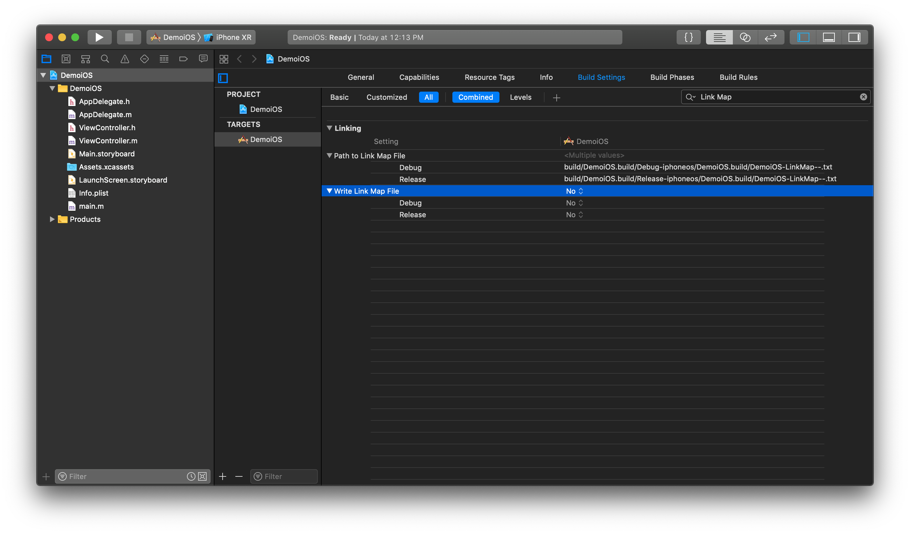
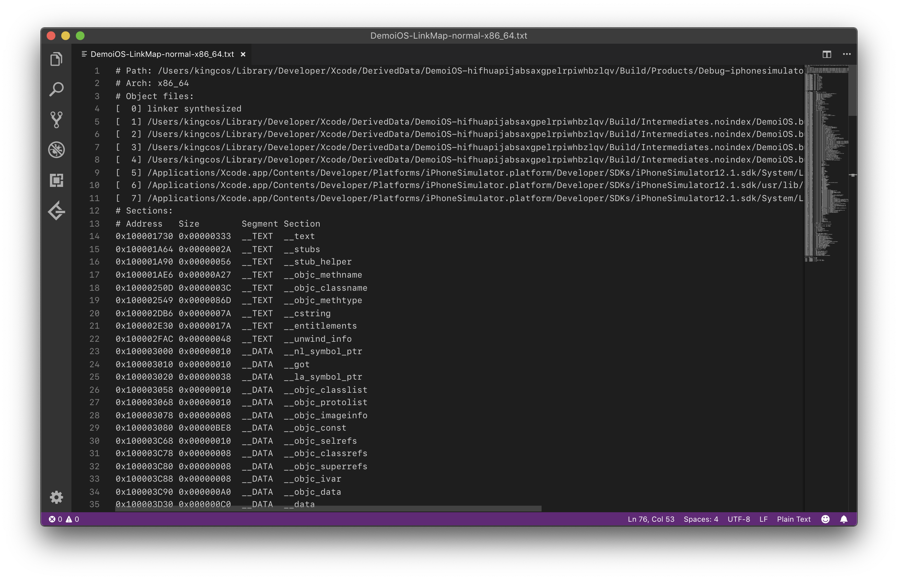
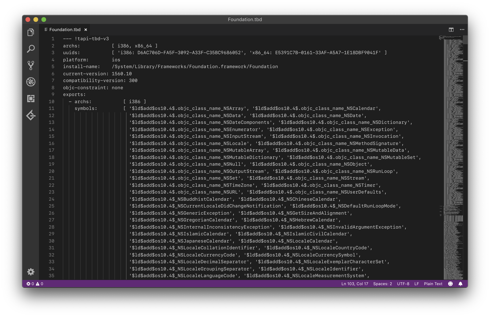

# Focus - Xcode 中的 Link Map 文件

| Date | Notes | Xcode |
|:-----:|:-----:|:-----:|
| 2019-04-01 | 首次提交 | 10.1 |

## Preface

Link Map File，译作链接映射文件（下文将称 Link Map 文件）。在构建可执行文件之前，需要先编译为目标文件（Object File），并链接所需要的其他库，那么 Link Map 文件就记录了链接器（Linker）在链接过程中产生的一些信息，本文将谈谈这个文件的构成。

## What

Xcode 中默认是不会将 Link Map 文件在构建时暴露出来的，需要我们手动在「Build Settings」-「Write Link Map File」-「Yes」打开该写入该文件的设置。这样当我们再次编译项目，默认就可以在 `~/Library/Developer/Xcode/DerivedData/<TARGET_NAME>-<Random_ID>/Build/Intermediates.noindex/<TARGET_NAME>.build/Debug-<Device_Type>/<TARGET_NAME>.build/<TARGET_NAME>-LinkMap-normal-<Arch>.txt` 中找到。如有更改 Link Map 文件路径的需求也可以在「Path to Link Map File」中更改。



举个例子，我的 DemoiOS 项目中 Link Map 文件的完整路径为：`/Users/kingcos/Library/Developer/Xcode/DerivedData/DemoiOS-hifhuapijabsaxgpelrpiwhbzlqv/Build/Intermediates.noindex/DemoiOS.build/Debug-iphonesimulator/DemoiOS.build/DemoiOS-LinkMap-normal-x86_64.txt`。

## How

下面来分析一下 Link Map 文件的构成。



### Path

```
# Path: /Users/kingcos/Library/Developer/Xcode/DerivedData/DemoiOS-hifhuapijabsaxgpelrpiwhbzlqv/Build/Products/Debug-iphonesimulator/DemoiOS.app/DemoiOS
```

Path 为最终生成「可执行文件」的路径。

### Arch

```
// Target: Simulator
# Arch: x86_64

// Target: iPhone
# Arch: arm64
```

Arch 为「可执行文件」的架构，具体架构与设备的对照可参考下表：

| Device | System | Arch |
|:---:|:---:|:---:| 
| iOS 模拟器 | iOS | x86_64 |
| 搭载 A7 及以上的 iOS 真机 | iOS | arm64（A12 架构为「arm64e」，但 Link Map 文件尚未体现） |
| 搭载 A7 以下的 iOS 真机 | iOS | armv7 |
| Apple Watch 模拟器 | watchOS | i386 |
| Apple Watch 真机 | watchOS | armv7s/arm64_32（Apple Watch S4 为「arm64_32」） |
| Mac | macOS | x86_64 |

### Object files

```
# Object files:
[  0] linker synthesized
[  1] /Users/kingcos/Library/Developer/Xcode/DerivedData/DemoiOS-hifhuapijabsaxgpelrpiwhbzlqv/Build/Intermediates.noindex/DemoiOS.build/Debug-iphonesimulator/DemoiOS.build/DemoiOS.app-Simulated.xcent
[  2] /Users/kingcos/Library/Developer/Xcode/DerivedData/DemoiOS-hifhuapijabsaxgpelrpiwhbzlqv/Build/Intermediates.noindex/DemoiOS.build/Debug-iphonesimulator/DemoiOS.build/Objects-normal/x86_64/ViewController.o
[  3] /Users/kingcos/Library/Developer/Xcode/DerivedData/DemoiOS-hifhuapijabsaxgpelrpiwhbzlqv/Build/Intermediates.noindex/DemoiOS.build/Debug-iphonesimulator/DemoiOS.build/Objects-normal/x86_64/main.o
[  4] /Users/kingcos/Library/Developer/Xcode/DerivedData/DemoiOS-hifhuapijabsaxgpelrpiwhbzlqv/Build/Intermediates.noindex/DemoiOS.build/Debug-iphonesimulator/DemoiOS.build/Objects-normal/x86_64/AppDelegate.o
[  5] /Applications/Xcode.app/Contents/Developer/Platforms/iPhoneSimulator.platform/Developer/SDKs/iPhoneSimulator12.1.sdk/System/Library/Frameworks//Foundation.framework/Foundation.tbd
[  6] /Applications/Xcode.app/Contents/Developer/Platforms/iPhoneSimulator.platform/Developer/SDKs/iPhoneSimulator12.1.sdk/usr/lib/libobjc.tbd
[  7] /Applications/Xcode.app/Contents/Developer/Platforms/iPhoneSimulator.platform/Developer/SDKs/iPhoneSimulator12.1.sdk/System/Library/Frameworks//UIKit.framework/UIKit.tbd
```

Object files 为「目标文件」，该部分列出了所有的目标文件、记录系统动态库信息的文件等，其中第一列为序号，也对应了下面「Symbols」部分中的「File」一列。

| No. | File | Notes |
|:---:|:---:|:---:|
| 0 | linker synthesized | 链接器合成所需要的数据。 |
| 1 | DemoiOS.app-Simulated.xcent | xcent 是 XML 1.0 文档文本文件，可以使用编辑器直接打开。其中存储了 `application-identifier` 和 `keychain-access-groups`，但该行仅在模拟器作为构建目标时存在。 | 
| 2~4 | *.o | 编译后的目标文件 |
| 5~7 | *.tbd | tbd 是文本基础（Text-based）文件，也可以用编辑器打开，其中包含了动态库的信息，例如系统 Foundation.tbd 如下图 |



### Sections

```
# Sections:
# Address	Size    	Segment	Section
0x100001730	0x00000333	__TEXT	__text           // 代码段
0x100001A64	0x0000002A	__TEXT	__stubs          // 符号桩
0x100001A90	0x00000056	__TEXT	__stub_helper    // 辅助函数
0x100001AE6	0x00000A27	__TEXT	__objc_methname  // 方法名
0x10000250D	0x0000003C	__TEXT	__objc_classname // 类名
0x100002549	0x0000086D	__TEXT	__objc_methtype  // 方法类型
0x100002DB6	0x0000007A	__TEXT	__cstring        // 字符串
0x100002E30	0x0000017A	__TEXT	__entitlements
0x100002FAC	0x00000048	__TEXT	__unwind_info    // 存储处理异常的信息
0x100003000	0x00000010	__DATA	__nl_symbol_ptr  // 非懒绑定的指针符号表
0x100003010	0x00000010	__DATA	__got
0x100003020	0x00000038	__DATA	__la_symbol_ptr  // 懒绑定的指针符号表
0x100003058	0x00000010	__DATA	__objc_classlist // 类列表
0x100003068	0x00000010	__DATA	__objc_protolist // 协议列表
0x100003078	0x00000008	__DATA	__objc_imageinfo // 镜像信息
0x100003080	0x00000BE8	__DATA	__objc_const     // 常量
0x100003C68	0x00000010	__DATA	__objc_selrefs   // self 引用
0x100003C78	0x00000008	__DATA	__objc_classrefs // 类引用
0x100003C80	0x00000008	__DATA	__objc_superrefs // 父类引用
0x100003C88	0x00000008	__DATA	__objc_ivar      // 成员变量
0x100003C90	0x000000A0	__DATA	__objc_data      // 数据
0x100003D30	0x000000C0	__DATA	__data           // 数据段
```

Sections 中主要描述了节（Section）相关的信息，分为四列：内存地址、大小、段（Segment）、节。每一行的地址为上一行初始地址 + 内存大小（+ 偏移量）。`__TEXT` 和 `__DATA` 标示了段信息，并各自对应多个节信息。`__TEXT` 为只读代码段，存储了可执行的代码信息，`__DATA` 为数据段，存储了可读写但不可执行的数据。关于此处更为详细的信息，之后将在「Mach-O」专题中讲述。

### Symbols

```
# Symbols:
# Address	Size    	File  Name
0x100001730	0x0000003C	[  2] -[ViewController viewDidLoad]
0x100001770	0x00000092	[  3] _main
0x100001810	0x00000080	[  4] -[AppDelegate application:didFinishLaunchingWithOptions:]
0x100001890	0x00000040	[  4] -[AppDelegate applicationWillResignActive:]
0x1000018D0	0x00000040	[  4] -[AppDelegate applicationDidEnterBackground:]
0x100001910	0x00000040	[  4] -[AppDelegate applicationWillEnterForeground:]
0x100001950	0x00000040	[  4] -[AppDelegate applicationDidBecomeActive:]
0x100001990	0x00000040	[  4] -[AppDelegate applicationWillTerminate:]
0x1000019D0	0x00000020	[  4] -[AppDelegate window]
0x1000019F0	0x00000040	[  4] -[AppDelegate setWindow:]
0x100001A30	0x00000033	[  4] -[AppDelegate .cxx_destruct]
0x100001A64	0x00000006	[  5] _NSStringFromClass
0x100001A6A	0x00000006	[  7] _UIApplicationMain
0x100001A70	0x00000006	[  6] _objc_autoreleasePoolPop
0x100001A76	0x00000006	[  6] _objc_autoreleasePoolPush
0x100001A7C	0x00000006	[  6] _objc_msgSendSuper2
0x100001A82	0x00000006	[  6] _objc_retainAutoreleasedReturnValue
0x100001A88	0x00000006	[  6] _objc_storeStrong
0x100001A90	0x00000010	[  0] helper helper
0x100001AA0	0x0000000A	[  5] _NSStringFromClass
0x100001AAA	0x0000000A	[  6] _objc_autoreleasePoolPop
0x100001AB4	0x0000000A	[  6] _objc_autoreleasePoolPush
0x100001ABE	0x0000000A	[  6] _objc_msgSendSuper2
0x100001AC8	0x0000000A	[  6] _objc_retainAutoreleasedReturnValue
0x100001AD2	0x0000000A	[  6] _objc_storeStrong
0x100001ADC	0x0000000A	[  7] _UIApplicationMain
0x100001AE6	0x0000000C	[  2] literal string: viewDidLoad
0x100001AF2	0x00000006	[  3] literal string: class
0x100001AF8	0x00000009	[  4] literal string: isEqual:
0x100001B01	0x00000005	[  4] literal string: self
0x100001B06	0x00000011	[  4] literal string: performSelector:
0x100001B17	0x0000001C	[  4] literal string: performSelector:withObject:
0x100001B33	0x00000027	[  4] literal string: performSelector:withObject:withObject:
0x100001B5A	0x00000008	[  4] literal string: isProxy
0x100001B62	0x0000000F	[  4] literal string: isKindOfClass:
0x100001B71	0x00000011	[  4] literal string: isMemberOfClass:
0x100001B82	0x00000014	[  4] literal string: conformsToProtocol:
0x100001B96	0x00000014	[  4] literal string: respondsToSelector:
0x100001BAA	0x00000007	[  4] literal string: retain
0x100001BB1	0x00000008	[  4] literal string: release
0x100001BB9	0x0000000C	[  4] literal string: autorelease
0x100001BC5	0x0000000C	[  4] literal string: retainCount
0x100001BD1	0x00000005	[  4] literal string: zone
0x100001BD6	0x00000005	[  4] literal string: hash
0x100001BDB	0x0000000B	[  4] literal string: superclass
0x100001BE6	0x0000000C	[  4] literal string: description
0x100001BF2	0x00000011	[  4] literal string: debugDescription
0x100001C03	0x0000001F	[  4] literal string: applicationDidFinishLaunching:
0x100001C22	0x0000002C	[  4] literal string: application:willFinishLaunchingWithOptions:
0x100001C4E	0x0000002B	[  4] literal string: application:didFinishLaunchingWithOptions:
0x100001C79	0x0000001C	[  4] literal string: applicationDidBecomeActive:
0x100001C95	0x0000001D	[  4] literal string: applicationWillResignActive:
0x100001CB2	0x0000001B	[  4] literal string: application:handleOpenURL:
0x100001CCD	0x00000032	[  4] literal string: application:openURL:sourceApplication:annotation:
0x100001CFF	0x0000001D	[  4] literal string: application:openURL:options:
0x100001D1C	0x00000024	[  4] literal string: applicationDidReceiveMemoryWarning:
0x100001D40	0x0000001A	[  4] literal string: applicationWillTerminate:
0x100001D5A	0x00000022	[  4] literal string: applicationSignificantTimeChange:
0x100001D7C	0x00000035	[  4] literal string: application:willChangeStatusBarOrientation:duration:
0x100001DB1	0x0000002B	[  4] literal string: application:didChangeStatusBarOrientation:
0x100001DDC	0x00000026	[  4] literal string: application:willChangeStatusBarFrame:
0x100001E02	0x00000025	[  4] literal string: application:didChangeStatusBarFrame:
0x100001E27	0x00000031	[  4] literal string: application:didRegisterUserNotificationSettings:
0x100001E58	0x0000003E	[  4] literal string: application:didRegisterForRemoteNotificationsWithDeviceToken:
0x100001E96	0x0000003E	[  4] literal string: application:didFailToRegisterForRemoteNotificationsWithError:
0x100001ED4	0x0000002A	[  4] literal string: application:didReceiveRemoteNotification:
0x100001EFE	0x00000029	[  4] literal string: application:didReceiveLocalNotification:
0x100001F27	0x0000004F	[  4] literal string: application:handleActionWithIdentifier:forLocalNotification:completionHandler:
0x100001F76	0x00000061	[  4] literal string: application:handleActionWithIdentifier:forRemoteNotification:withResponseInfo:completionHandler:
0x100001FD7	0x00000050	[  4] literal string: application:handleActionWithIdentifier:forRemoteNotification:completionHandler:
0x100002027	0x00000060	[  4] literal string: application:handleActionWithIdentifier:forLocalNotification:withResponseInfo:completionHandler:
0x100002087	0x00000041	[  4] literal string: application:didReceiveRemoteNotification:fetchCompletionHandler:
0x1000020C8	0x0000002F	[  4] literal string: application:performFetchWithCompletionHandler:
0x1000020F7	0x0000003C	[  4] literal string: application:performActionForShortcutItem:completionHandler:
0x100002133	0x00000043	[  4] literal string: application:handleEventsForBackgroundURLSession:completionHandler:
0x100002176	0x00000032	[  4] literal string: application:handleWatchKitExtensionRequest:reply:
0x1000021A8	0x0000002D	[  4] literal string: applicationShouldRequestHealthAuthorization:
0x1000021D5	0x0000002C	[  4] literal string: application:handleIntent:completionHandler:
0x100002201	0x0000001F	[  4] literal string: applicationDidEnterBackground:
0x100002220	0x00000020	[  4] literal string: applicationWillEnterForeground:
0x100002240	0x0000002F	[  4] literal string: applicationProtectedDataWillBecomeUnavailable:
0x10000226F	0x0000002C	[  4] literal string: applicationProtectedDataDidBecomeAvailable:
0x10000229B	0x00000035	[  4] literal string: application:supportedInterfaceOrientationsForWindow:
0x1000022D0	0x00000031	[  4] literal string: application:shouldAllowExtensionPointIdentifier:
0x100002301	0x0000003F	[  4] literal string: application:viewControllerWithRestorationIdentifierPath:coder:
0x100002340	0x00000028	[  4] literal string: application:shouldSaveApplicationState:
0x100002368	0x0000002B	[  4] literal string: application:shouldRestoreApplicationState:
0x100002393	0x00000030	[  4] literal string: application:willEncodeRestorableStateWithCoder:
0x1000023C3	0x0000002F	[  4] literal string: application:didDecodeRestorableStateWithCoder:
0x1000023F2	0x0000002E	[  4] literal string: application:willContinueUserActivityWithType:
0x100002420	0x00000035	[  4] literal string: application:continueUserActivity:restorationHandler:
0x100002455	0x00000039	[  4] literal string: application:didFailToContinueUserActivityWithType:error:
0x10000248E	0x00000023	[  4] literal string: application:didUpdateUserActivity:
0x1000024B1	0x00000034	[  4] literal string: application:userDidAcceptCloudKitShareWithMetadata:
0x1000024E5	0x00000007	[  4] literal string: window
0x1000024EC	0x0000000B	[  4] literal string: setWindow:
0x1000024F7	0x0000000E	[  4] literal string: .cxx_destruct
0x100002505	0x00000008	[  4] literal string: _window
0x10000250D	0x0000000F	[  2] literal string: ViewController
0x10000251C	0x0000000C	[  4] literal string: AppDelegate
0x100002528	0x00000016	[  4] literal string: UIApplicationDelegate
0x10000253E	0x00000009	[  4] literal string: NSObject
0x100002547	0x00000002	[  4] literal string: 
0x100002549	0x00000008	[  2] literal string: v16@0:8
0x100002551	0x0000000B	[  4] literal string: B24@0:8@16
0x10000255C	0x00000008	[  4] literal string: #16@0:8
0x100002564	0x00000008	[  4] literal string: @16@0:8
0x10000256C	0x0000000B	[  4] literal string: @24@0:8:16
0x100002577	0x0000000E	[  4] literal string: @32@0:8:16@24
0x100002585	0x00000011	[  4] literal string: @40@0:8:16@24@32
0x100002596	0x00000008	[  4] literal string: B16@0:8
0x10000259E	0x0000000B	[  4] literal string: B24@0:8#16
0x1000025A9	0x0000000B	[  4] literal string: B24@0:8:16
0x1000025B4	0x00000009	[  4] literal string: Vv16@0:8
0x1000025BD	0x00000008	[  4] literal string: Q16@0:8
0x1000025C5	0x00000012	[  4] literal string: ^{_NSZone=}16@0:8
0x1000025D7	0x00000015	[  4] literal string: B24@0:8@"Protocol"16
0x1000025EC	0x00000012	[  4] literal string: @"NSString"16@0:8
0x1000025FE	0x0000000B	[  4] literal string: v24@0:8@16
0x100002609	0x0000000E	[  4] literal string: B32@0:8@16@24
0x100002617	0x00000014	[  4] literal string: B48@0:8@16@24@32@40
0x10000262B	0x00000011	[  4] literal string: B40@0:8@16@24@32
0x10000263C	0x00000011	[  4] literal string: v40@0:8@16q24d32
0x10000264D	0x0000000E	[  4] literal string: v32@0:8@16q24
0x10000265B	0x0000002D	[  4] literal string: v56@0:8@16{CGRect={CGPoint=dd}{CGSize=dd}}24
0x100002688	0x0000000E	[  4] literal string: v32@0:8@16@24
0x100002696	0x00000015	[  4] literal string: v48@0:8@16@24@32@?40
0x1000026AB	0x00000018	[  4] literal string: v56@0:8@16@24@32@40@?48
0x1000026C3	0x00000012	[  4] literal string: v40@0:8@16@24@?32
0x1000026D5	0x0000000F	[  4] literal string: v32@0:8@16@?24
0x1000026E4	0x0000000E	[  4] literal string: Q32@0:8@16@24
0x1000026F2	0x00000011	[  4] literal string: @40@0:8@16@24@32
0x100002703	0x00000012	[  4] literal string: B40@0:8@16@24@?32
0x100002715	0x00000011	[  4] literal string: v40@0:8@16@24@32
0x100002726	0x0000001A	[  4] literal string: v24@0:8@"UIApplication"16
0x100002740	0x0000002B	[  4] literal string: B32@0:8@"UIApplication"16@"NSDictionary"24
0x10000276B	0x00000024	[  4] literal string: B32@0:8@"UIApplication"16@"NSURL"24
0x10000278F	0x00000034	[  4] literal string: B48@0:8@"UIApplication"16@"NSURL"24@"NSString"32@40
0x1000027C3	0x00000035	[  4] literal string: B40@0:8@"UIApplication"16@"NSURL"24@"NSDictionary"32
0x1000027F8	0x00000020	[  4] literal string: v40@0:8@"UIApplication"16q24d32
0x100002818	0x0000001D	[  4] literal string: v32@0:8@"UIApplication"16q24
0x100002835	0x0000003C	[  4] literal string: v56@0:8@"UIApplication"16{CGRect={CGPoint=dd}{CGSize=dd}}24
0x100002871	0x00000039	[  4] literal string: v32@0:8@"UIApplication"16@"UIUserNotificationSettings"24
0x1000028AA	0x00000025	[  4] literal string: v32@0:8@"UIApplication"16@"NSData"24
0x1000028CF	0x00000026	[  4] literal string: v32@0:8@"UIApplication"16@"NSError"24
0x1000028F5	0x0000002B	[  4] literal string: v32@0:8@"UIApplication"16@"NSDictionary"24
0x100002920	0x00000032	[  4] literal string: v32@0:8@"UIApplication"16@"UILocalNotification"24
0x100002952	0x00000048	[  4] literal string: v48@0:8@"UIApplication"16@"NSString"24@"UILocalNotification"32@?<v@?>40
0x10000299A	0x00000052	[  4] literal string: v56@0:8@"UIApplication"16@"NSString"24@"NSDictionary"32@"NSDictionary"40@?<v@?>48
0x1000029EC	0x00000041	[  4] literal string: v48@0:8@"UIApplication"16@"NSString"24@"NSDictionary"32@?<v@?>40
0x100002A2D	0x00000059	[  4] literal string: v56@0:8@"UIApplication"16@"NSString"24@"UILocalNotification"32@"NSDictionary"40@?<v@?>48
0x100002A86	0x00000035	[  4] literal string: v40@0:8@"UIApplication"16@"NSDictionary"24@?<v@?Q>32
0x100002ABB	0x00000024	[  4] literal string: v32@0:8@"UIApplication"16@?<v@?Q>24
0x100002ADF	0x00000042	[  4] literal string: v40@0:8@"UIApplication"16@"UIApplicationShortcutItem"24@?<v@?B>32
0x100002B21	0x00000030	[  4] literal string: v40@0:8@"UIApplication"16@"NSString"24@?<v@?>32
0x100002B51	0x00000043	[  4] literal string: v40@0:8@"UIApplication"16@"NSDictionary"24@?<v@?@"NSDictionary">32
0x100002B94	0x00000043	[  4] literal string: v40@0:8@"UIApplication"16@"INIntent"24@?<v@?@"INIntentResponse">32
0x100002BD7	0x00000027	[  4] literal string: Q32@0:8@"UIApplication"16@"UIWindow"24
0x100002BFE	0x00000027	[  4] literal string: B32@0:8@"UIApplication"16@"NSString"24
0x100002C25	0x00000044	[  4] literal string: @"UIViewController"40@0:8@"UIApplication"16@"NSArray"24@"NSCoder"32
0x100002C69	0x00000026	[  4] literal string: B32@0:8@"UIApplication"16@"NSCoder"24
0x100002C8F	0x00000026	[  4] literal string: v32@0:8@"UIApplication"16@"NSCoder"24
0x100002CB5	0x00000040	[  4] literal string: B40@0:8@"UIApplication"16@"NSUserActivity"24@?<v@?@"NSArray">32
0x100002CF5	0x00000033	[  4] literal string: v40@0:8@"UIApplication"16@"NSString"24@"NSError"32
0x100002D28	0x0000002D	[  4] literal string: v32@0:8@"UIApplication"16@"NSUserActivity"24
0x100002D55	0x0000002E	[  4] literal string: v32@0:8@"UIApplication"16@"CKShareMetadata"24
0x100002D83	0x00000012	[  4] literal string: @"UIWindow"16@0:8
0x100002D95	0x00000015	[  4] literal string: v24@0:8@"UIWindow"16
0x100002DAA	0x0000000C	[  4] literal string: @"UIWindow"
0x100002DB6	0x00000005	[  4] literal string: hash
0x100002DBB	0x00000005	[  4] literal string: TQ,R
0x100002DC0	0x0000000B	[  4] literal string: superclass
0x100002DCB	0x00000005	[  4] literal string: T#,R
0x100002DD0	0x0000000C	[  4] literal string: description
0x100002DDC	0x00000011	[  4] literal string: T@"NSString",R,C
0x100002DED	0x00000011	[  4] literal string: debugDescription
0x100002DFE	0x00000007	[  4] literal string: window
0x100002E05	0x00000011	[  4] literal string: T@"UIWindow",&,N
0x100002E16	0x0000001A	[  4] literal string: T@"UIWindow",&,N,V_window
0x100002E30	0x0000017A	[  1] opaque_section
0x100002FAC	0x00000048	[  0] compact unwind info
0x100003000	0x00000008	[  0] non-lazy-pointer-to-local: dyld_stub_binder
0x100003008	0x00000008	[  0] non-lazy-pointer
0x100003010	0x00000008	[  0] non-lazy-pointer-to-local: _objc_msgSend
0x100003018	0x00000008	[  0] non-lazy-pointer-to-local: _objc_release
0x100003020	0x00000008	[  5] _NSStringFromClass
0x100003028	0x00000008	[  7] _UIApplicationMain
0x100003030	0x00000008	[  6] _objc_autoreleasePoolPop
0x100003038	0x00000008	[  6] _objc_autoreleasePoolPush
0x100003040	0x00000008	[  6] _objc_msgSendSuper2
0x100003048	0x00000008	[  6] _objc_retainAutoreleasedReturnValue
0x100003050	0x00000008	[  6] _objc_storeStrong
0x100003058	0x00000008	[  2] anon
0x100003060	0x00000008	[  4] anon
0x100003068	0x00000008	[  4] l_OBJC_LABEL_PROTOCOL_$_NSObject
0x100003070	0x00000008	[  4] l_OBJC_LABEL_PROTOCOL_$_UIApplicationDelegate
0x100003078	0x00000008	[  0] objc image info
0x100003080	0x00000048	[  2] l_OBJC_METACLASS_RO_$_ViewController
0x1000030C8	0x00000020	[  2] l_OBJC_$_INSTANCE_METHODS_ViewController
0x1000030E8	0x00000048	[  2] l_OBJC_CLASS_RO_$_ViewController
0x100003130	0x000001D0	[  4] l_OBJC_$_PROTOCOL_INSTANCE_METHODS_NSObject
0x100003300	0x00000020	[  4] l_OBJC_$_PROTOCOL_INSTANCE_METHODS_OPT_NSObject
0x100003320	0x00000048	[  4] l_OBJC_$_PROP_LIST_NSObject
0x100003368	0x000000A0	[  4] l_OBJC_$_PROTOCOL_METHOD_TYPES_NSObject
0x100003408	0x00000018	[  4] l_OBJC_$_PROTOCOL_REFS_UIApplicationDelegate
0x100003420	0x000004A0	[  4] l_OBJC_$_PROTOCOL_INSTANCE_METHODS_OPT_UIApplicationDelegate
0x1000038C0	0x00000018	[  4] l_OBJC_$_PROP_LIST_UIApplicationDelegate
0x1000038D8	0x00000188	[  4] l_OBJC_$_PROTOCOL_METHOD_TYPES_UIApplicationDelegate
0x100003A60	0x00000018	[  4] l_OBJC_CLASS_PROTOCOLS_$_AppDelegate
0x100003A78	0x00000048	[  4] l_OBJC_METACLASS_RO_$_AppDelegate
0x100003AC0	0x000000E0	[  4] l_OBJC_$_INSTANCE_METHODS_AppDelegate
0x100003BA0	0x00000028	[  4] l_OBJC_$_INSTANCE_VARIABLES_AppDelegate
0x100003BC8	0x00000058	[  4] l_OBJC_$_PROP_LIST_AppDelegate
0x100003C20	0x00000048	[  4] l_OBJC_CLASS_RO_$_AppDelegate
0x100003C68	0x00000008	[  2] pointer-to-literal-cstring
0x100003C70	0x00000008	[  3] pointer-to-literal-cstring
0x100003C78	0x00000008	[  3] objc-class-ref
0x100003C80	0x00000008	[  2] anon
0x100003C88	0x00000008	[  4] _OBJC_IVAR_$_AppDelegate._window
0x100003C90	0x00000028	[  2] _OBJC_CLASS_$_ViewController
0x100003CB8	0x00000028	[  2] _OBJC_METACLASS_$_ViewController
0x100003CE0	0x00000028	[  4] _OBJC_METACLASS_$_AppDelegate
0x100003D08	0x00000028	[  4] _OBJC_CLASS_$_AppDelegate
0x100003D30	0x00000060	[  4] l_OBJC_PROTOCOL_$_NSObject
0x100003D90	0x00000060	[  4] l_OBJC_PROTOCOL_$_UIApplicationDelegate
```

Symbols 中为符号（Symbol）相关的信息，分为四列：内存地址、大小、文件（序号对应 Object files 中的文件）、符号名称。通过结合「Sections」部分可以得知每一节的具体符号内容，并可以计算某个类或文件编译后的大小，帮助我们分析包体积。

### Dead Stripped Symbols

```
# Dead Stripped Symbols:
#        	Size    	File  Name
<<dead>> 	0x00000018	[  2] CIE
<<dead>> 	0x00000018	[  3] CIE
<<dead>> 	0x00000006	[  4] literal string: class
<<dead>> 	0x00000008	[  4] literal string: v16@0:8
<<dead>> 	0x00000018	[  4] CIE
```

Dead Stripped Symbols 也是和上面结构一致的符号表，但「Dead」意味着表里的符号已经不再存在，因此没有记录内存地址。

## Reference

- [TBD - fileinfo.com](https://fileinfo.com/extension/tbd)
- [深入剖析Macho (1) - SatanWoo](https://satanwoo.github.io/2017/06/13/Macho-1/)
