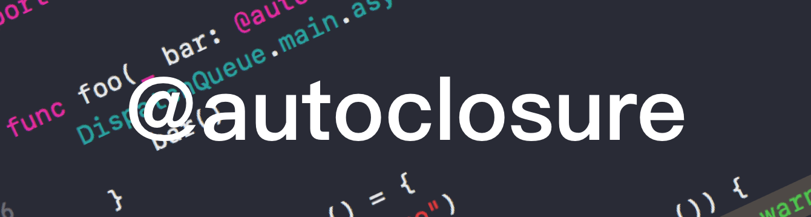

# Focus - Swift 中的 @autoclosure

| Date | Notes | Swift | Xcode | Source Code |
|:-----:|:-----:|:-----:|:-----:|:-----:|
| 2018-04-05 | 更新并明确源代码所用版本 | 4.1 | 9.3 | [Swift 4.1 Release](https://github.com/apple/swift/releases/tag/swift-4.1-RELEASE) |
| 2018-01-13 | 首次提交 | 4.0.3 | 9.2 | - |



## Preface

> Focus，即专注。笔者希望可以尽力将一些不是那么透彻的点透过 Demo 和源代码而看到其本质。由于国内软件开发仍很大程度依赖国外的语言、知识，部分术语会在文中首次提及时标注英文。笔者英文水平有限，这样的目的也是为了尽可能减少歧义，但在其中不免有所错、遗漏，还请大家多多批评、指正。
> 
> 本文及更新会首发于笔者的 GitHub 的 Perspective 仓库：[https://github.com/kingcos/Perspective](https://github.com/kingcos/Perspective)，欢迎 Star 🌟。

## What

> *Closures* are self-contained blocks of functionality that can be passed around and used in your code. Closures in Swift are similar to blocks in C and Objective-C and to lambdas in other programming languages.
> 
> — *The Swift Programming Language (Swift 4.1)*

闭包（Closure）在 Swift 等许多语言中普遍存在。熟悉 Objective-C 的同学一定对 Block 不陌生。两者其实是比较类似的，相较于 Block，闭包的写法简化了许多，也十分灵活。

在 Swift 中，`@` 开头通常代表着属性（Attribute）。`@autoclosure` 属于类型属性（Type Attribute），意味着其可以对类型（Type）作出一些限定。

## How

### 自动（Auto-）

- `@autoclosure` 名称中即明确了这是一种「自动」闭包，即可以让返回该参数类型的闭包作为参数；
- 其只可以修饰作为参数的闭包类型，但该闭包不能有参数，否则会报错：「error: argument type of @autoclosure parameter must be '()'」。

```Swift
func logIfTrue(_ predicate: () -> Bool) {
    if predicate() {
        print(#function)
    }
}

// logIfTrue(predicate: () -> Bool)
logIfTrue { 1 < 2 }

func logIfTrueWithAutoclosure(_ predicate: @autoclosure () -> Bool) {
    if predicate() {
        print(#function)
    }
}

// logIfTrueWithAutoclosure(predicate: Bool)
logIfTrueWithAutoclosure(1 < 2)

// OUTPUT:
// logIfTrue
// logIfTrueWithAutoclosure
```

### 延迟调用（Delay Evaluation）

- Swift 中的闭包会被延迟调用，即只有在真正被调用时，才被执行；
- 延迟调用特性有利于非必须执行且运算开销较大的代码；
- 该特性非 `@autoclosure` 独有，但通常搭配使用。

```Swift
var array = [1, 2, 3, 4, 5]

array.removeLast()
print(array.count)

var closureVar = { array.removeLast() }
print(array.count)

closureVar()
print(array.count)

// OUTPUT:
// 4
// 4
// 3
```

### @escaping

- 当闭包的真正执行时机可能要在其所在函数返回（Return）之后时，通常使用 `@escaping`，可以用于处理一些耗时操作的回调；
- `@autoclosure` 与 `@escaping` 是可以兼容的，放置顺序可以颠倒。

```Swift
func doWith(_ completion: () -> Void) {
    completion()
}

func doWithAutoclosureAndEscaping(_ escaper: @autoclosure @escaping () -> Void) {
    doWith {
        escaper()
    }
}

func doWithEscapingAndAutoclosure(_ escaper: @escaping @autoclosure () -> Void) {
    doWith {
        escaper()
    }
}
```

## Source Code

### Test Cases

> $SWIFT_SOURCE_CODE_PATH/test/attr/attr_autoclosure.swift

- `inout` 与 `@autoclosure` 不兼容，且没有实际意义；
- `@autoclosure` 不适用于函数的可变参数（Variadic Parameters）。

### Use Cases

> $SWIFT_SOURCE_CODE_PATH/stdlib/public/core/

#### 短路（Short Circuit）运算符

```Swift
// Bool.swift
extension Bool {
  @_inlineable // FIXME(sil-serialize-all)
  @_transparent
  @inline(__always)
  public static func && (lhs: Bool, rhs: @autoclosure () throws -> Bool) rethrows
      -> Bool {
    return lhs ? try rhs() : false
  }

  @_inlineable // FIXME(sil-serialize-all)
  @_transparent
  @inline(__always)
  public static func || (lhs: Bool, rhs: @autoclosure () throws -> Bool) rethrows
      -> Bool {
    return lhs ? true : try rhs()
  }
}

// Optional.swift
@_inlineable // FIXME(sil-serialize-all)
@_transparent
public func ?? <T>(optional: T?, defaultValue: @autoclosure () throws -> T)
    rethrows -> T {
  switch optional {
  case .some(let value):
    return value
  case .none:
    return try defaultValue()
  }
}

@_inlineable // FIXME(sil-serialize-all)
@_transparent
public func ?? <T>(optional: T?, defaultValue: @autoclosure () throws -> T?)
    rethrows -> T? {
  switch optional {
  case .some(let value):
    return value
  case .none:
    return try defaultValue()
  }
}
```

- Swift 中的 `&&`、`||` 以及 `??` 属于短路运算符，即当表达式左边的结果已经可以决定整个运算符的返回值时（运算符的本质也是函数），右边便没有必要运算。利用了 `@autoclosure` 使得运算符右边可以为闭包，再凭借 Delay Evaluation 特性保证了「短路」。

```swift
var flag = 0
var age: Int? = nil

func getAgeA() -> Int? {
    flag += 10
    return 20
}

func getAgeB() -> Int? {
    flag += 100
    return nil
}

age ?? getAgeA() ?? getAgeB()
print(flag)

// OUTPUT:
// 10
```

#### 断言（Assert）

- 断言相关的方法将某些参数设置为闭包类型，并标注了 `@autoclosure`，一是可以直接将闭包直接作为参数；二是当 Release 模式时，Closure 没有必要执行，即可节省开销（XCTest 和 Dispatch 中的部分方法同理）。

```Swift
// AssertCommon.swift
@_inlineable // FIXME(sil-serialize-all)
public // COMPILER_INTRINSIC
func _undefined<T>(
  _ message: @autoclosure () -> String = String(),
  file: StaticString = #file, line: UInt = #line
) -> T {
  _assertionFailure("Fatal error", message(), file: file, line: line, flags: 0)
}

// Assert.swift
@_inlineable // FIXME(sil-serialize-all)
@_transparent
public func assert(
  _ condition: @autoclosure () -> Bool,
  _ message: @autoclosure () -> String = String(),
  file: StaticString = #file, line: UInt = #line
) {
  // Only assert in debug mode.
  // 在 Debug 模式且条件不成立，断言失败
  if _isDebugAssertConfiguration() {
    if !_branchHint(condition(), expected: true) {
      _assertionFailure("Assertion failed", message(), file: file, line: line,
        flags: _fatalErrorFlags())
    }
  }
}

@_inlineable // FIXME(sil-serialize-all)
@_transparent
public func precondition(
  _ condition: @autoclosure () -> Bool,
  _ message: @autoclosure () -> String = String(),
  file: StaticString = #file, line: UInt = #line
) {
  // Only check in debug and release mode.  In release mode just trap.
  if _isDebugAssertConfiguration() {
    if !_branchHint(condition(), expected: true) {
      _assertionFailure("Precondition failed", message(), file: file, line: line,
        flags: _fatalErrorFlags())
    }
  } else if _isReleaseAssertConfiguration() {
    let error = !condition()
    Builtin.condfail(error._value)
  }
}

@_inlineable // FIXME(sil-serialize-all)
@inline(__always)
public func assertionFailure(
  _ message: @autoclosure () -> String = String(),
  file: StaticString = #file, line: UInt = #line
) {
  if _isDebugAssertConfiguration() {
    _assertionFailure("Fatal error", message(), file: file, line: line,
      flags: _fatalErrorFlags())
  }
  else if _isFastAssertConfiguration() {
    _conditionallyUnreachable()
  }
}

@_inlineable // FIXME(sil-serialize-all)
@_transparent
public func preconditionFailure(
  _ message: @autoclosure () -> String = String(),
  file: StaticString = #file, line: UInt = #line
) -> Never {
  // Only check in debug and release mode.  In release mode just trap.
  if _isDebugAssertConfiguration() {
    _assertionFailure("Fatal error", message(), file: file, line: line,
      flags: _fatalErrorFlags())
  } else if _isReleaseAssertConfiguration() {
    Builtin.int_trap()
  }
  _conditionallyUnreachable()
}

@_inlineable // FIXME(sil-serialize-all)
@_transparent
public func fatalError(
  _ message: @autoclosure () -> String = String(),
  file: StaticString = #file, line: UInt = #line
) -> Never {
  _assertionFailure("Fatal error", message(), file: file, line: line,
    flags: _fatalErrorFlags())
}

@_inlineable // FIXME(sil-serialize-all)
@_transparent
public func _precondition(
  _ condition: @autoclosure () -> Bool, _ message: StaticString = StaticString(),
  file: StaticString = #file, line: UInt = #line
) {
  // Only check in debug and release mode. In release mode just trap.
  if _isDebugAssertConfiguration() {
    if !_branchHint(condition(), expected: true) {
      _fatalErrorMessage("Fatal error", message, file: file, line: line,
        flags: _fatalErrorFlags())
    }
  } else if _isReleaseAssertConfiguration() {
    let error = !condition()
    Builtin.condfail(error._value)
  }
}

@_inlineable // FIXME(sil-serialize-all)
@_transparent
public func _debugPrecondition(
  _ condition: @autoclosure () -> Bool, _ message: StaticString = StaticString(),
  file: StaticString = #file, line: UInt = #line
) {
  // Only check in debug mode.
  if _isDebugAssertConfiguration() {
    if !_branchHint(condition(), expected: true) {
      _fatalErrorMessage("Fatal error", message, file: file, line: line,
        flags: _fatalErrorFlags())
    }
  }
}

@_inlineable // FIXME(sil-serialize-all)
@_transparent
public func _sanityCheck(
  _ condition: @autoclosure () -> Bool, _ message: StaticString = StaticString(),
  file: StaticString = #file, line: UInt = #line
) {
#if INTERNAL_CHECKS_ENABLED
  if !_branchHint(condition(), expected: true) {
    _fatalErrorMessage("Fatal error", message, file: file, line: line,
      flags: _fatalErrorFlags())
  }
#endif
}
```

## Summary

> It’s common to *call* functions that take autoclosures, but it’s not common to *implement* that kind of function.
> 
> **NOTE**
> 
> Overusing autoclosures can make your code hard to understand. The context and function name should make it clear that evaluation is being deferred.
>
> — *The Swift Programming Language (Swift 4.1)*

- 通常，开发者并无必要去实现带有 `@autoclosure` 的函数，如果确有必要，也需要做到明确、清晰。

## Extension

### COMPILER_INTRINSIC

> The compiler intrinsic which is called to lookup a string in a table of static string case values.（笔者译：编译器内置，即在一个静态字符串值表中查找一个字符串。）
>
> — *$SWIFT_SOURCE_CODE_PATH/stdlib/public/core/StringSwitch.swift*
> 
> In computer software, in compiler theory, an intrinsic function (or builtin function) is a function (subroutine) available for use in a given programming language which implementation is handled specially by the compiler. Typically, it may substitute a sequence of automatically generated instructions for the original function call, similar to an inline function. Unlike an inline function, the compiler has an intimate knowledge of an intrinsic function and can thus better integrate and optimize it for a given situation.（笔者译：在计算机软件领域，编译器理论中，内置函数（或称内建函数）是在给定编程语言中可以被编译器所专门处理的的函数（子程序）。通常，它可以用一系列自动生成的指令代替原来的函数调用，类似于内联函数。与内联函数不同的是，编译器更加了解内置函数，因此可以更好地整合和优化特定情况。）。
> 
> — *WikiPedia*

- COMPILER_INTRINSIC 代表其为编译器的内置函数。

> 也欢迎您关注我的微博 [@萌面大道V](http://weibo.com/375975847)

## Reference

- [apple/swift](https://github.com/apple/swift)
- [The Swift Programming Language (Swift 4.1)](https://developer.apple.com/library/content/documentation/Swift/Conceptual/Swift_Programming_Language/)
- [Short-circuit evaluation](https://en.wikipedia.org/wiki/Short-circuit_evaluation)
- [Intrinsic function](https://en.wikipedia.org/wiki/Intrinsic_function)
- [what is a compiler intrinsic function?](https://cs.stackexchange.com/questions/57116/what-is-a-compiler-intrinsic-function)
- [@AUTOCLOSURE 和 ??](http://swifter.tips/autoclosure/)
