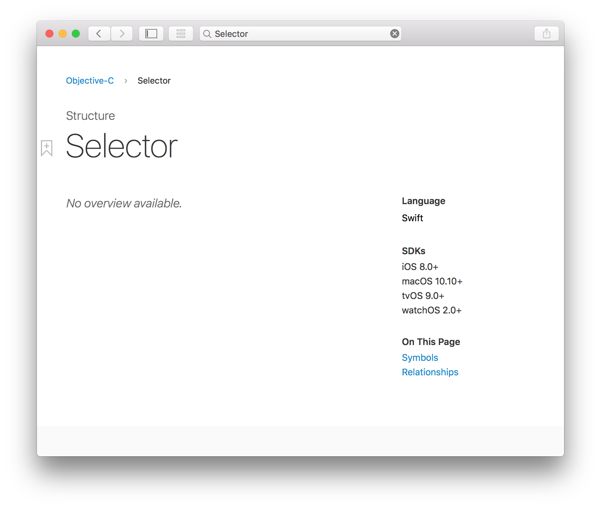

# Swift 中的 Selector

| Date | Notes | Swift | Xcode |
|:-----:|:-----:|:-----:|:-----:|
| 2017-01-31 | 首次发布（简书 & 掘金） | 3.0 | 8.2.1 |



## Preface

> Focus，即专注。笔者希望可以尽力将一些不是那么透彻的点透过 Demo 和 Source Code 而看到其本质。由于国内软件开发仍很大程度依赖国外的语言、知识，所以该博客中的术语将使用英文表述，除非一些特别统一的词汇或整段翻译时将使用中文，但也会在首次提及时标注英文。笔者英文水平有限，这样的目的也是尽可能减少歧义，但在其中不免有所错误，遗漏，还请大家多多批评、指正。
> 
> 本文及更新会首发于笔者的 GitHub 的 Perspective 仓库：[https://github.com/kingcos/Perspective](https://github.com/kingcos/Perspective)，欢迎 Star 🌟。

## What

常用纯代码来开发的同学都应该比较熟悉这个方法：

```swift
func addTarget(_ target: Any?, action: Selector, for controlEvents: UIControlEvents)
```

Selector 源自 Objective-C，例如 SEL 类型，以及 `@selector()` 方法选择器。Swift 中也兼容了这个概念，不过随着 Swift 的迭代，Selector 的一些写法也出现了很大的变化。比较遗憾的是，官方文档对于 Selector 没有介绍。


因此只能自己总结一下 Swift 3.0 中的 Selector，便有利于自己理解，也便于以后的参考。注：以下 Demo 中的 cyanButton 是用 StoryBoard 拖拽的。

## Selector 类型

Swift 中的 Selector 类型其实就是 Objective-C 中的 SEL 类型。在 Swift 中，Selector 的本质是结构体。常用的构造 Selector 类型变量的方法有以下几种：

- `public init(_ str: String)`

类似 Objective-C 中的 `NSSelectorFromString`，Swift 中的 Selector 也可以使用字符串来构造：

```swift
@IBOutlet weak var cyanButton: UIButton!

override func viewDidLoad() {
    super.viewDidLoad()

    cyanButton.addTarget(self,
                         action: Selector("cyanButtonClick"),
                         for: .touchUpInside)
}

func cyanButtonClick() {
    print(#function)
}
```

- `#selector()`

通过字符串构造 Selector 变量是一种方法，但是当在上例中 Xcode 会提示这样的警告：「Use '#selector' instead of explicitly constructing a 'Selector'」。即使用 `#selector()` 代替字符串明确构造 Selector。

```swift
@IBOutlet weak var cyanButton: UIButton!

override func viewDidLoad() {
    super.viewDidLoad()

    cyanButton.addTarget(self,
                         action: #selector(ViewController.cyanButtonClick),
                         for: .touchUpInside)
}

func cyanButtonClick() {
    print(#function)
}
```

`#selector()` 的好处是不再需要使用字符串来构造。因为当使用字符串构造时，若传入的字符串没有对应的方法名，那么程序在执行时就会直接崩溃：「unrecognized selector sent to instance」。

若当前作用域构造 Selector 的方法名**唯一**时，可以直接使用方法名，而省略作用域。

```swift
cyanButton.addTarget(self,
                     action: #selector(cyanButtonClick),
                     for: .touchUpInside)
```

若是 Swift 中的私有方法，则必须赋予其 Objective-C 的 runtime（运行时）。即在方法名前加上 `@objc`：

```swift
@IBOutlet weak var cyanButton: UIButton!
@IBOutlet weak var anotherCyanButton: UIButton!

override func viewDidLoad() {
    super.viewDidLoad()
    cyanButton.addTarget(self,
                         action: #selector(ViewController.cyanButtonClick(_:)),
                         for: .touchUpInside)

    // 当前作用域 cyanButtonClick 存在冲突，不能直接使用方法名
    //「Ambiguous use of 'cyanButtonClick'」
    // anotherCyanButton.addTarget(self,
                                action: #selector(cyanButtonClick),
                                for: .touchUpInside)
}

// 无参方法
func cyanButtonClick() {
    print(#function)
}

// 有参私有方法
@objc private func cyanButtonClick(_ button: UIButton) {
    let btnLabel = button.titleLabel?.text ?? "nil"
    print(btnLabel)
    print(#function)
}
```

当遇到上述存在歧义的相同方法名时，也可以使用**强制类型转换**来解决：

```swift
@IBOutlet weak var cyanButton: UIButton!
@IBOutlet weak var anotherCyanButton: UIButton!

override func viewDidLoad() {
    super.viewDidLoad()

    let methodA = #selector(cyanButtonClick as () -> ())
    let methodB = #selector(cyanButtonClick as (UIButton) -> ())

    cyanButton.addTarget(self,
                         action: methodA,
                         for: .touchUpInside)
    anotherCyanButton.addTarget(self,
                                action: methodB,
                                for: .touchUpInside)
}

func cyanButtonClick() {
    print(#function)
}

@objc private func cyanButtonClick(_ button: UIButton) {
    let btnLabel = button.titleLabel?.text ?? "nil"
    print(btnLabel)
    print(#function)
}
```

- `#selector()` & `Seletcor("")`

通过上面的 Demo，也可以看出 `#selector()` 更加安全、清晰，但是 `Seletcor("")` 并不是一无是处。当我们需要调用标准库中的私有方法时，只能通过字符串来构造。

为了方便测试，此处自定义了一个 `CustomViewController`。其中带有私有方法：`@objc private func privateFunc()` 以及 `func defaultFunc()`。此处使用的 `ViewController` 继承自 `CustomViewController`：

CustomViewController.swift

```swift
class CustomViewController: UIViewController {

    @objc private func privateFunc() {
        print(#function)
    }

    func defaultFunc() {
        print(#function)
    }

}
```

ViewController.swift

```swift
class ViewController: CustomViewController {

    @IBOutlet weak var cyanButton: UIButton!
    @IBOutlet weak var anotherCyanButton: UIButton!

    override func viewDidLoad() {
        super.viewDidLoad()

        cyanButton.addTarget(self,
                             action: #selector(defaultFunc),
                             for: .touchUpInside)
        anotherCyanButton.addTarget(self,
                                    action: Selector("privateFunc"),
                                    for: .touchUpInside)
    }

}
```

因为父类的私有方法对子类来说是不可见的，直接使用 `#selector()` 无法通过编译，但这个方法确实存在，所以这里只能使用字符串来构造 Selector。

当然这里 Xcode 会提示警告，但仍然可以编译通过并运行，所以这并不是官方提倡的行为。这是我在将系统边缘返回改写全屏返回时，发现私有的 `handleNavigationTransition:` 方法不能通过 `#selector()`，因此使用了字符串代替。

## Syntax Sugar

配合 Swift 的 Extension，可以使用其管理当前控制器的所有 Selector：

```swift
import UIKit

fileprivate extension Selector {
    static let redButtonClick = #selector(ViewController.redButtonClick(_:))
    static let cyanButtonClick = #selector(ViewController.cyanButtonClick)
}

class ViewController: CustomViewController {

    @IBOutlet weak var cyanButton: UIButton!
    @IBOutlet weak var redButton: UIButton!

    override func viewDidLoad() {
        super.viewDidLoad()

        cyanButton.addTarget(self,
                             action: .cyanButtonClick,
                             for: .touchUpInside)
        redButton.addTarget(self,
                                    action: .redButtonClick,
                                    for: .touchUpInside)
    }

    func cyanButtonClick() {
        print(#function)
    }

    func redButtonClick(_ button: UIButton) {
        let btnLabel = button.titleLabel?.text ?? "nil"
        print(btnLabel)
        print(#function)
    }

}
```

## getter & setter

Swift 3.0 中加入了 Selector 引用变量（不可为常量）的 getter 和 setter 方法：

```swift
class Person: NSObject {
    dynamic var firstName: String
    dynamic let lastName: String
    dynamic var fullName: String {
        return "\(firstName) \(lastName)"
    }

    init(firstName: String, lastName: String) {
        self.firstName = firstName
        self.lastName = lastName
    }
}


fileprivate extension Selector {
    static let firstNameGetter = #selector(getter: Person.firstName)
    static let firstNameSetter = #selector(setter: Person.firstName)
}
```

## Reference

- [Using Swift with Cocoa and Objective-C (Swift 3.0.1)](https://developer.apple.com/library/content/documentation/Swift/Conceptual/BuildingCocoaApps/InteractingWithObjective-CAPIs.html#//apple_ref/doc/uid/TP40014216-CH4-XID_26)
- [SE-0022](https://github.com/apple/swift-evolution/blob/master/proposals/0022-objc-selectors.md)
- [SELECTOR](http://swifter.tips/selector/)
- [Swift: Selector Syntax Sugar](https://medium.com/swift-programming/swift-selector-syntax-sugar-81c8a8b10df3#.pkwxpy65w)
- [Swift：Selector 语法糖](http://swift.gg/2016/06/02/swift-selector-syntax-sugar/)
- [#selector() and the responder chain](http://swiftandpainless.com/selector-and-the-responder-chain/)
- [#selector() 和响应链](http://swift.gg/2016/04/20/selector-and-the-responder-chain/)
- [SE-0064](https://github.com/apple/swift-evolution/blob/master/proposals/0064-property-selectors.md)
- [Swift 3必看：#selector获取属性的getter和setter方法](http://www.jianshu.com/p/70ef96704f4e)
