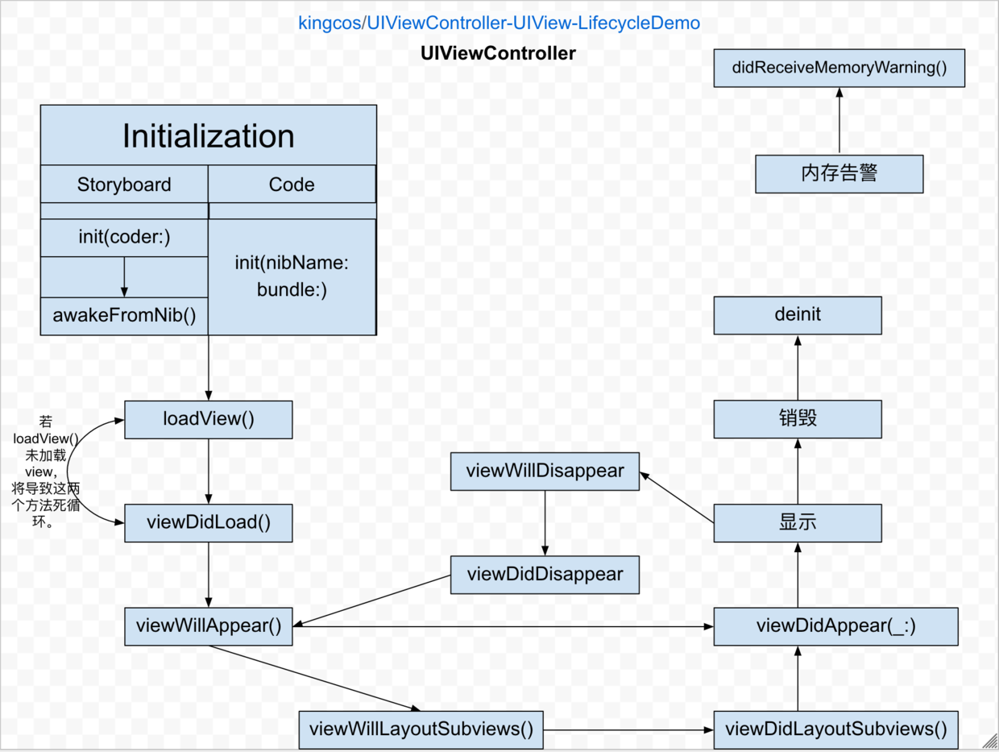

# Focus - 探究 UIViewController 生命周期

| Date | Notes | Swift | Xcode |
|:-----:|:-----:|:-----:|:-----:|
| 2017-03-10 | 首次提交 | 3.0 | 8.2.1 |

## 前言

对象的生命周期一直是开发者所需要关心的，教授 [CS193p](https://github.com/kingcos/CS193P_2017) 的老师 Paul 也详细的讲述了 UIViewController 的生命周期。为了记述这一过程，故作此文。由于 Xcode 提供了纯代码和 Storyboard（Xib 同理）两种布局 UI 的方式，因此初始化部分略有不同。

为了方便观察，我创建了一个 BaseViewController，继承自原本的 UIViewController，重写其中的生命周期方法，并让后续新的控制器继承自该控制器，以便观察。

本文对应的 Demo 可以在 [https://github.com/kingcos/UIViewController-UIView-LifecycleDemo](https://github.com/kingcos/UIViewController-UIView-LifecycleDemo) 查看、下载。



## Initialization

### Storyboard

> **OUTPUT:**
init(coder:)
awakeFromNib()

#### init(coder:)

- 当使用 Storyboard 时，控制器的构造器为 `init(coder:)`。
- 该构造器为必需构造器，如果重写其他构造器，则必须重写该构造器。
- 该构造器为可失败构造器，即有可能构造失败，返回 nil。
- 该方法来源自 NSCoding 协议，而 UIViewController 遵从这一协议。
- 该方法被调用意味着控制器有可能（并非一定）在未来会显示。
- 在控制器生命周期中，该方法只会被调用一次。

#### awakeFromNib()

- 当使用 Storyboard 时，该方法会被调用。
- 当调用该方法时，将保证所有的 outlet 和 action 连接已经完成。
- 该方法内部必须调用父类该方法，虽然默认实现为空，但 UIKit 中许多类的该方法为非空。
- 由于控制器中对象的初始化顺序不能确定，所以构造器中不应该向其他对象发送消息，而应当在 `awakeFromNib()` 中安全地发送。
- 通常使用 `awakeFromNib()` 可以进行在设计时无法完成的必要额外设置。

### Code

> **OUTPUT:**
init(nibName:bundle:) - NibName: nil, Bundle: nil

#### init(nibName:bundle:)

- 当使用纯代码创建控制器，控制器的构造器为 `init(nibName:bundle:)`。
- 虽然使用代码创建时调用了该构造器，但传入的参数均为 nil。

---

> **OUTPUT:**
loadView()
viewDidLoad()
viewWillAppear
viewWillLayoutSubviews() - Optional((162.0, 308.0, 50.0, 50.0))
viewDidLayoutSubviews() - Optional((67.0, 269.0, 241.0, 129.0))
viewDidAppear
viewWillDisappear
viewDidDisappear
deinit

## loadView()

- `loadView()` 即加载控制器管理的 view。
- 不能直接手动调用该方法；当 view 被请求却为 nil 时，该方法加载并创建 view。
- 若控制器有关联的 Nib 文件，该方法会从 Nib 文件中加载 view；如果没有，则创建空白 UIView 对象。
- 如果使用 Interface Builder 创建 view，则务必不要重写该方法。
- 可以使用该方法手动创建视图，且需要将根视图分配为 view；自定义实现不应该再调用父类的该方法。
- 执行其他初始化操作，建议放在 `viewDidLoad()` 中。

## viewDidLoad()

- view 被加载到内存后调用 `viewDidLoad()`。
- 重写该方法需要首先调用父类该方法。
- 该方法中可以额外初始化控件，例如添加子控件，添加约束。
- 该方法被调用意味着控制器有可能（并非一定）在未来会显示。
- 在控制器生命周期中，该方法只会被调用一次。

## viewWillAppear(_:)

- 该方法在控制器 view 即将添加到视图层次时以及展示 view 时所有动画配置前被调用。
- 重写该方法需要首先调用父类该方法。
- 该方法中可以进行操作即将显示的 view，例如改变状态栏的取向，类型。
- 该方法被调用意味着控制器将一定会显示。
- 在控制器生命周期中，该方法可能会被多次调用。

> 注意：
如果控制器 A 被展示在另一个控制器 B 的 popover 中，那么控制器 B 不会调用该方法，直到控制器 A 清除。

## viewWillLayoutSubviews()

- 该方法在通知控制器将要布局 view 的子控件时调用。
- 每当视图的 bounds 改变，view 将调整其子控件位置。
- 该方法可重写以在 view 布局子控件前做出改变。
- 该方法的默认实现为空。
- 该方法调用时，AutoLayout 未起作用。
- 在控制器生命周期中，该方法可能会被多次调用。

## viewDidLayoutSubviews()

- 该方法在通知控制器已经布局 view 的子控件时调用。
- 该方法可重写以在 view 布局子控件后做出改变。
- 该方法的默认实现为空。
- 该方法调用时，AutoLayout 已经完成。
- 在控制器生命周期中，该方法可能会被多次调用。

## viewDidAppear(_:)

- 该方法在控制器 view 已经添加到视图层次时被调用。
- 重写该方法需要首先调用父类该方法。
- 该方法可重写以进行有关正在展示的视图操作。
- 在控制器生命周期中，该方法可能会被多次调用。

## viewWillDisappear(_:)

- 该方法在控制器 view 将要从视图层次移除时被调用。
- 类似 `viewWillAppear(_:)`。
- 该方法可重写以提交变更，取消视图第一响应者状态。

## viewDidDisappear(_:)

- 该方法在控制器 view 已经从视图层次移除时被调用。
- 类似 `viewDidAppear(_:)`。
- 该方法可重写以清除或隐藏控件。

## didReceiveMemoryWarning()

- 当内存预警时，该方法被调用。
- 不能直接手动调用该方法。
- 该方法可重写以释放资源、内存。

## deinit

- 控制器销毁时（离开堆），调用该方法。

## Note

### Rotation

> **OUTPUT:**
willTransition(to:with:)
viewWillLayoutSubviews() - Optional((67.5, 269.5, 240.0, 128.0))
viewDidLayoutSubviews() - Optional((213.5, 123.5, 240.0, 128.0))
viewWillLayoutSubviews() - Optional((213.5, 123.5, 240.0, 128.0))
viewDidLayoutSubviews() - Optional((213.5, 123.5, 240.0, 128.0))
viewWillLayoutSubviews() - Optional((213.5, 123.5, 240.0, 128.0))
viewDidLayoutSubviews() - Optional((213.5, 123.5, 240.0, 128.0))

- 当 view 转变，会调用 `willTransition(to:with:)` 方法。
- 当屏幕旋转，view 的 bounds 改变，其内部的子控件也需要按照约束调整为新的位置，因此也调用了 `viewWillLayoutSubviews()` 和 `viewDidLayoutSubviews()`。

### Present & Dismiss

> **OUTPUT:**
viewWillDisappear
viewDidDisappear
viewDidDisappear
viewWillAppear
viewDidAppear

- 当在一个控制器内 Present 新的控制器，原先的控制器并不会销毁，但会消失，因此调用了 `viewWillDisappear` 和 `viewDidDisappear` 方法。
- 如果新的控制器 Dismiss，即清除自己，原先的控制器会再一次出现，因此调用了其中的 `viewWillAppear` 和 `viewDidAppear` 方法。

### 死循环

```Swift
class LoopViewController: UIViewController {

override func loadView() {
print(#function)
}

override func viewDidLoad() {
print(#function)
let _ = view
}

}
```

> **OUTPUT:**
loadView()
viewDidLoad()
loadView()
viewDidLoad()
loadView()
viewDidLoad()
loadView()
viewDidLoad()
loadView()

- 若 `loadView()` 没有加载 view，`viewDidLoad()` 会一直调用 `loadView()` 加载 view，因此构成了死循环，程序即卡死。

## Reference

- [CS193P_2017](https://github.com/kingcos/CS193P_2017)
- [UIViewController 相关生命周期总结](http://amztion.com/2016/12/03/uiviewcontroller-lifecycle/)

