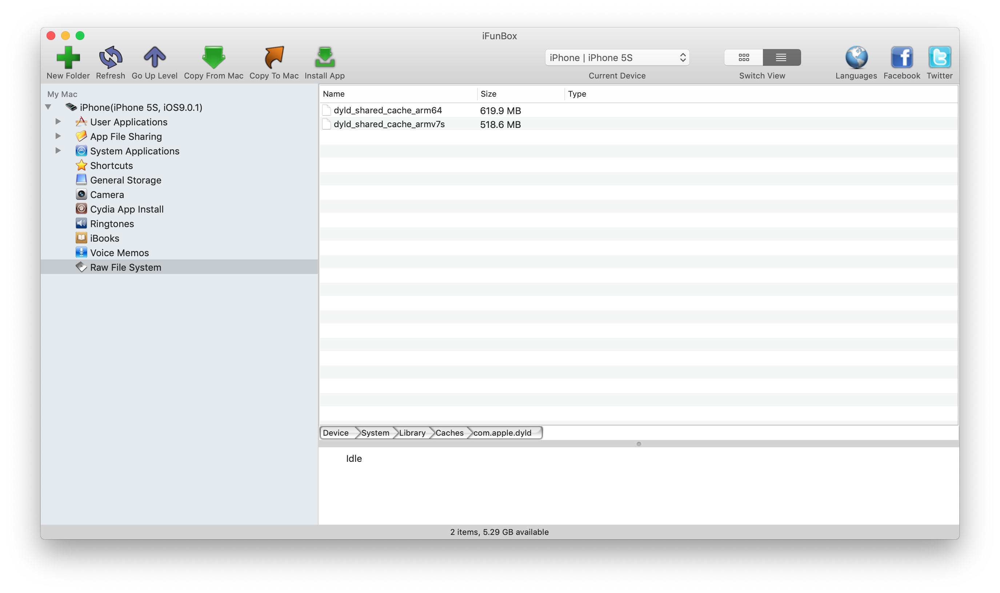
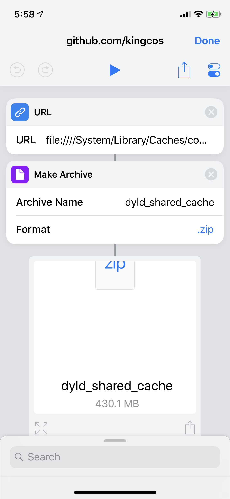
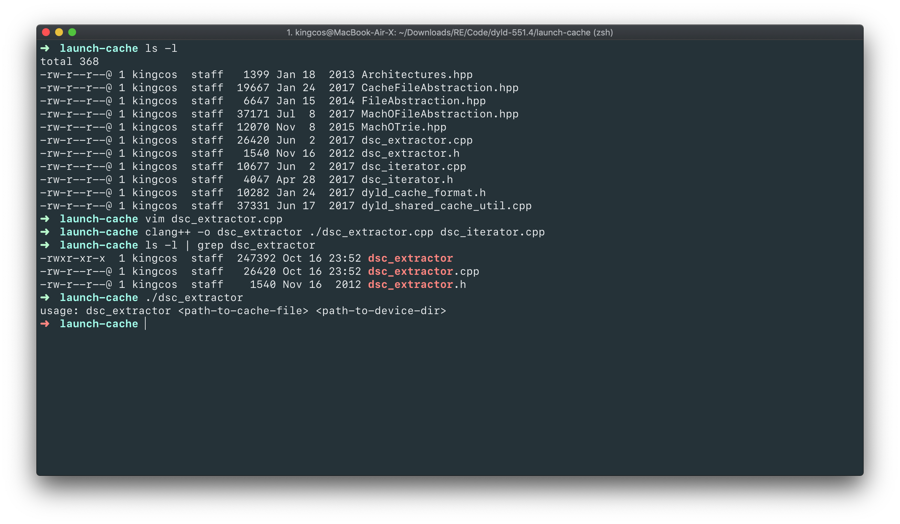
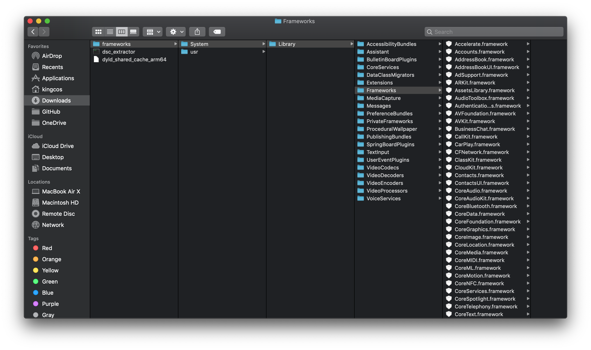

# Focus - 谈谈 iOS 中的 `dyld_shared_cache`

| Date | Notes | Source Code |
|:-----:|:-----:|:-----:|
| 2018-10-14 | 首次提交 | [dyld-551.4](https://opensource.apple.com/tarballs/dyld/dyld-551.4.tar.gz) |

## What

iOS & macOS 作为操作系统，其中内置了许多系统库（Library）。`dyld_shared_cache`，即动态库共享缓存。自 iOS 3.1 后，所有系统动态库被集合成一个 `dyld_shared_cache` 文件，以提升性能。

## How

`dyld_shared_cache` 存在于 iOS 设备的 `/System/Library/Caches/com.apple.dyld/` 目录。文件名即为 `dyld_shared_cache_arm*` 加上对应的架构编号。

### 从设备提取 `dyld_shared_cache`

如果 iOS 设备已经越狱，那么就可以直接从 `/System/Library/Caches/com.apple.dyld/` 目录下找到，拷贝出来即可。

而如果没有越狱设备，则可以巧妙地使用 Shortcuts（捷径）App 来获取，你可以使用我已经编辑好的 Shortcuts：，运行后，将其 AirDrop 到 Mac 端，解压即可。

### 提取 `dyld_shared_cache`

关于将库从 `dyld_shared_cache` 中还原的工具现在有很多，这里只选取了使用 Apple 开源 dyld 中 dsc_extractor.cpp 来提取。有关更加详细的提取，可以参考 [Extracting libraries from `dyld_shared_cache` - zhuowei](https://worthdoingbadly.com/dscextract/) 一文。

下载 Apple Open Source 官网 dyld 代码，找到其中 dsc_extractor.cpp 文件，将其 `main` 函数上方的 `#if 0` 宏置为 `#if 1`，这样 `main` 函数才得以执行。

使用 macOS 自带的 clang++ 编译器即可编译：`clang++ -o dsc_extractor ./dsc_extractor.cpp dsc_iterator.cpp`。

最后运行可执行文件，并带上 `dyld_shared_cache_arm64` 路径和要提取到的路径参数，即可，例如：`./dsc_extractor dyld_shared_cache_arm64 ./frameworks`。

## Why

在搭载 iOS 9.0.1 的 iPhone 5s 上，`dyld_shared_cache_armv7s` 大小为 518.6 MB，`dyld_shared_cache_arm64` 大小为 619.9 MB。而自 iOS 11 开始全面弃用 32 位应用，因此搭载 iOS 12 的 iPhone X 上仅有 `dyld_shared_cache_arm64`，大小为 1.28 GB。可以看出系统库在逐渐增大，这其中包括新增的 SDK 等。如果不进行整合，系统加载类库每次都需要检索所有需要的动态库，App 的启动时间会剧增。而整合为单一文件，程序启动的压力便会小很多，启动速度和性能便有所提升。

## Reference

- [dyld - Apple Open Source](https://opensource.apple.com/tarballs/dyld/)
- [`dyld_shared_cache` - iPhoneDevWiki](http://iphonedevwiki.net/index.php/Dyld_shared_cache)
- [Extracting libraries from `dyld_shared_cache` - zhuowei](https://worthdoingbadly.com/dscextract/)