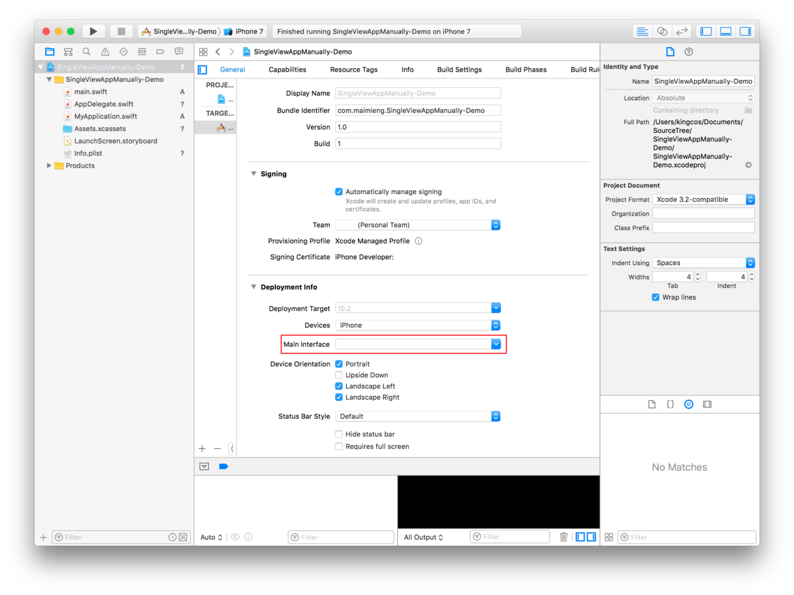

# Focus - 浅谈 iOS 应用启动过程

| Date | Notes | Swift | Xcode |
|:-----:|:-----:|:-----:|:-----:|
| 2017-05-26 | CS193p UIApplication | 3.1 | 8.3.2 |
| 2017-03-28 | 首次提交 | 3.0 | 8.2.1 |

## Preface

首先要感谢[没故事的卓同学](http://weibo.com/u/1926303682)大大送的泊学会员，在泊学学了几节课，了解了很多不同角度的 iOS 开发知识。这篇文章就启发自其 iOS 101 中的[一个纯手工的 Single View Application](https://boxueio.com/series/ios-101/ebook/89) 一文。但本文将更加深入的叙述了启动过程，且实现均为 Swift 3.0。

**本文对应的 Demo 可以在：[https://github.com/kingcos/SingleViewAppManually-Demo](https://github.com/kingcos/SingleViewAppManually-Demo) 查看、下载。**

## Manually or Storyboard

main.m in Objective-C Single View Application

```objc
#import <UIKit/UIKit.h>
#import "AppDelegate.h"

int main(int argc, char * argv[]) {
    @autoreleasepool {
        return UIApplicationMain(argc, argv, nil, NSStringFromClass([AppDelegate class]));
    }
}
```

- 自从 Storyboard 诞生以来，关于纯代码、Xib、以及 Storyboard 的选择就在 iOS 开发圈中炸开了锅。这里不会探讨各种姿势的优劣，只是可能很多和我一样的初学者，从一开始就被 Storyboard 先入为主。加上方便灵活的拖控件，自然而然就可能没有机会去思考一个 iOS 应用是如何启动起来的。加上 Swift 的诞生，使得整个项目的初始结构得到了更大的简化（少了 main.m 以及很多 .h 头文件）。
- 为了便于研究 iOS 应用的启动过程，我们删除 Xcode 自动创建的 Main.storyboard，并把 Main Interface 清空。



## AppDelegate.swift

- AppDelegate.swift 中是 AppDelegate 类。
- AppDelegate 将会创建 App 内容绘制的窗口，并提供应用内响应状态改变（state transitions）的地方。
- AppDelegate 将会创建 App 的入口和 Run Loop（运行循环），并将输入事件发送到 App（由 `@UIApplicationMain` 完成）。

> Run Loop:
An event processing loop that you use to schedule work and coordinate the receipt of incoming events in your app. (From Start Developing iOS Apps (Swift))
Run Loop 是一个事件处理循环，可以用来在应用中安排任务并定位收到的即将到来的事件。

AppDelegate.swift

```swift
class AppDelegate: UIResponder, UIApplicationDelegate {
    var window: UIWindow?

    func application(_ application: UIApplication, didFinishLaunchingWithOptions launchOptions: [UIApplicationLaunchOptionsKey: Any]?) -> Bool {

        window = UIWindow()
        window?.backgroundColor = UIColor.red
        window?.rootViewController = UIViewController()
        window?.makeKeyAndVisible()

        return true
    }
}
```

- 因为我们删除了 Main.storyboard，我们需要以上代码初始化 UIWindow（根 UIView），并使得其可见，关于 UIWindow 可以参考文末的链接。
- AppDelegate 中的方法将应用程序对象和代理联系起来，当应用在不同状态会自动调用相应的代理方法，我们可以自定义相应的实现，抑或留空或删除即使用默认的实现。
- `application(_:​did​Finish​Launching​With​Options:​)`：该方法在应用启动进程几乎完成且将要运行之际调用，因此在其中初始化 window，设置根控制器，并使得其可见。

## @UIApplicationMain

main.swift

```swift
import UIKit

UIApplicationMain(
    CommandLine.argc,
    UnsafeMutableRawPointer(CommandLine.unsafeArgv)
        .bindMemory(
            to: UnsafeMutablePointer<Int8>.self,
            capacity: Int(CommandLine.argc)),
    nil,
    NSStringFromClass(AppDelegate.self)
)
```

- 在 AppDelegate.swift 文件中 AppDelegate 类声明之上的一行便是 @UIApplicationMain。
- 我们可以尝试将该行注释，链接器将直接报错「entry point (_main) undefined.」，即入口 main 未定义，因此可以得知 @UIApplicationMain 标签将会根据其下方的 AppDelegate 创建一个 UIApplicationMain 入口并启动程序。
- 手动实现 @UIApplicationMain：
  - 如果不使用 @UIApplicationMain 标签，需要自己建立一个 main.swift 文件，但我们不需要自己创建方法，Xcode 可以直接将该文件中的代码当作 main() 函数。
  - 在 main.swift 中，我们添加以上的代码。

> Code written at global scope is used as the entry point for the program, so you don’t need a main() function. (From The Swift Programming Language (Swift 3.0.1))
全局范围书写的代码将被当作程序入口，所以不需要 main() 函数。

## UIApplication​Main()

- 在 main.swift 中，调用了 `int UIApplicationMain(int argc, char * _Nonnull argv[], NSString *principalClassName, NSString *delegateClassName);` 方法。
- 该方法在创建了应用程序对象、应用程序代理、以及设置了事件循环。
- UIApplication​Main() 的前两个参数是命令行参数。
- principalClassName: 该参数为 UIApplication 类名或其子类名的字符串，nil 是默认为 UIApplication。
- delegateClassName: 该参数为要初始化的应用程序代理（AppDelegate）类，也可指定为 nil 但需要从应用程序的主 nib 文件加载代理对象。
- 虽然该函数有返回值，但从不返回。

## UIApplication

MyApp.swift

```swift
class MyApp: UIApplication {
    override func sendEvent(_ event: UIEvent) {
        print("\(#function) - Event: \(event)")

        super.sendEvent(event)
    }
}
```

- 由上文得知，main.swift 中 UIApplication​Main()的第三个参数可以为 UIApplication 类名或其子类名的字符串。
- 新建一个 MyApp.swift 在其中定义一个 UIApplication 子类，我们便可以在这里做一些针对应用全局的事情，比如重写 `sendEvent(:)` 方法便可以监听到整个应用发送事件。

### Update for CS193p

```Swift
let myApp = UIApplication.shared
```

- UIApplication 在 App 中是单例的。
- UIApplication 管理所有全局行为。
- UIApplication 不需要子类化。

```Swift
// 在其他 App 中打开 URL
open func open(_ url: URL, options: [String : Any] = [:], completionHandler completion: ((Bool) -> Swift.Void)? = nil)

@available(iOS 3.0, *)
open func canOpenURL(_ url: URL) -> Bool

// 注册接收推送通知
@available(iOS 8.0, *)
open func registerForRemoteNotifications()

@available(iOS 3.0, *)
open func unregisterForRemoteNotifications()
// 本地或推送的通知由 UNNotification 处理

// 设置后台取回间隔
@available(iOS 7.0, *)
open func setMinimumBackgroundFetchInterval(_ minimumBackgroundFetchInterval: TimeInterval)
// 通常将其设置为：
UIApplicationBackgroundFetchIntervalMinimum

// 后台时请求更长时间
@available(iOS 4.0, *)
open func beginBackgroundTask(expirationHandler handler: (() -> Swift.Void)? = nil) -> UIBackgroundTaskIdentifier
// 不要忘记结束时调用 endBackgroundTask(UIBackgroundTaskIdentifier)

// 状态来网络使用 Spinner 显示开关
var isNetworkActivityIndicatorVisible: Bool

var backgroundTimeRemaining: TimeInterval { get } // 直到暂停
var preferredContentSizeCategory: UIContentSizeCategory { get } // 大字体或小字体
var applicationState: UIApplicationState { get } // 前台，后台，已激活
```


## Reference

- [一个纯手工的 Single View Application](https://boxueio.com/series/ios-101/ebook/89)
- [Start Developing iOS Apps (Swift)
](https://developer.apple.com/library/content/referencelibrary/GettingStarted/DevelopiOSAppsSwift/)
- [@UIAPPLICATIONMAIN](http://swifter.tips/uiapplicationmain/)
- [How to call UIApplicationMain in main.swift in Swift 3](https://forums.developer.apple.com/thread/46405)
- [CS193p 查漏补缺（二）Lecture 04 - UIWindow](http://www.jianshu.com/p/b850e8d99316)
- [CS193p 查漏补缺（九）Lecture 16](http://www.jianshu.com/p/7dd2d29d78db)
