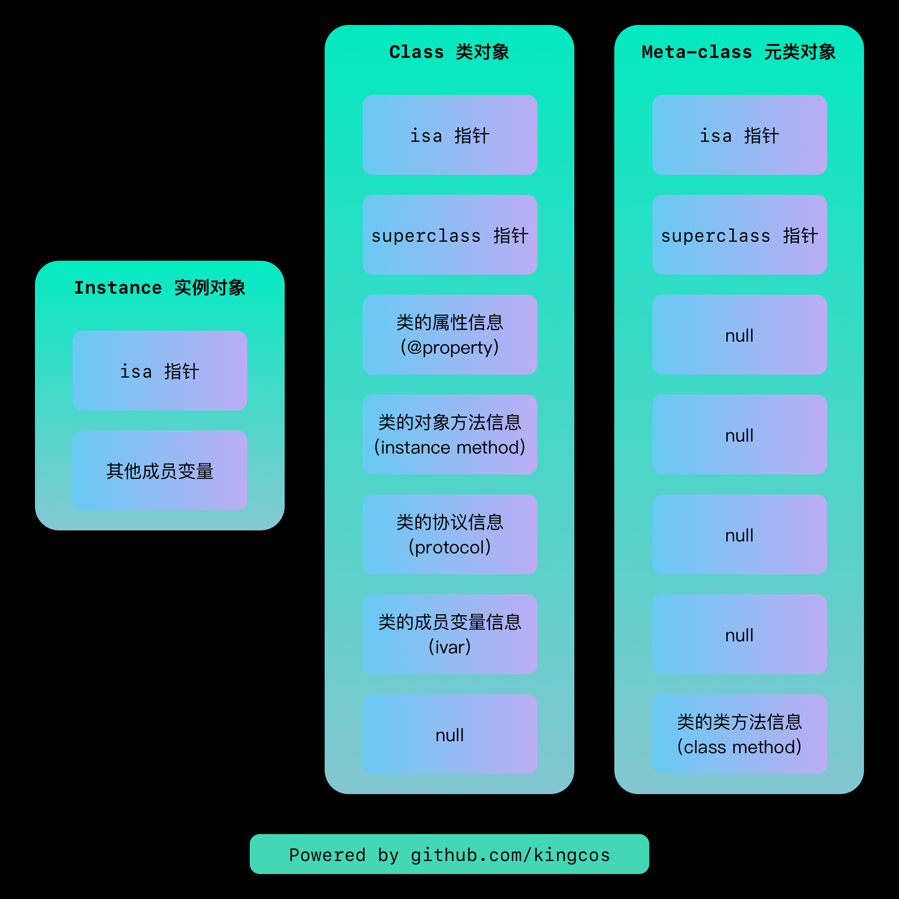
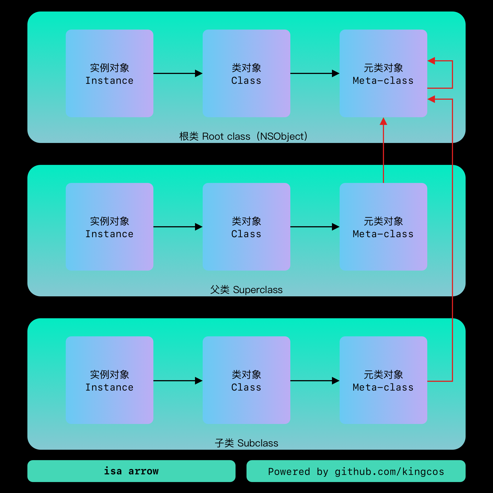
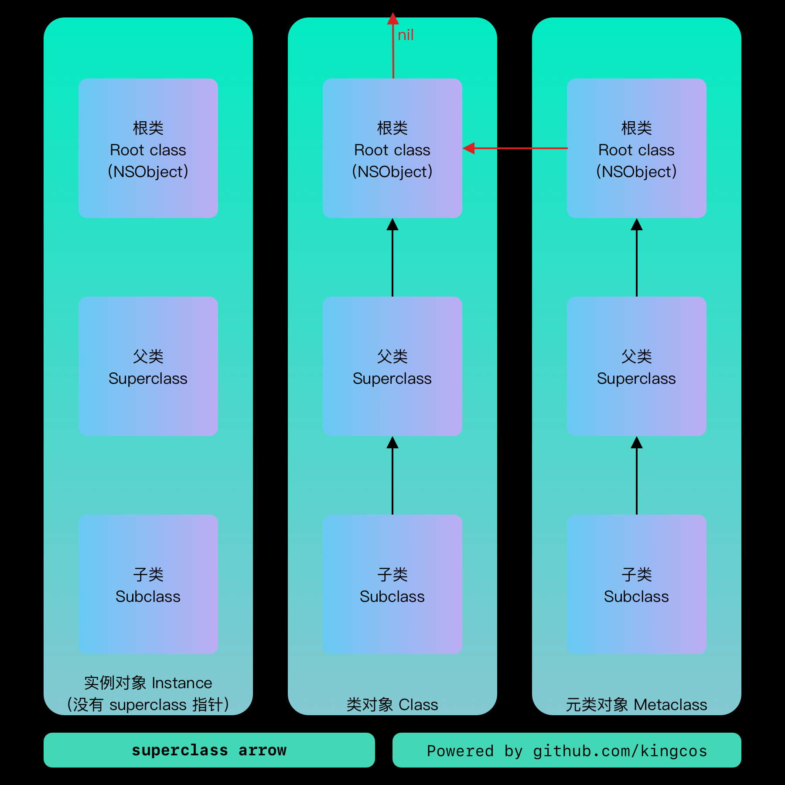

# Focus - iOS 中的 isa

| Date | Notes | Source Code |
|:-----:|:-----:|:-----:|
| 2019-03-18 | 首次提交 | [objc4-750](https://opensource.apple.com/tarballs/objc4/) |

## 对象的分类

Obj-C 中的对象，主要有三种，实例对象（Instance Object）、类对象（Class Object）、以及元类对象（Meta-class Object）。类对象和元类对象的类型均为 `Class`，即 `typedef struct objc_class *Class;`，所以它们的结构其实是一致的，只是存放的内容不同。



定义一个继承自 `NSObject` 的 `Computer` 类，方便后续的 Demo。

```objc
// EDdeviceProtocol 协议
@protocol EDdeviceProtocol
- (void)powerOn;
@end

// Computer 类，继承自 NSObject，遵守 EDdeviceProtocol
@interface Computer : NSObject <EDdeviceProtocol> {
// 成员变量
@public
    int _memorySize;
    int _diskSize;
}

// 属性
@property (copy) NSString *model;

// 实例方法
- (void)print:(NSString *)content;

// 类方法
+ (NSString *)arch;
@end

@implementation Computer
- (void)print:(NSString *)content {
    NSLog(@"Print Content: %@", content);
}

// 协议方法
- (void)powerOn {
    NSLog(@"Start...");
}

+ (NSString *)arch {
    return @"Von Neumann architecture";
}
@end
```

## 实例对象

```objc
// cpt 为指向 Computer 类型实例对象的指针
Computer *cpt = [[Computer alloc] init];
cpt->_memorySize = 16;
cpt->_diskSize = 512;
cpt.model = @"MacBook Pro 13'";
// Direct access to Objective-C's isa is deprecated in favor of object_getClass()
// cpt->isa;
```

我们可以手动创建一个 `Computer` 类型的实例对象，`cpt` 指向的实例对象中存放了继承自 `NSObject` 基类的 `isa` 指针成员变量，但是当我们尝试直接读取时会无法编译通过，因为该 API 已经被标记为过时了，编译器提醒可以使用 `object_getClass()` 取而代之；另外，它还存放了其它成员变量以及属性的具体值。

```objc
// NSObject.h
@interface NSObject <NSObject> {
#pragma clang diagnostic push
#pragma clang diagnostic ignored "-Wobjc-interface-ivars"
    Class isa  OBJC_ISA_AVAILABILITY;
#pragma clang diagnostic pop
}
```

## 类对象

与实例对象不同，类对象和元类对象并不需要我们手动创建。类对象中存放了 `isa` 指针、`superclass` 指针、以及为所有该类实例对象公用的信息。它并不存放成员变量以及属性的具体值，但存放了诸如名称、类型等信息；它还存放了该类的对象方法、遵守的协议信息等，因为这些公共信息对于一个类只保存一份即可。

```objc
// 获取类对象的方法：
Class cptClass1 = [cpt class];
Class cptClass2 = [Computer class];
Class cptClass3 = object_getClass(cpt);

// LLDB:
// (lldb) p/x cptClass1
// (Class) $0 = 0x00000001000013d0 Computer
// (lldb) p/x cptClass2
// (Class) $1 = 0x00000001000013d0 Computer
// (lldb) p/x cptClass3
// (Class) $1 = 0x00000001000013d0 Computer
```

类对象可以通过实例对象通过 `[obj class]`、`[Computer class]` 或 Runtime API `object_getClass` 获取。类对象的类型都是 `Class`，但在 Xcode 中并没有直接暴露该类型。

```objc
// Object.mm
typedef struct objc_class *Class;

// objc-runtime-new.h
struct objc_class : objc_object {
    // Class ISA;
    // ➡️ 父类指针
    Class superclass;
    cache_t cache;             // formerly cache pointer and vtable
    class_data_bits_t bits;    // class_rw_t * plus custom rr/alloc flags

    class_rw_t *data() { 
        return bits.data();
    }

    // ...
};

// objc-private.h
struct objc_object {
private:
    // ➡️ isa 指针
    isa_t isa;
    
// ...
}

// objc-runtime-new.h
struct class_rw_t {
    // Be warned that Symbolication knows the layout of this structure.
    uint32_t flags;
    uint32_t version;

    const class_ro_t *ro;

    // ➡️ 方法、属性、协议信息
    method_array_t methods;
    property_array_t properties;
    protocol_array_t protocols;

    // ...
};

// objc-runtime-new.h
struct class_ro_t {
    uint32_t flags;
    uint32_t instanceStart;
    // ➡️ 实例大小
    uint32_t instanceSize;
#ifdef __LP64__
    uint32_t reserved;
#endif

    const uint8_t * ivarLayout;
    
    // ➡️ 类名
    const char * name;
    method_list_t * baseMethodList;
    protocol_list_t * baseProtocols;
    // ➡️ 成员变量
    const ivar_list_t * ivars;

    const uint8_t * weakIvarLayout;
    property_list_t *baseProperties;

    method_list_t *baseMethods() const {
        return baseMethodList;
    }
};
```

但在 objc4 源码中，我们可以找到 `Class` 的定义，它是一个指向 `objc_class` 结构体的指针。`objc_class` 继承的父类 `objc_object` 只有一个成员变量，即 `isa`。`objc_class` 自身还拥有 `superclass`、`bits` 等成员变量，`bits` 中的 `data()` 存放了指向 `class_rw_t` 的指针，即一些可读可写的数据（表）；`class_rw_t`，里面又包含了 `methods` 方法列表、`properties` 属性列表、`protocols` 列表、以及一个指向 `class_ro_t` 类型的指针（该指针为 `const` 不可变更指向地址），存放只读的数据（表）；`class_ro_t` 结构体里存放了 `instanceSize` 实例大小、`ivars` 成员变量等数据。

Obj-C 中，将类对象作为了一个透明类型，让我们无需关心其内部实现细节，但因为代码已经开源，所以我们尝试下将 `Computer` 类对象的结构展示出来。

```objc
#ifndef objc_header_h
#define objc_header_h

typedef struct v_objc_class *VClass;

union isa_t {
    VClass cls;
    uintptr_t bits;
};

template <typename Element>
struct entsize_list_tt {
    uint32_t entsizeAndFlags;
    uint32_t count;
    Element first;
};

struct ivar_t {
#if __x86_64__
    // *offset was originally 64-bit on some x86_64 platforms.
    // We read and write only 32 bits of it.
    // Some metadata provides all 64 bits. This is harmless for unsigned
    // little-endian values.
    // Some code uses all 64 bits. class_addIvar() over-allocates the
    // offset for their benefit.
#endif
    int32_t *offset;
    const char *name;
    const char *type;
    // alignment is sometimes -1; use alignment() instead
    uint32_t alignment_raw;
    uint32_t size;
};

struct ivar_list_t : entsize_list_tt<ivar_t> {
};

struct method_t {
    SEL name;
    const char *types;
    IMP imp;
};

struct method_list_t : entsize_list_tt<method_t> {
};

struct protocol_list_t {
    // count is 64-bit by accident.
    uintptr_t count;
};

struct property_t {
    const char *name;
    const char *attributes;
};

struct property_list_t : entsize_list_tt<property_t> {
};

struct class_ro_t {
    uint32_t flags;
    uint32_t instanceStart;
    uint32_t instanceSize;
#ifdef __LP64__
    uint32_t reserved;
#endif
    
    const uint8_t * ivarLayout;
    
    const char * name;
    method_list_t * baseMethodList;
    protocol_list_t * baseProtocols;
    const ivar_list_t * ivars;
    
    const uint8_t * weakIvarLayout;
    property_list_t *baseProperties;
};

struct class_rw_t {
    // Be warned that Symbolication knows the layout of this structure.
    uint32_t flags;
    uint32_t version;

    const class_ro_t *ro;

    method_list_t *methods;
    property_list_t *properties;
    protocol_list_t *protocols;
};

#define FAST_DATA_MASK          0x00007ffffffffff8UL
struct class_data_bits_t {
    // Values are the FAST_ flags above.
    uintptr_t bits;
public:
    class_rw_t* data() {
        return (class_rw_t *)(bits & FAST_DATA_MASK);
    }
};

typedef uintptr_t cache_key_t;
struct bucket_t {
    IMP _imp;
    cache_key_t _key;
};

typedef uint32_t mask_t;  // x86_64 & arm64 asm are less efficient with 16-bits
struct cache_t {
    struct bucket_t *_buckets;
    mask_t _mask;
    mask_t _occupied;
};

struct v_objc_object {
    union isa_t isa;
};

struct v_objc_class : v_objc_object {
    // Class ISA;
    VClass superclass;
    cache_t cache;             // formerly cache pointer and vtable
    class_data_bits_t bits;    // class_rw_t * plus custom rr/alloc flags
    
    class_rw_t *data() {
        return bits.data();
    }
};

#endif /* objc_header_h */
```

将以上内容放进一个头文件中，即可使用我们定义好结构的指针指向类对象的内存空间。需要注意的是，以上代码含有 C++ 语法，所以引入该头文件的 `.m` 文件需要改名为 `.mm`，即 Objective-C++ 文件类型。

```objc
VClass cptVClass = (__bridge VClass)[Computer class];
class_rw_t *rwt = cptVClass->data();

// LLDB:
// 对象方法
// Printing description of rwt->methods->first:
// (method_t) first = {
//     name = "coresCount"
//     types = 0x0000000100000f94 "i16@0:8"
//     imp = 0x0000000100000d80 (DemoOC`::-[Computer coresCount]() at main.mm:36)
// }
// 属性
// Printing description of rwt->properties->first:
// (property_t) first = (name = "coresCount", attributes = "Ti,N,V_coresCount")
// 协议
// Printing description of rwt->protocols->count:
// (uintptr_t) count = 1
// 成员变量
// (lldb) p rwt->ro->ivars->first
// (const ivar_t) $3 = {
//   offset = 0x00000001000012c0
//   name = 0x0000000100000f5c "_memorySize"
//   type = 0x0000000100000fa7 "i"
//   alignment_raw = 2
//   size = 4
// }
```

## 元类对象

元类对象和类对象一样，都是 `Class` 类型。但元类对象只可以通过 Runtime 的 `object_getClass` API 传入类对象，获取到元类对象。需要注意的是 `[[Computer class] class]` 或 `[[cpt class] class]` 都只能返回类对象。

```objc
VClass cptMetaVClass = (__bridge VClass)object_getClass([Computer class]);
class_rw_t *rwt = cptMetaVClass->data();

// LLDB:
// Printing description of rwt->methods->first:
// (method_t) first = {
//     name = "arch"
//     types = 0x0000000100000f86 "@16@0:8"
//     imp = 0x0000000100000d40 (DemoOC`::+[Computer arch]() at main.mm:52)
// }
```

元类对象中除了存储 `isa` 和 `superclass` 指针，还存储了类方法。其存放位置和类对象存放实例方法的存放位置一致。

## isa



`isa` 是所有类型的对象中都存在的一个成员，其定义在基类 `NSObject` 内部。实例对象中的 `isa` 指向类对象，类对象中的 `isa` 指向元类对象，元类对象中的 `isa` 指向根元类对象（包括根元类对象也指向自己）。

## superclass



`superclass` 是仅存在于类对象和元类对象的一个成员。类对象中的 `superclass` 指向当前类的父类，元类对象中的 `superclass` 指向该元类对象的父类。基类 `NSObject` 的 `superclass` 指向 `nil`，根元类对象的 `superclass` 指向基类 `NSObject` 的类对象。

## isa & superclass

- `isa` 将实例对象与类对象、元类对象连接起来；`superclass` 将子类、父类、基类连接起来
- 当向一个实例发送实例方法的消息时（也可称调用实例方法，但因为 Obj-C 是消息结构的语言，方法调用并不严谨），该实例对象会通过 `isa` 找到其类对象，因为实例方法存储在类对象中；如果该类的类对象中并没有存储该实例方法，其类对象将使用 `superclass` 找到其父类的类对象，并在其中查找实例方法；直到在 `NSObject` 基类的类对象也无法找到时，`superclass` 将指向 `nil` 停止查找，爆出错误：。
- 当向一个类（的类对象）发送类方法的消息时，不会经过实例对象；类对象会通过其 `isa` 指针找到其元类对象，因为类方法存储在元类对象中；如果该类的元类对象中并没有存储该类方法，其元类对象将使用 `superclass` 找到其父类的元类对象，并在其中查找类方法；直到查找到 `NSObject` 基类的元类对象还没有类方法时，`NSObject` 元类对象的 `superclass` 将指回 `NSObject` 类对象中，在其存储的实例方法列表中查找，若还是没有找到，`NSObject` 类对象的 `superclass` 将指向 `nil` 停止查找，爆出错误：
- 通过上一点，其实我们可以知道在 Obj-C 中，方法是通过消息传递的，而传递的其实就是方法名。Obj-C 的方法名中并不包含是否为实例方法或类方法的标示，甚至没有参数和返回值的标示，这也是严谨意义上 Obj-C 不支持重载（Overload）的原因（但支持参数个数不同的重载）。

---


`objc_getClass`

参数是类名（字符串），返回类对象

`object_getClass`

如果参数是实例对象，返回类对象；如果参数是类对象，返回元类对象；如果参数是元类对象，返回 NSObject（基类）的元类对象。


isa -> superclass -> super -> ... -> superclass == nil ? nil : method

Intsance Method: isa from instance
Class Method: isa from class

ISA_MASK

