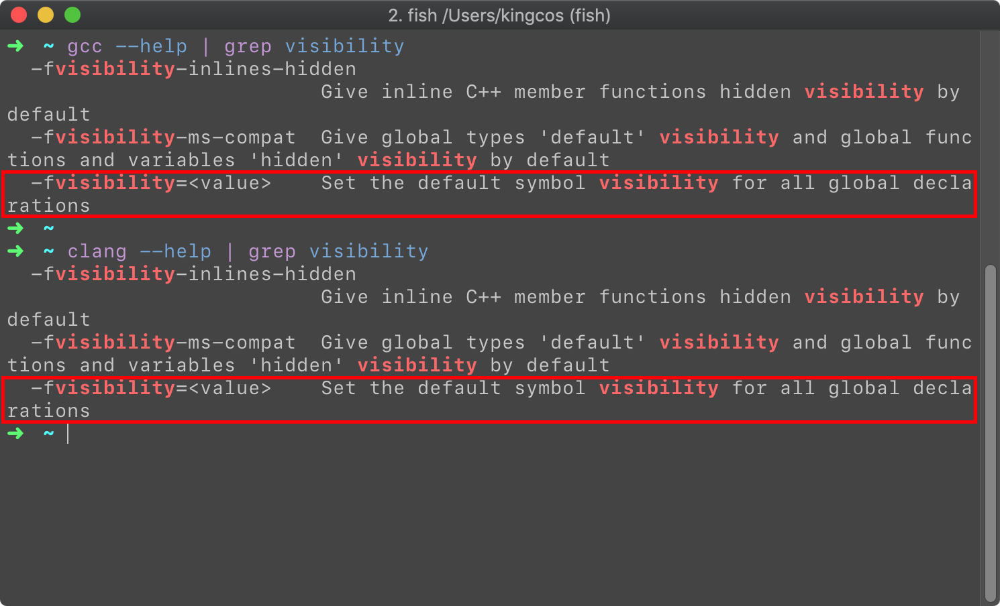

# Practice - Obj-C 中成员变量和类的访问控制

| Platform | Env |
|:-----:|:-----:|
| macOS 10.14.2 | gcc, clang |

## Preface

Obj-C 中的成员变量，即 Instance Variables，通常称为 ivar。在面向对象的概念中，一个类的对外暴露决定了其所提供的能力，对子类则提供扩展性，但有些时候我们也不希望外界甚至子类不知道一些细节，这时就用到了访问控制（Access Control）。在 C++、Java、Swift 等大多数高级语言中都有这样的概念，Obj-C 中总共有四种等级，这次就来简单谈谈 Obj-C 中成员变量的访问控制。

## 访问控制修饰符

### @public

```objc
@interface Computer : NSObject {
    @public
    NSString *_name;
}
@end

@implementation Computer
@end

Computer *cpt = [[Computer alloc] init];
cpt->_name = @"My PC";
NSLog(@"%@", cpt->_name);

// My PC
```

声明为 `@public` 的成员变量是访问控制中开放范围最大的，其允许外界可以直接访问到（当然，前提是引入包含该类的头文件）。

### @protected

```objc
@interface Computer : NSObject {
    int _memorySize;
    
    @protected
    int _diskSize;
}

@end

@implementation Computer
@end

@interface Mac : Computer
- (instancetype)initWithDiskSize:(int)diskSize memorySize:(int)memorySize;
- (instancetype)init NS_UNAVAILABLE;
- (void)printDiskAndMemoryInfo;
@end

@implementation Mac
- (instancetype)initWithDiskSize:(int)diskSize memorySize:(int)memorySize {
    self = [super init];
    if (self) {
        _diskSize = diskSize;
        _memorySize = memorySize;
    }
    return self;
}

- (void)printDiskAndMemoryInfo {
    NSLog(@"My Mac's disk size is %d GB, memory size is %d GB.", _diskSize, _memorySize);
}
@end

Mac *mac = [[Mac alloc] initWithDiskSize:512 memorySize:16];
[mac printDiskAndMemoryInfo];

// My Mac's disk size is 512 GB, memory size is 16 GB.
```

声明为 `@protected` 的成员变量只能在本类或子类中使用。注意，当不使用任何访问控制修饰符时，成员变量默认即为 `@protected`。

### @private

```objc
@interface Computer : NSObject {
    @private
    int _secretKey;
    int _secretData;
}
@end

@implementation Computer

- (instancetype)init {
    self = [super init];
    if (self) {
        _secretKey = arc4random();
    }
    return self;
}

- (void)setData:(int)data {
    _secretData = data ^ secretKey;
}
@end
```

声明为 `@public` 的成员变量是访问控制中开放范围最小的，只能被本类访问到。

### @package

建立一个 Cocoa Framework 的工程，导入以下代码：

```objc
// Fruit.h
#import <Foundation/Foundation.h>
@interface Fruit : NSObject {
    @package
    NSString *_name;
}
@end

// FrameworkPublicHeader.h
#import "Person.h"

// main.m
Fruit *fruit = [[Fruit alloc] init];
fruit->_name = @"Apple";
NSLog(@"%@", fruit->_name);

// Dynamic Library:
// Undefined symbols for architecture x86_64:
//   "_OBJC_IVAR_$_Fruit._name", referenced from:
//       _main in main.o
// ld: symbol(s) not found for architecture x86_64

// Static Library:
// Apple
```

将构建后的 `.framework` 导入到另外的 macOS Command Line 工程中，尝试发现：当 Framework 的 Mach-O Type 为动态库（Dynamic Library）时，将出现上述错误，无法访问到 `@package` 修饰的 `_name` 成员变量；但当 Framework 的 Mach-O Type 为静态库（Static Library）时，却可以正常编译并运行。在 StackOverflow 上的一个问题中提到了 Image（镜像），`@package` 其实开放于同一个镜像内，可能是动态库与静态库的差别，但具体原因我仍在尝试找寻答案，也希望有理解的读者能够提供一些思路。

根据官方文档和上述实践的 Demo：

- 在 32 位系统中，`@package` 等同于 `@public`
- 在 64 位系统中，且在定义该类的 Framework 中，为 `@public`
- 在 64 位系统中，但不在定义该类的 Framework 中，为 `@private`

在 64 位系统，将不会导出声明为 `@package` 的成员变量符号，当在该类框架外使用时，将会出现链接错误。

### 类扩展

在 Obj-C 的类扩展（Class Extension）中，我们可以定义一些不想暴露在外界（.h）的属性、成员变量、或方法，做到「物理」隔离。

```objc
// Person-Inner.h
#import "Person.h"

@interface Person ()

- (void)doSomething;

@end

// Person.m
#import "Person.h"
#import "Person-Inner.h"

@implementation Person
- (void)doSomething {
    NSLog(@"Do something.");
}
@end
```

如上，对外我们只需要暴露 Person.h，而将类扩展所在的 Inner.h 不暴露为 Public Header 即可。

## 符号（Symbols）

`nm` 是 macOS 自带的命令行程序，可以用来查看 LLVM 符号表，但默认情况将打印全部的符号，如果希望只显示外部的全局符号，可以使用 `-g` 参数。

```objc
// main.m
#import <Foundation/Foundation.h>

@interface Computer : NSObject  {
    int _memorySize;
    
    @public
    NSString *_name;
    
    @package
    NSString *_macAdress;
    
    @protected
    int _diskSize;
    
    @private
    int _secret;
}
@end

@implementation Computer
@end

int main(int argc, const char * argv[]) {
    return 0;
}

// nm executable-mach-o-file
// 0000000100000ec0 t -[Computer .cxx_destruct]
// 00000001000011d0 S _OBJC_CLASS_$_Computer
//                  U _OBJC_CLASS_$_NSObject
// 0000000100001198 S _OBJC_IVAR_$_Computer._diskSize
// 0000000100001180 s _OBJC_IVAR_$_Computer._macAdress
// 0000000100001190 S _OBJC_IVAR_$_Computer._memorySize
// 00000001000011a0 s _OBJC_IVAR_$_Computer._secret
// 0000000100001188 S _OBJC_IVAR_$_Computer._name
// 00000001000011a8 S _OBJC_METACLASS_$_Computer
//                  U _OBJC_METACLASS_$_NSObject
// 0000000100000000 T __mh_execute_header
//                  U __objc_empty_cache
// 0000000100000f20 T _main
//                  U _objc_storeStrong
//                  U dyld_stub_binder

// nm -g executable-mach-o-file
// 00000001000011d0 S _OBJC_CLASS_$_Computer
//                  U _OBJC_CLASS_$_NSObject
// 0000000100001198 S _OBJC_IVAR_$_Computer._diskSize
// 0000000100001190 S _OBJC_IVAR_$_Computer._memorySize
// 0000000100001188 S _OBJC_IVAR_$_Computer._name
// 00000001000011a8 S _OBJC_METACLASS_$_Computer
//                  U _OBJC_METACLASS_$_NSObject
// 0000000100000000 T __mh_execute_header
//                  U __objc_empty_cache
// 0000000100000f20 T _main
//                  U _objc_storeStrong
//                  U dyld_stub_binder
``` 

在 64 位的 Obj-C 中，每个类以及实例变量的访问控制都有一个与之关联的符号，类或实例变量都会通过引用此符号来使用。类符号的格式为 ` _OBJC_CLASS_$_ClassName` 和 `_OBJC_METACLASS_$_ClassName`，成员变量符号的格式为 `_OBJC_IVAR_$_ClassName.IvarName`。

在 C/C++ 中也有类似的符号概念。

## 可见程度（Visibility）

在不明确指定的默认情况下，这些符号均是暴露给外界的。但 gcc 编译器都可以通过 `-fvisibility` 参数设定可见程度，但优先级低于直接在源代码中声明可见程度。`-fvisibility=default` 即默认可见程度，`-fvisibility=hidden`，使得编译源文件内未明确指定的符号隐藏。



> 虽然看似 clang 也支持该参数，但在测试中，本机的 clang 却无法达到和 gcc 同样的效果。

建立一个 Test.cpp 的 C++ 源文件，但在文件内部不进行任何的可见程度设定，建立 main.cpp 并在主函数中调用 Test 中的方法。我们将先把 Test.cpp 编译并打包为静态库文件，再用 main.cpp 编译好的目标文件将其链接起来：

```cpp
// Test.cpp
#include <stdio.h>

void test() {
    printf("Test");
}

// main.cpp
void test();

int main() {
    test();
}

// gcc:
// ➜  ~ g++ -shared -o libTest.so Test.cpp
// ➜  ~ g++ -o main main.cpp -L ./ -lTest
// ➜  ~ ./main
// Test⏎

// clang:
// ➜  ~ clang++ -c Test.cpp
// ➜  ~ ar -r libTest.a Test.o
// ar: creating archive libTest.a
// ➜  ~ clang++ -c main.cpp
// ➜  ~ clang++ main.o -L. -lTest -o main
// ➜  ~ ./main
// Test⏎
```

使用 `nm` 查看其符号表，注意：C++ 中的符号在使用时是解码过的，所以默认输出也是解码后的符号，我们可以使用 `-C` 参数限制其解码，`-C` 与 `-g` 一起可以直接使用 `-gC`。

```objc
// gcc
// ➜  ~ nm libTest.so 
// 0000000000000f70 T __Z4testv
//                  U _printf
//                  U dyld_stub_binder

// ➜  ~ nm -gC libTest.so
// 0000000000000f70 T test()
//                  U _printf
//                  U dyld_stub_binder

// ➜  ~ nm -gC main
//                  U test()
// 0000000100000000 T __mh_execute_header
// 0000000100000f80 T _main
//                  U dyld_stub_binder
```

保持源代码文件不更改，添加编译参数为 `-fvisibility=hidden`，则将出现链接错误：

```cpp
// gcc:
// ➜  ~ g++ -shared -o libTest.so -fvisibility=hidden Test.cpp
// ➜  ~ g++ -o app main.cpp -L ./ -lTest
// Undefined symbols for architecture x86_64:
//   "test()", referenced from:
//       _main in main-0369ae.o
// ld: symbol(s) not found for architecture x86_64
// clang: error: linker command failed with exit code 1 (use -v to see invocation)

//➜  ~ nm -gC libTest.so
//                 U _printf
//                 U dyld_stub_binder
```

在 C/C++源文件中，也可以通过 `__attribute((visibility("value")))` 设定某个方法或类的可见程度。尝试将 Test.cpp 的 `test()` 方法设置为 `hidden`，也将出现链接错误：

```cpp
// Test.cpp
#include <stdio.h>

__attribute((visibility("hidden")))
void test() {
    printf("Test");
}

// gcc:
// ➜  ~ g++ -shared -o libTest.so Test.cpp
// ➜  ~ g++ -o app main.cpp -L ./ -lTest
// Undefined symbols for architecture x86_64:
//   "test()", referenced from:
//       _main in main-45a3c6.o
// ld: symbol(s) not found for architecture x86_64
// clang: error: linker command failed with exit code 1 (use -v to see invocation)

// ➜  ~ nm libTest.so
//                  U _printf
//                  U dyld_stub_binder
```

```objc
__attribute__((visibility("hidden")))
@interface ClassName : SomeSuperclass
```

官方文档中提到，在 Obj-C 中可以通过 `__attribute__((visibility("hidden")))` 来设定类的可见程度，但关于这点我并没有实践成功，尝试将代码翻译为 C++，但似乎并有因为该语句而增加有用的信息。但在 objc-api.h 中有针对默认可见程度 `__attribute__((visibility("default")))` 的宏定义，它被定义为一个更简单使用的宏 `OBJC_VISIBLE`（当然，该宏在 Win 32 系统中代表 `__declspec(dllexport)` 或 `__declspec(dllimport)`），关于这点的延伸，本文暂不涉及。

```objc
// objc-api.h
#if !defined(OBJC_VISIBLE)
#   if TARGET_OS_WIN32
#       if defined(BUILDING_OBJC)
#           define OBJC_VISIBLE __declspec(dllexport)
#       else
#           define OBJC_VISIBLE __declspec(dllimport)
#       endif
#   else
#       define OBJC_VISIBLE  __attribute__((visibility("default")))
#   endif
#endif
```

## Reference

- [The Objective-C Programming Language - Apple](https://developer.apple.com/library/archive/documentation/Cocoa/Conceptual/ObjectiveC/Chapters/ocDefiningClasses.html#//apple_ref/doc/uid/TP30001163-CH12-SW1)
- [Objective-C Release Notes - Apple](https://developer.apple.com/library/archive/releasenotes/Cocoa/RN-ObjectiveC/index.html#//apple_ref/doc/uid/TP40004309-CH1-DontLinkElementID_7)
- [64-bit Class and Instance Variable Access Control - Apple](https://developer.apple.com/library/archive/releasenotes/Cocoa/RN-ObjectiveC/index.html#//apple_ref/doc/uid/TP40004309-CH1-SW1)
- [What does the @package directive do in Objective-C? - StackOverflow](https://stackoverflow.com/questions/772600/what-does-the-package-directive-do-in-objective-c)
- [GCC系列: __attribute__((visibility(""))) - veryitman](https://blog.csdn.net/veryitman/article/details/46756683)
- [nm 命令 - IBM](https://www.ibm.com/support/knowledgecenter/zh/ssw_aix_72/com.ibm.aix.cmds4/nm.htm)
- [Attributes in Clang - LLVM.org](http://clang.llvm.org/docs/AttributeReference.html)