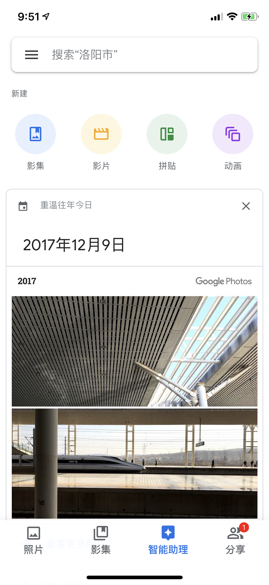
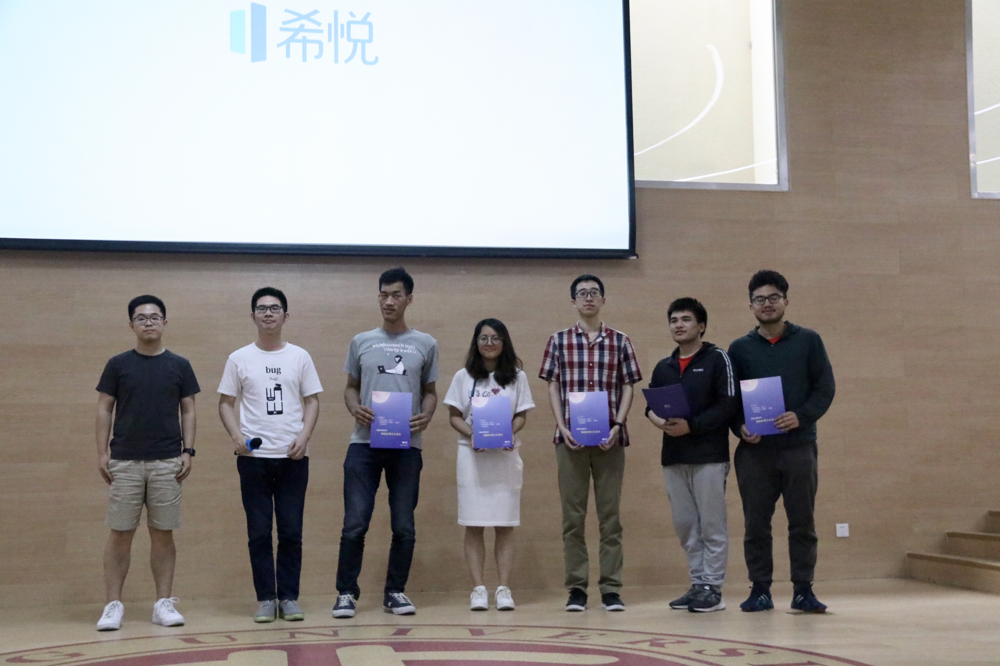
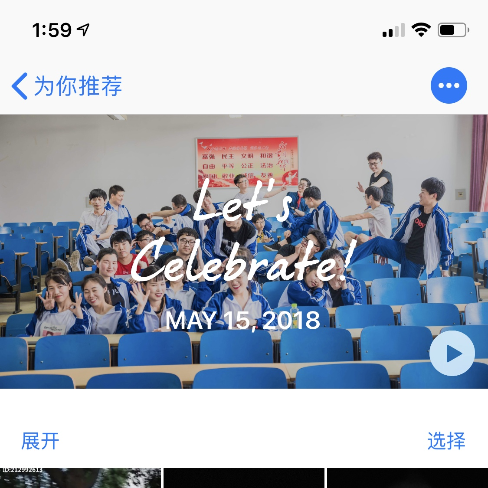
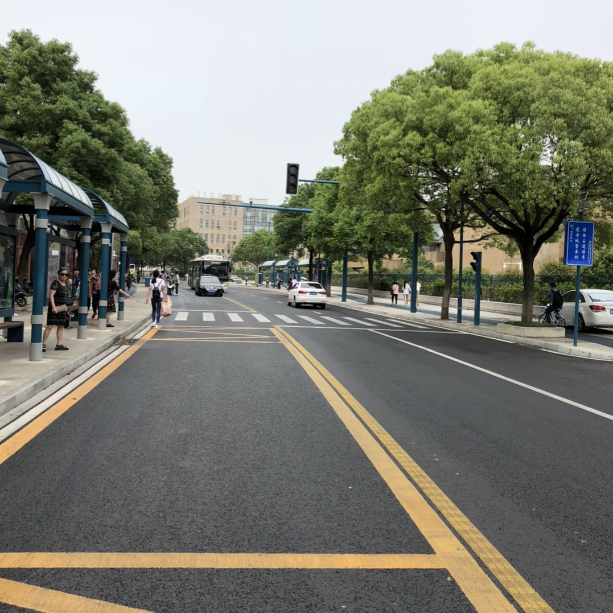
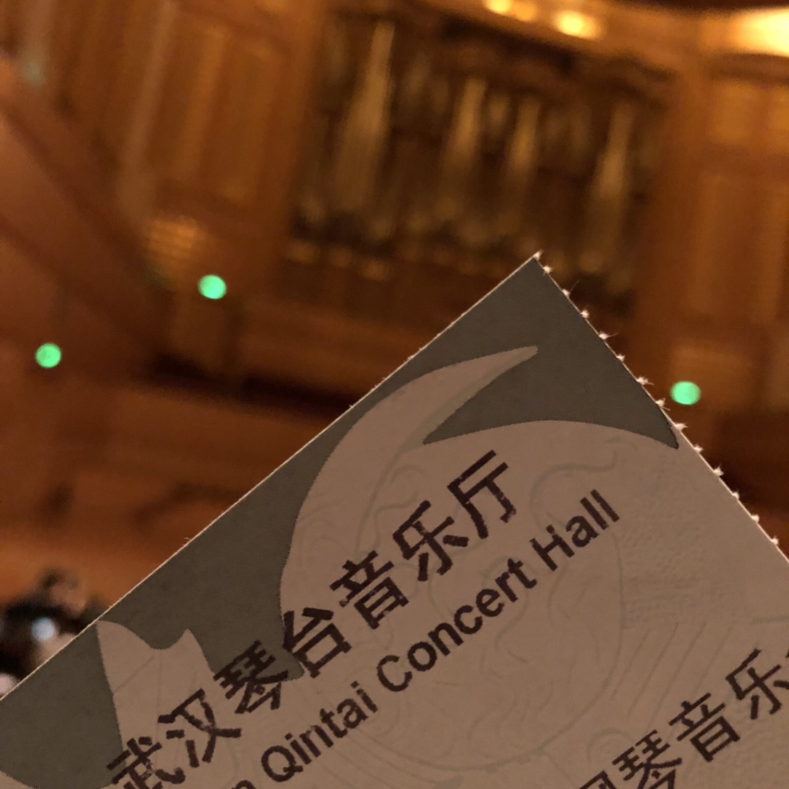
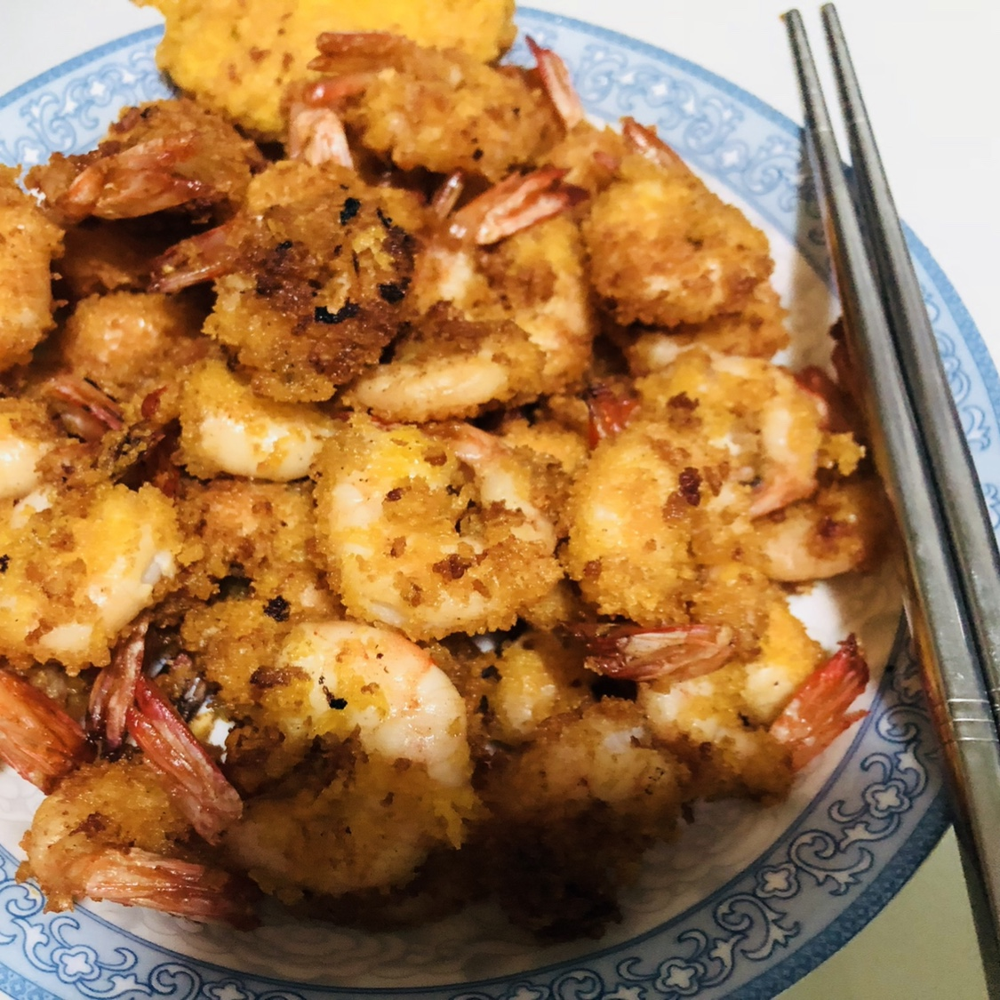

# Thought - 2018 年「终」总结

今天是 2018 年 12 月 10 日，一年前的昨天，我从家里坐高铁到达了北京。还记得那天晚上，两个同学来火车站接我，我们一起坐公交去他们在昌平沙河的培训宿舍。一天的奔波加上本来就晕车的我，在公交行驶过高速后就难受的不行，不得不下车休息片刻。

不像刚到上海的时候，没有工作的压力，充满着一些生活的气息。而来到北京就是为了实习，为了工作。虽然目的性更强，但也让我不得不更快地融入这个环境，而没时间去慢慢感受。我是北方人，北京更加令我熟悉，但却总感觉不如上海能带给我的新鲜感。从在北科的宿舍到确定现在住的地方，我一共搬了四次家，最终选择了公司附近但价格相对较高的房间。虽然房租已经逼近当时我的实习工资，但这一年我认为这个投资还是非常值得的，毕竟时间的价值更难以衡量。

在北京实习的日子里，去北大参加了比赛，又回到学校拍了毕业照，再辗转到长沙比赛，又去武汉听了音乐会，回了趟家，最后又返回了北京，正式加入了现在的团队。

在北大的比赛，让我感受到我和这些名校学生的差距并没有想象中的遥不可及，当然我不是说差距不明显而是觉得自己有了信心。当然我也羡慕他们拥有如此丰富的资源，也坚定了我会再去读研的决心。虽然比赛最后的名次并不是很靠前，但和北大学长学姐、北航浙大学弟的这次友谊和合作，令我倍感幸运。

北大比赛结束的第二天，我便一早乘坐高铁回学校，准备再见见大学的同学们，拍拍毕业照。班长为了等我，特意将聚餐时间往后推迟了一日。所以很遗憾有些同学因为工作等原因提早回去，只得有缘再见。在大学的四年里，我担任学委，和大学同学们的相处甚至要好过于高中同学。当然，不得不说毕业聚餐后发生了一些事情，也许是这辈子都不会忘记的事情吧...虽然学校只是个很普通的二本，这四年也发生了很多事情，但一些老师和这些同学们却让我不后悔来到这里。

要想放下一些事情，就得让自己忙起来。忙完大学生涯最后的篇章，便又启程去了长沙，这次的比赛地点是在长沙的超算中心。说实话，这次的比赛因为没有很好的构思，只能很简单地做了个 Demo，效果也非常一般。这次的比赛是面向华中地区，相较于在上海和北京的比赛，能明显感受到一些差距，但也越发发现这类比赛的作品其实存在着很高的重复性。最后因为赶音乐会的时间紧迫，没能在长沙逗留一段时间，仅有的一丝印象也是一座非常干净、轻松的城市。

离开长沙，坐上高铁，奔向武汉。去武汉的理由很简单，只是在复旦比赛认识的队友多买了一张音乐会的票，于是就随他去了。因为通宵比赛，加上路途奔波，我已经非常疲倦，但这次音乐会对于我个人感受至深。我们还年轻，生活不应该只是对着电脑、手机，生活纵然有不易，但也是如此的丰富多彩。也没有来得及注意武汉，但确实也是一座非常发达的城市。

享受完音乐会，便又马不停蹄地踏上回家之途。其实原本打算是直接回北京，但想到工作之后回家似乎就不那么自由，便还是决定回家一趟。出门久了才知道，什么都抵挡不过父母做的一顿饭，只是这次在家呆不了太久，便又要踏上北上之途。

回京之旅和以往不同，是因为买到了比高铁还要便宜的机票，人生中第一次乘坐了飞机。可能洛阳坐飞机的人并不多，飞机也并没有我想象中那么大，不过飞机起飞加速时的推背感却让我感到很过瘾。

这一年真的是非常丰富的一年，除了上面这一段游记，年初的时候在北京陪韩国留学放假回来的好友在北京玩了几天，看了升旗，逛了故宫，也了解了航天与航空的差异（笑）；在北京去了 Apple Store，和北京的小朋友一起上了 Today at Apple，感受了苹果新的零售哲学；六月中旬去了清华，和来上科大宣讲的外籍教授一对一讨论了 Robotistic（机器人学），也认识了上科大优秀的博士生；第一次正式加入一家公司；主动和团队里的人去美团总部交流技术；在新员工培训中拿到了第一名；周末和同学第一次爬了长城；第一次被拉去蹦了野生迪...

当然，一年再怎么精彩，也依然会有遗憾。对于那些可以在未来弥补的遗憾，就放在之后的计划中吧，对于那些无法弥补的，就让它过去吧。感谢 2018 年，也感谢这一年遇到的所有人，辗转多地也遇到很多可爱的人。最后，也感谢自己。幸运，总是留给有准备的人。2019，加油！

*V.*

*提笔于 2018.12.10，完结于 2018.12.11 晚；北京*

---

## 后记

原本以为 2018 年就会如此过去，却没曾想到在最后一周又发生了很多事情。倒数第二周的周末，听闻公司「优化」的消息，又一次下载了脉脉。传言言之凿凿，又加上我还未转正，简直是「性价比」之选。其实工作了一年，确实感觉辛苦，不如学生时代的自由和悠闲。虽然有了所得，但失去的更多。所以如果被「优化」，我就准备先回学校把驾照考完，再去想想自己真正热爱的事情，其实我一直有想法要亲自打造一款产品，那么我想就是时候去做了。

当然，结果是我并没有被「优化」，打造产品的计划又被耽搁了，而让我痛心的是和我一起入职的好几个小伙伴们被「优化」。工作这一年，越发认识到社会上的人久而久之都会变得「油腻」，而这些刚从校园里出来的孩子们却没有社会上的浮躁气息，失去这些同事实在令我可惜。真心希望他们能找到更好的去处，也希望我们友谊长存，也希望我自己能保持初心。

2018 年从实习，到公司被收购，入职，涨薪，裁员，这些经历都让我学习到很多。其实这种「优化」和个人能力的相关性很低，而和个人所在的业务关联性很大。之前总是天真地以为技术是唯一，其实现在才发现，技术只是基本功，个人的能力绝不能仅仅只在技术能力上体现，而是需要全方位的修炼。

2018 年总归要过去，虽然在 2018 年的尾巴上又重新加回了一位好友，也简单地聊了几句，但深感有些事情却再也不会回去了。

<i><b>Yesterday is history, tomorrow is a mystery, today is God's gift, that's why we call it the present. - Joan Rivers</b></i>

*V.*

*后记于 2019.01.03 午*
