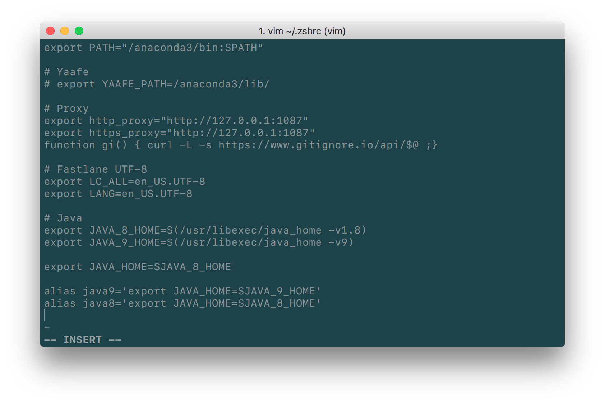
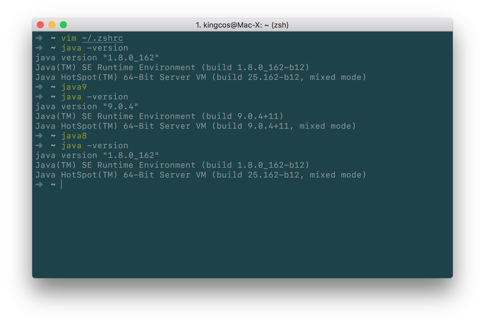

# Tips - macOS 下管理多个 Java 版本

| Platform | Notes |
|:-----:|:-----:|
| macOS 10.13.4 | Java 8 & 9 |

## Solution

- 安装 JDK 8 & 9（其他版本同理）
- `vim ~/.zsh_rc`（这里使用的是 BashShell，其他 Shell 自行替换）
- 文末追加：

```shell
# Java
export JAVA_8_HOME=$(/usr/libexec/java_home -v1.8)
export JAVA_9_HOME=$(/usr/libexec/java_home -v9)

# Default for Java 8
export JAVA_HOME=$JAVA_8_HOME

alias java9='export JAVA_HOME=$JAVA_9_HOME'
alias java8='export JAVA_HOME=$JAVA_8_HOME'
```



- 切换版本：`java8` / `java9`
- 检查版本：`java -version`



> 也欢迎您关注我的微博 [@萌面大道V](http://weibo.com/375975847)

## Extension

- [jenv](https://github.com/gcuisinier/jenv)