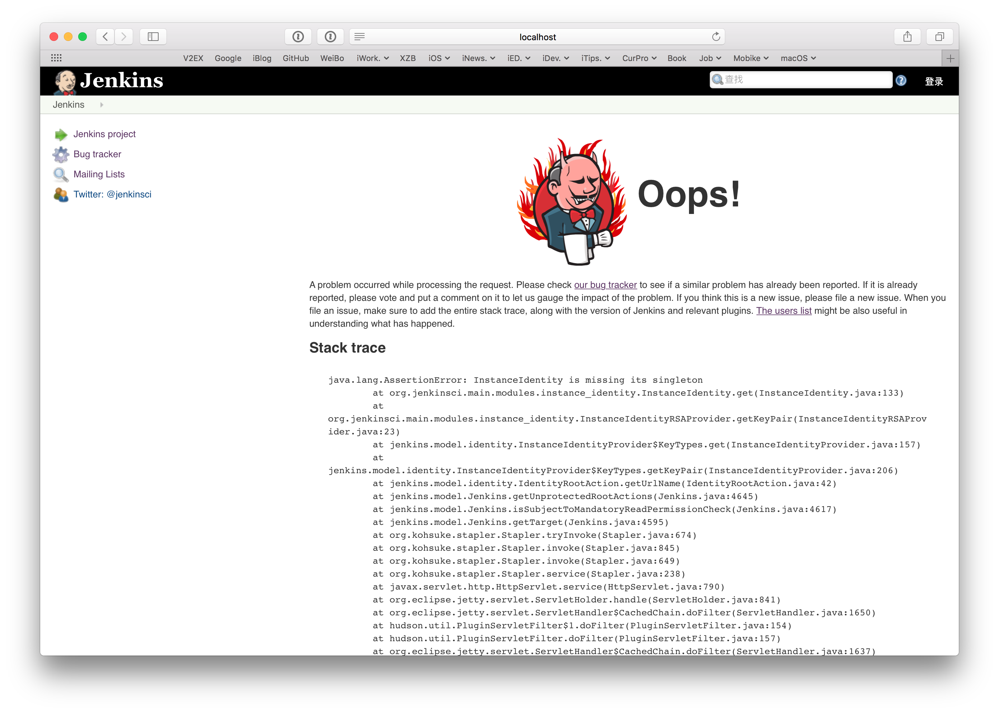

# Tips - macOS 管理多个 Java 版本

> Tips，即提示。笔者将三言两语简述缘由，提供解决方案，也可有延展，供读者自行查阅。
> 
> 本文及更新会首发于笔者的 GitHub 的 Perspective 仓库：[https://github.com/kingcos/Perspective](https://github.com/kingcos/Perspective)，欢迎 Star 🌟。

## Reason

由于 Jenkins 是基于 Java 开发的 CI 工具，自然需要 JRE 才能运行。但目前的 Jenkins 尚未很好的兼容本机的 Java 9。



## Solution

- 安装 JDK 8 & 9（其他版本同理）
- `vim ~/.zsh_rc`（这里使用的是 BashShell，其他 Shell 自行替换）
- 文末追加：

```shell
# Java
export JAVA_8_HOME=$(/usr/libexec/java_home -v1.8)
export JAVA_9_HOME=$(/usr/libexec/java_home -v9)

# Default for Java 8
export JAVA_HOME=$JAVA_8_HOME

alias java9='export JAVA_HOME=$JAVA_9_HOME'
alias java8='export JAVA_HOME=$JAVA_8_HOME'
```


- 切换版本：`java8` / `java9`
- 检查版本：`java -version`


> 也欢迎您关注我的微博 [@萌面大道V](http://weibo.com/375975847)

## Extension

- [jenv](https://github.com/gcuisinier/jenv)