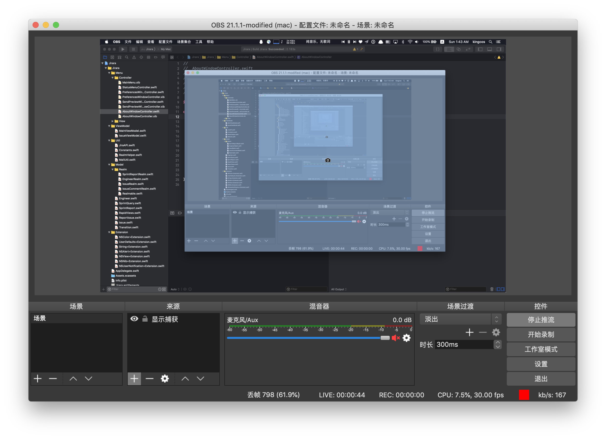
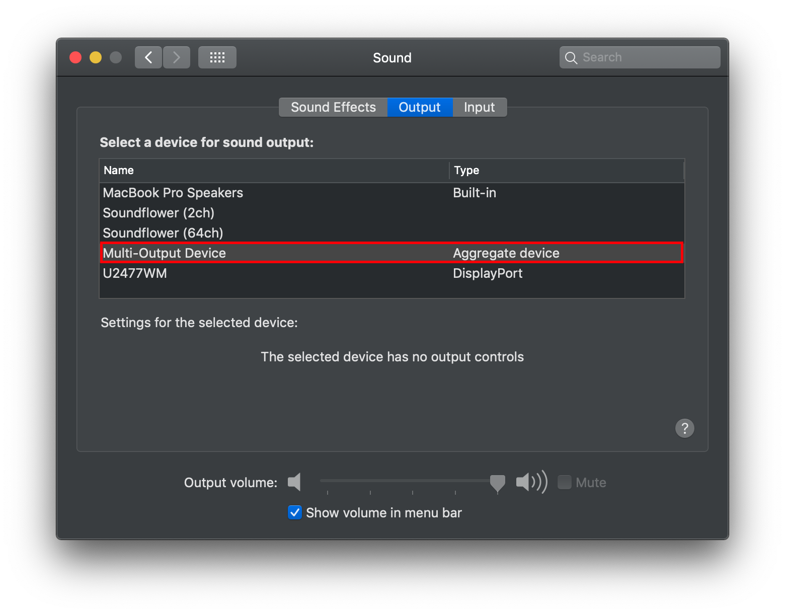
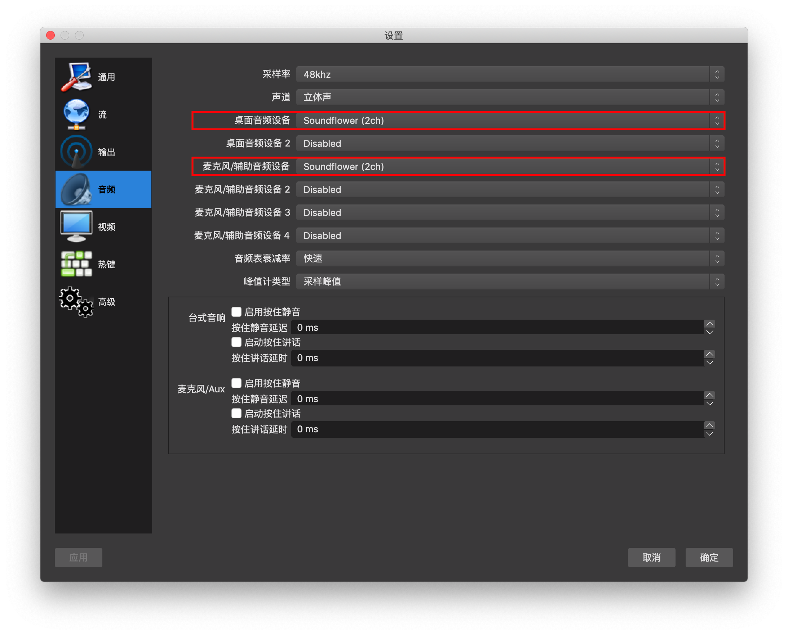

# Tips - 在 macOS 上进行直播推流

| Date | Platform | Software |
|:-----:|:-----:|:-----:|
| 2018.07.22 | macOS 10.14 beta 4 | OBS Studio, Soundflower
| 2019.03.30 | macOS 10.14.4 | - |

> 由于更换了电脑，上次好不容易折腾的配置也都无从参考，这次尽力把整个配置过程，以及音频输入输出的部分完善。直播推流使用了 OBS Studio，直播平台为 Bilibili。
> 
> 欢迎来围观我的直播间：[https://live.bilibili.com/7900407](https://live.bilibili.com/7900407)。

## Solution

### Basic setup


- 使用「Homebrew」安装 OBS

```
brew cask install obs
```


- 安装期间可以在 Bilibili 申请开通直播，并获取需要的 RTMP 地址以及直播码


- 打开「OBS」-「Preference」-「流」


- 在「URL」和「流名称」分别填写 Bilibili 提供的 RTMP 地址以及直播码
- 回到主界面为默认的场景添加来源，常用的是「显示捕获」（即完全把自己能看到推流出去）以及「窗口捕获」（即只把选中的窗口推流出去）
- 点击「开始推流」即可开始直播



### Audio

- 使用「Homebrew」安装 Soundflower

```
brew cask install soundflower
```

> ⚠️ 注意：
> 
> 在安装过程中，可能出现需要授权而导致安装错误，此时需要手动允许并重新安装即可。

#### 将 Mac 播放的音频外放 & 输出 OBS


- 打开系统自带的「Audio MIDI Setup.app」
- 选择左下角的「+」-「Create Multi-Output Device」
- 勾选「Soundflower (2ch)」和「MacBook Pro Speakers」



- 打开系统设置「Preference」-「Sound」-「Output」
- 切换为「Multi-Output Device」

> ⚠️ 注意：
> 
> 此时无法再调节音量大小，只能在各软件内部设置。



- 在 OBS 的「Preference」-「音频」中，将「桌面音频设备」和「麦克风/辅助音频设备」设置为「Soundflower (2ch)」，确定即可

#### 将 Mac 麦克风采集输出 OBS

- Waiting for update.

## Reference

- [OBS Studio](https://obsproject.com)
- [Soundflower](https://soundflower.en.softonic.com/mac)
- [如何使用 OBS 軟體在 Mac 電腦做桌面直播？- LIVEhouse.in](https://event.livehouse.in/zh-TW/tutorial/obs-mac.html)
- [Mac 上利用 OBS 在 B 站直播 iPhone 上的王者荣耀 - 秋风木叶](http://blog.ykqmain.com/obs/)