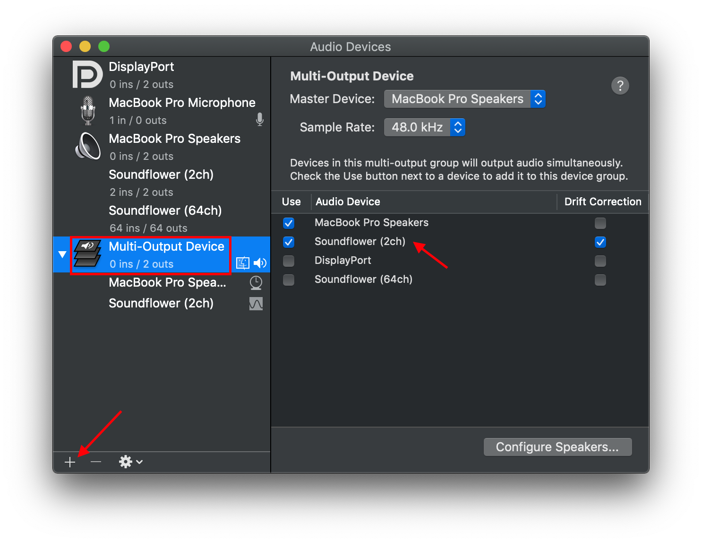

# Tips - 在 macOS 上直播

| Platform | Notes |
|:-----:|:-----:|
| macOS 10.14 beta 4 | JDK 8 & 9 |

> 由于更换了电脑，上次好不容易折腾的配置也都无从参考，这次尽力把整个配置过程，以及音频输入输出的部分完善。直播推流使用了 OBS Studio，直播平台为 Bilibili。

## Solution

### Basic setup


- 安装 OBS
    - 这里使用了「Homebrew」，当然也可以直接在官网下载

```
brew cask install obs
```


- 安装期间可以在 Bilibili 申请开通直播，后面配置需要 RTMP 地址以及直播码


- 安装之后便可以在 Launchpad 中打开 OBS，并打开「Preference」 - 「流」


- 在 URL 和流名称填写上述 RTMP 地址以及直播码
- 关闭 Preference 回到主界面为默认的场景添加来源，常用的是显示捕获（即完全把自己能看到推流出去）以及窗口捕获（即只把选中的窗口推流出去）
- 点击「开始推流」即可开始直播

### Audio

- 下载并安装 Soundflower

#### 将 Mac 播放的音频输出 OBS & 耳机

- 打开系统自带的 Audio MIDI Setup.app



#### 将 Mac 麦克风输出 OBS

- Waiting for update.

## Reference

- [OBS Studio](https://obsproject.com)
- [Soundflower](https://soundflower.en.softonic.com/mac)
