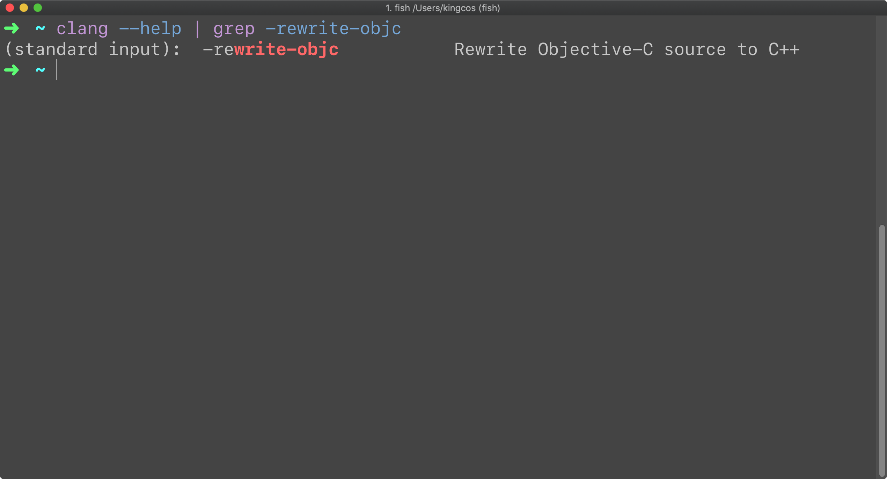

# Tips - 将 Obj-C 代码翻译为 C++ 代码

| Platform | Notes |
|:-----:|:-----:|
| macOS 10.14.2 | clang |

## Solution

```
➜  ~ clang --version
Apple LLVM version 10.0.0 (clang-1000.11.45.5)
Target: x86_64-apple-darwin18.2.0
Thread model: posix
InstalledDir: /Applications/Xcode.app/Contents/Developer/Toolchains/XcodeDefault.xctoolchain/usr/bin
```

Xcode 中，C/C++/Obj-C/C++ 的编译器是 clang。其加上 `-rewrite-objc` 参数可以将 Obj-C 代码翻译为 C++ 代码，即 `clang -rewrite-objc main.m -o main.cpp`。也可以结合 `xcrun` 设置编译所基于的 SDK，以及通过 `-arch` 指定编译架构参数，通过 `-framework` 指定需要依赖的框架，即 `xcrun -sdk iphoneos clang -arch arm64 -rewrite-objc main.m -o main-arm64.cpp -framework UIKit`。



虽然 clang 可以将 Obj-C 代码翻译为 C++，但其实大部分代码都属于 C 语言，比如 Obj-C 的类，其本质是 C 语言中的结构体。而翻译存在的目的是因为 Windows 上的 Visual Studio 中并没有 Obj-C 的编译器，所以 clang 将 Obj-C 转为 C/C++，便于其他 C/C++ 编译器进行编译。在使用 Xcode 构建 Obj-C 项目时并不会将 Obj-C 进行翻译，clang 可以直接编译纯 Obj-C 代码。

## Reference

- [StackOverflow - -rewrite-objc and Objective-C in clang](https://stackoverflow.com/questions/44561285/rewrite-objc-and-objective-c-in-clang)
- [StackOverflow - What's the relationship between Objective-C source code and after clang -rewrite-objc C++ code?](https://stackoverflow.com/questions/55198496/whats-the-relationship-between-objective-c-source-code-and-after-clang-rewrite)