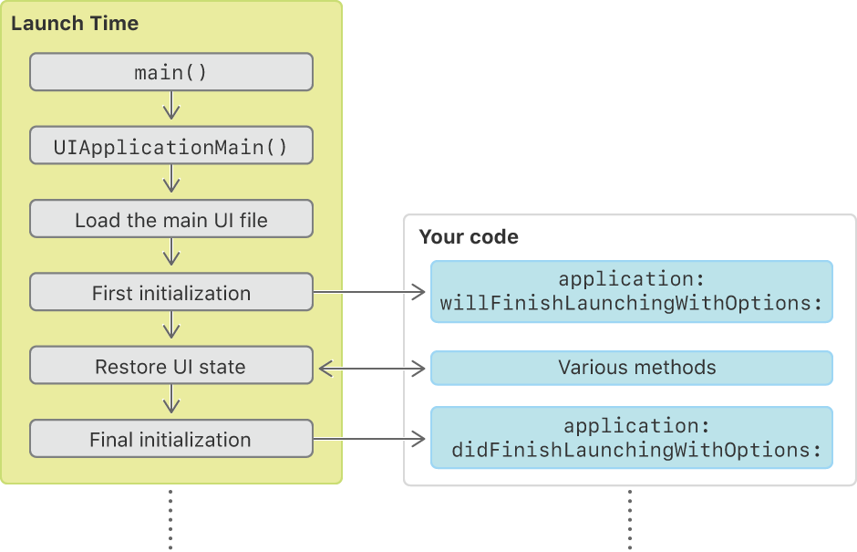

# Translation - [译]关于 App 启动顺序

作者 | 原文链接
--- | ---
Apple Inc. | [About the App Launch Sequence](https://developer.apple.com/documentation/uikit/core_app/managing_your_app_s_life_cycle/responding_to_the_launch_of_your_app/about_the_app_launch_sequence)

学习在启动时的代码执行顺序。

- **框架：**UIKit 

---

## 概览

一个 App 的启动需要经过许多复杂的步骤，其中大部分由 UIKit 自动处理。在启动过程中，UIKit 会调用 App 代理中的方法，因此我们可以执行自定义的任务。图中的步骤展示了从 App 启动的时间开始直到被认为初始化完成的过程。

1. 由用户显式或系统隐式启动 App。
2. Xcode 提供的 `main` 函数调用 UIKit 的 [`UIApplicationMain(_:_:_:_:)`](https://developer.apple.com/documentation/uikit/1622933-uiapplicationmain) 函数。
3. [`UIApplicationMain(_:_:_:_:)`](https://developer.apple.com/documentation/uikit/1622933-uiapplicationmain) 函数创建 [`UIApplication`](https://developer.apple.com/documentation/uikit/uiapplication) 对象和 App 代理。
4. UIKit 从主 storyboard 或 nib 文件加载 App 的默认界面。
5. UIKit 调用 App 代理的 [`application(_:willFinishLaunchingWithOptions:)`](https://developer.apple.com/documentation/uikit/uiapplicationdelegate/1623032-application) 方法。
6. UIKit 执行状态恢复（state restoration），即调用 App 代理和视图控制器中的额外的方法。
7. UIKit 调用 App 代理的 [`application(_:didFinishLaunchingWithOptions:)`](https://developer.apple.com/documentation/uikit/uiapplicationdelegate/1622921-application) 方法。

当初始化完成，系统将 App 转到激活（前台）状态或后台状态。当 App 转到激活状态，其窗口出现在屏幕上，并开始响应用户交互。当 App 转到后台状态，其窗口保持隐藏，并在被暂停前运行极短的时间。

不管 App 启动到前台还是后台，大部分启动时间初始化的代码应当是相同的。举个例子，我们应当依旧初始化 App 的数据结构，并设置 App 用户界面。但是，如果有只在前台或后台运行的自定义的任务，检查 [`UIApplication`](https://developer.apple.com/documentation/uikit/uiapplication) 对象的 [`applicationState`](https://developer.apple.com/documentation/uikit/uiapplication/1623003-applicationstate) 属性即可。当 App 运行到前台时，UIKit 设置该属性为 [`UIApplication.State.inactive`](https://developer.apple.com/documentation/uikit/uiapplication/state/inactive)，当 App 运行到后台时，UIKit 设置该属性为  [`UIApplication.State.background`](https://developer.apple.com/documentation/uikit/uiapplication/state/background)。

## 参阅

### 启动时间

- [为 App 执行一次性设置（Performing One-Time Setup for Your App）](https://developer.apple.com/documentation/uikit/core_app/managing_your_app_s_life_cycle/responding_to_the_launch_of_your_app/performing_one-time_setup_for_your_app)
  - 确保 App 环境被正确配置。

---

> 以下内容为译者添加：

## 参考

- [[译]为 App 执行一次性设置](https://github.com/kingcos/Perspective/issues/59)
