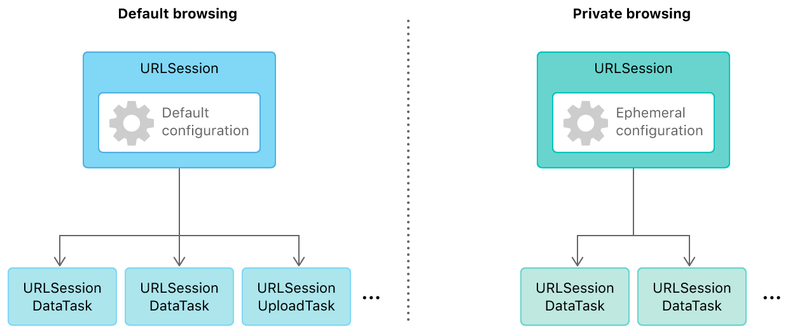

# Translation - [译]URL 加载系统

作者 | 原文链接
--- | ---
Apple Inc. | [URL Loading System](https://developer.apple.com/documentation/foundation/url_loading_system)

使用标准互联网协议与 URL 交互，并和服务器通信。

---

## 概览

URL 加载系统通过标准协议比如 HTTPS 或自建协议提供对 URL 标识资源的访问。加载过程是异步的，所以 App 可以保持响应并当数据到达或出错时进行处理。

使用 [URLSession](https://developer.apple.com/documentation/foundation/urlsession) 实例可以创建一个或多个 [URLSessionTask](https://developer.apple.com/documentation/foundation/urlsessiontask) 实例，来抓取并返回数据给 App、下载文件、或者上传数据和文件到远程地址。使用 [URLSessionConfiguration](https://developer.apple.com/documentation/foundation/urlsessionconfiguration) 对象可以配置会话（Session），可以控制类似如何使用缓存和 Cookie 的行为、以及是否允许蜂窝网络连接。

一个会话可以重复地创建任务。举个例子，浏览器可能有分隔的会话以区分普通和隐私浏览，隐私会话将不缓存数据。图 1 展示了不同配置的两种会话可以创建许多任务。

1. 默认浏览：URLSession [默认配置] -> URLSessionDataTask
2. 隐私浏览：URLSession [临时配置] -> URLSessionDataTask

为了接收定期的更新（或错误），每个会话都与一个代理关联。默认代理将调用提供的回调 Block；如果选择提供自定义的代理，该 Block 不再调用。

通过配置 App 运行在后台时的会话，即可当 App 被挂起时，系统可以代替其下载数据并唤醒 App，并唤起 App 以分发结果。

## 话题

## 参阅

### 网络 - [Bonjour](https://developer.apple.com/documentation/foundation/bonjour)

- 便于在本地网络发现广告服务，或者发现别人展示的广告。

---

> 以下内容为译者添加：

## 参考

