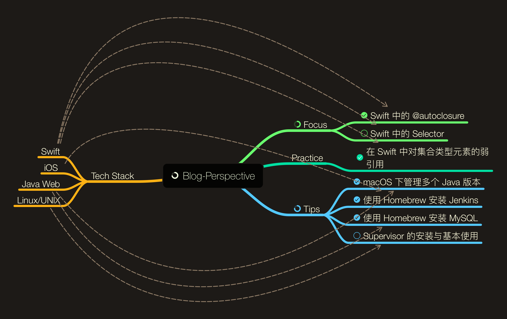

# Perspective

> Perspective，即透视。

## Focus

> Focus，即专注。笔者希望可以尽力将一些不是那么透彻的点透过 Demo 和源代码而看到其本质。由于国内软件开发仍很大程度依赖国外的语言、知识，部分术语会在文中首次提及时标注英文，这样的目的也是为了尽可能减少歧义。

- [Swift 中的 @autoclosure](https://github.com/kingcos/Perspective/issues/5)
- [Swift 中的 Selector](Posts/Focus/Swift_Selector)
- [Swift Evolution (Latest Swift version: 4.1)](https://github.com/kingcos/Perspective/issues/11)

## Practice

> Practice，即实践。笔者将会把网上各处的知识点进行实际的代码总结、扩展。文章将着重 Demo，非核心相关的内容将以链接形式放置在文末供读者参考、延伸。

- [在 Swift 中对集合类型元素的弱引用](https://github.com/kingcos/Perspective/issues/6)

## Reading

> Reading，即阅读。

- [Mac OS X and iOS Internals](/Posts/Reading/MacOSX_and_iOS_Internals)

## Tips

> Tips，即提示。笔者将三言两语简述解决方案，延伸部分供读者自行参考、查阅。

- [简单管理多版本 JDK](https://github.com/kingcos/Perspective/issues/7)
- [使用 Homebrew 安装 MySQL](https://github.com/kingcos/Perspective/issues/8)
- [Supervisor 的安装与基本使用](https://github.com/kingcos/Perspective/issues/9)
- [使用 Homebrew 安装 Jenkins](https://github.com/kingcos/Perspective/issues/10)

## Translation

> Translation，即翻译。笔者将自己尽心翻译作品发布于此，限于笔者能力，望读者可以为其纠错，笔者将十分感激。

- [起底 SourceKit](https://github.com/kingcos/Perspective/issues/12)

## Thought

> Thought，即思考。这里只是个人的胡言乱语。

- [180625](/Thought/180625)

> 也欢迎您关注我的微博 [@萌面大道V](http://weibo.com/375975847)

## LICENSE

- 该仓库所有内容不得在未经本人允许下进行任何形式的转载、修改等，一切相关事宜请直接联系我本人。
- 谢谢您的配合！
